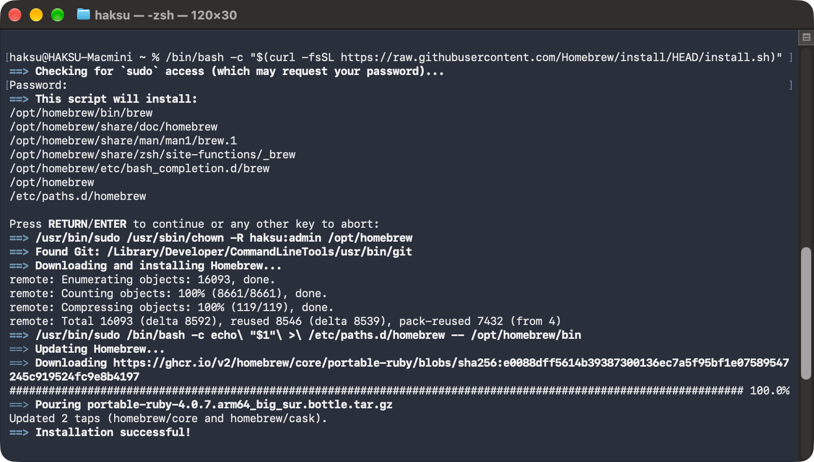
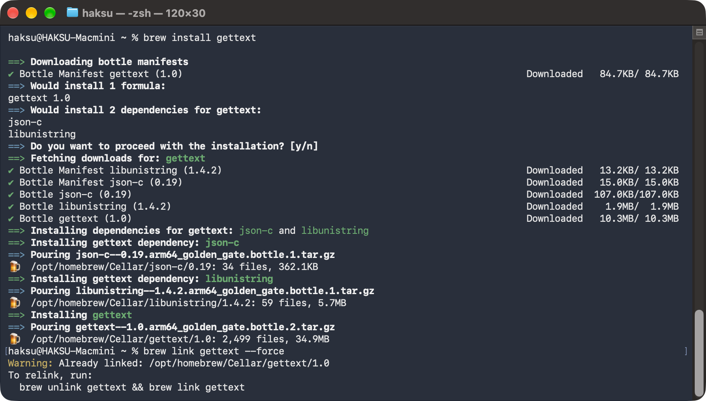

# 00. 기본 환경 구성 (Mac)

> 마지막 편집: 2026-10-05T06:12:03.713Z

## 1. AWS CLI 설치
[AWS CLI](https://aws.amazon.com/ko/cli/)
```bash
curl -fsSL https://awscli.amazonaws.com/v2/install.sh | bash

aws --version
```
## 2. 장기 자격 증명 구성 (Access Key/Secret Key)
```bash
aws configure

AWS Access Key ID [****************ZPHT]: 
AWS Secret Access Key [****************tTFh]: 
Default region name : ap-northeast-2
Default output format [None]: json
Configure AWS skills and the AWS MCP server for your AI coding agent(s)? [y/n/never]: n
```
## 3. `eksctl`
- 압축 파일 다운
	[eksctl 릴리스](https://github.com/eksctl-io/eksctl/releases)
- \~/Projects/eks-practice/bin 하위에 복사
## 4. `kubectl`
- 압축 파일 다운
	```bash
curl -LO "https://dl.k8s.io/release/$(curl -L -s https://dl.k8s.io/release/stable.txt)/bin/darwin/arm64/kubectl"
	```
- \~/Projects/eks-practice/bin 하위에 복사
- 실행 권한 부여
	```bash
chmod +x ~/Projects/eks-practice/bin/kubectl
	```
## 5. Homebrew
```bash
/bin/bash -c "$(curl -fsSL https://raw.githubusercontent.com/Homebrew/install/HEAD/install.sh)"
```

## 6. envsubst
```bash
brew install gettext
brew link gettext --force
```

