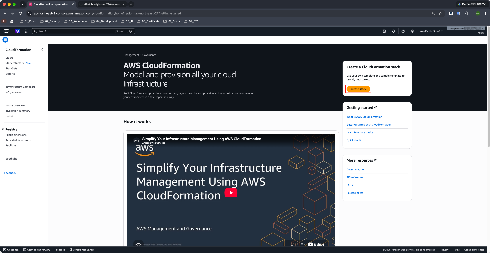
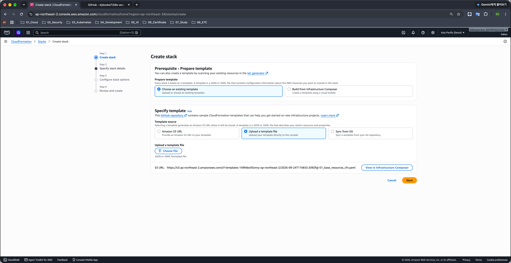
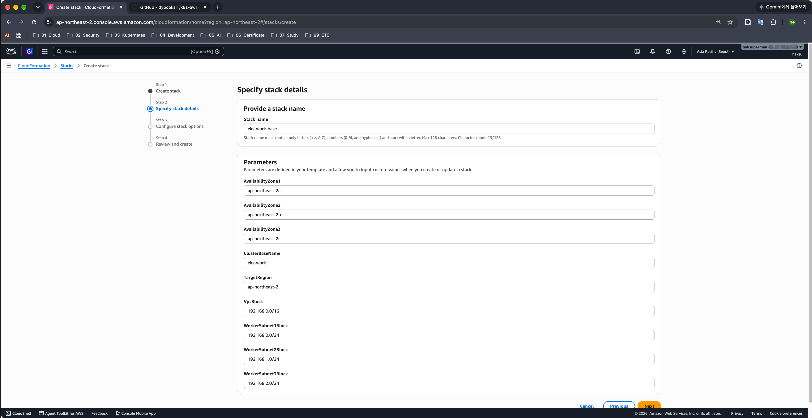

# 01. 기본 리소스 구성

> 마지막 편집: 2026-10-05T06:12:32.927Z

## 1. 기본 리소스 구축
### 1.1. 소스 코드 다운로드
[예제 소스 코드 저장소](https://github.com/dybooksIT/k8s-aws-book)
```bash
git clone https://github.com/dybooksIT/k8s-aws-book
```
### 1.2. 기본 리소스 생성
1. AWS Management Console → CloudFormation → Create stack
	
2. Prerequisite - Prepare template : Choose existing template 선택
3. Speficy template : Upload a template file 선택 → `k8s-aws-book > eks-env > 01_base_resources_cfn.yaml`
	
4. Stack name : `eks-work-base`
	
### 1.3. 리소스 생성 확인
예시로 VPC 확인
