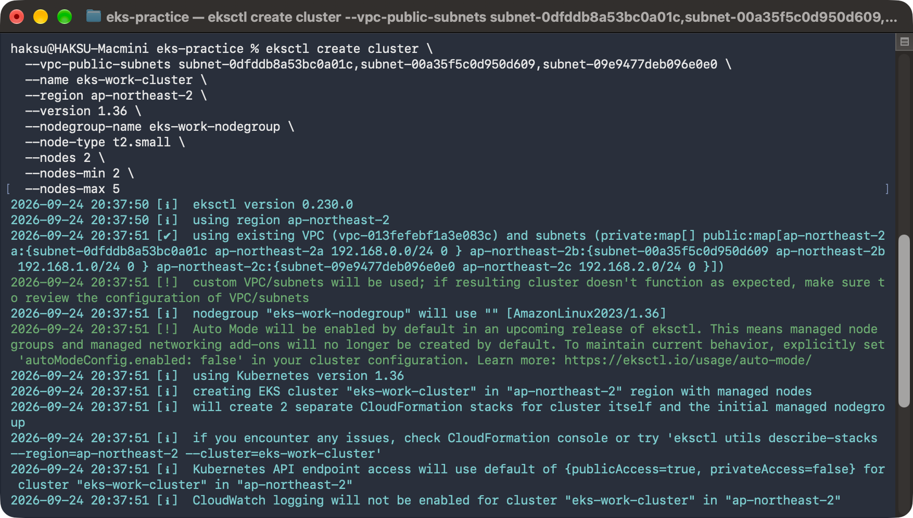
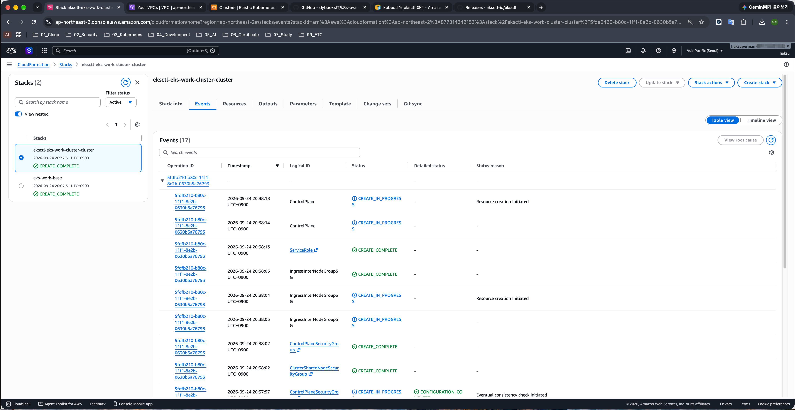
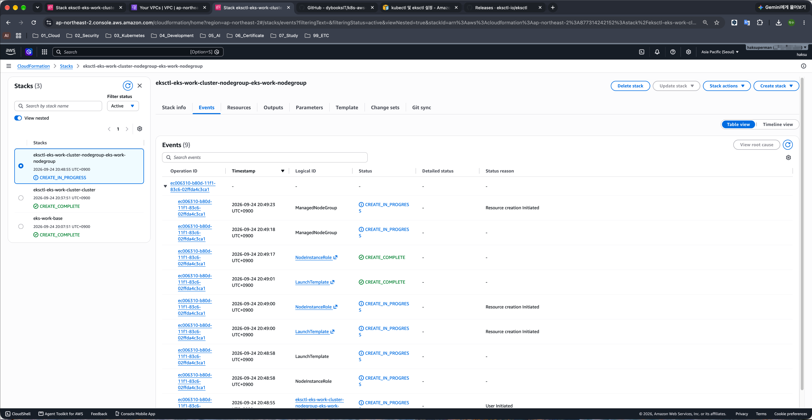
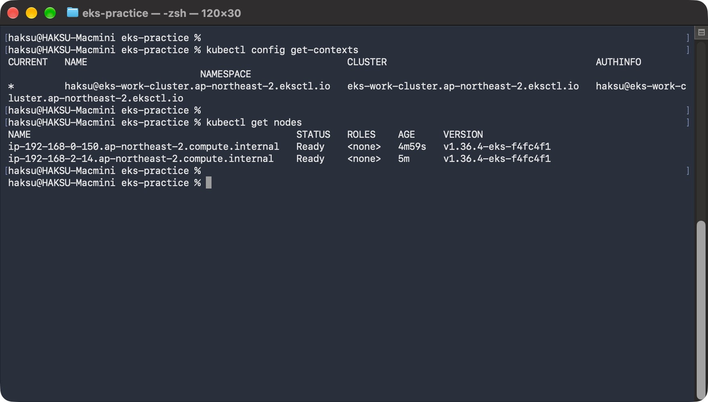
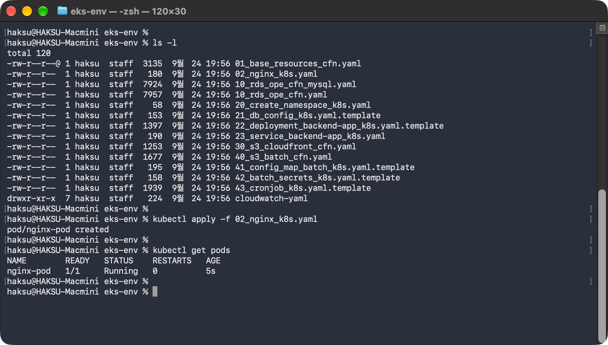
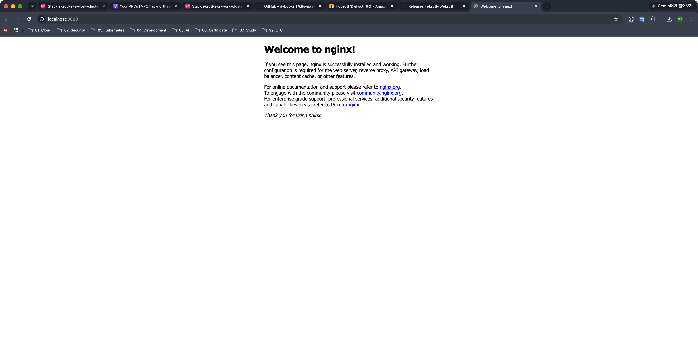

# 02. EKS 클러스터 구축

> 마지막 편집: 2026-10-04T14:11:04.876Z

## 1. EKS 클러스터 구축

### 1.1. eksctl 수행

```bash
eksctl create cluster \
  --vpc-public-subnets subnet-0dfddb8a53bc0a01c,subnet-00a35f5c0d950d609,subnet-09e9477deb096e0e0 \
  --name eks-work-cluster \
  --region ap-northeast-2 \
  --version 1.36 \
  --nodegroup-name eks-work-nodegroup \
  --node-type t2.small \
  --nodes 2 \
  --nodes-min 2 \
  --nodes-max 5
```



### 1.2. CloudFormation 진행 상황 확인




### 1.3. kubeconfig 설정

```bash
## 현재 활성 컨텍스트 확인
kubectl config get-contexts

## 워커 노드 확인
kubectl get nodes
```



## 2. EKS 클러스터 동작 확인

- 현재 위치 이동

    ```bash
    cd ~/Projects/eks-practice/k8s-book/eks-env
    ```

- 데모 웹 사이트 배포 및 확인

    ```bash
    kubectl apply -f 02_nginx_k8s.yaml

    kubectl get pods
    ```

    

- 포트 포워딩

    ```bash
    kubectl port-forward nginx-pod 8080:80
    ```

    
