# 03. 데이터베이스 설정

> 마지막 편집: 2026-10-04T14:17:24.301Z

## 1. RDS 배포

1. CloudFormation → Create stack → With new resources (Standard) 선택
    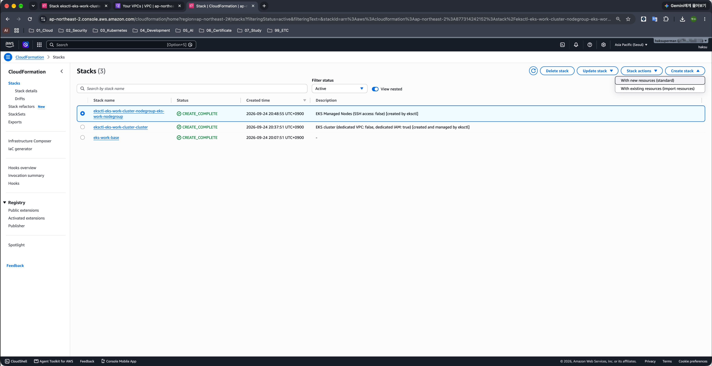
2. `~/Projects/eks-practice/eks-env/10_rds_cfn.yaml` 파일 업로드
    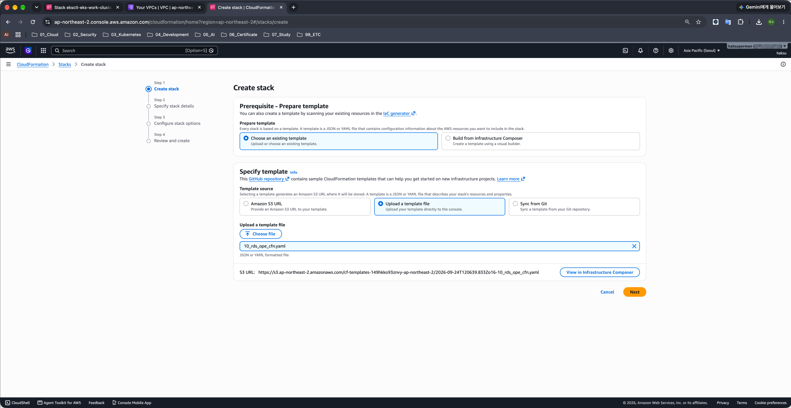
3. Stack name : eks-work-rds
4. 파라미터 설정
5. EksWorkVPC : eks-work-vpc
6. OpeServeRouteTable : 기본 리소스 Stack 배포 시 생성된 RouteTable의 ARN
    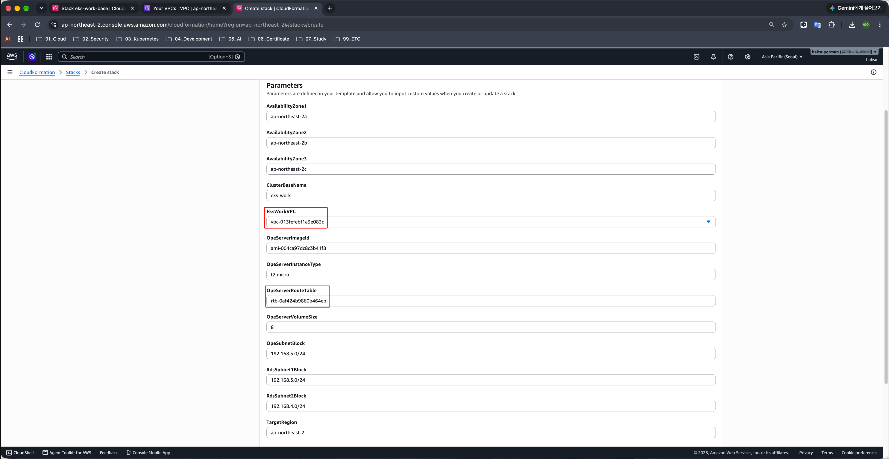
7. 생성 확인
    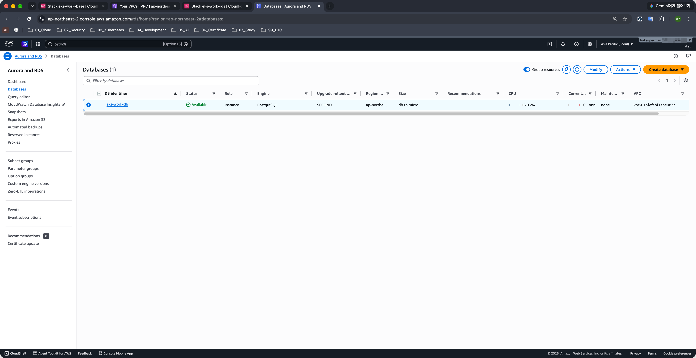

## 2. 세션 관리자를 통한 Bastion Host 접속

### 2.1. Session Manager 접속

1. AWS Session Manager → Start Session
    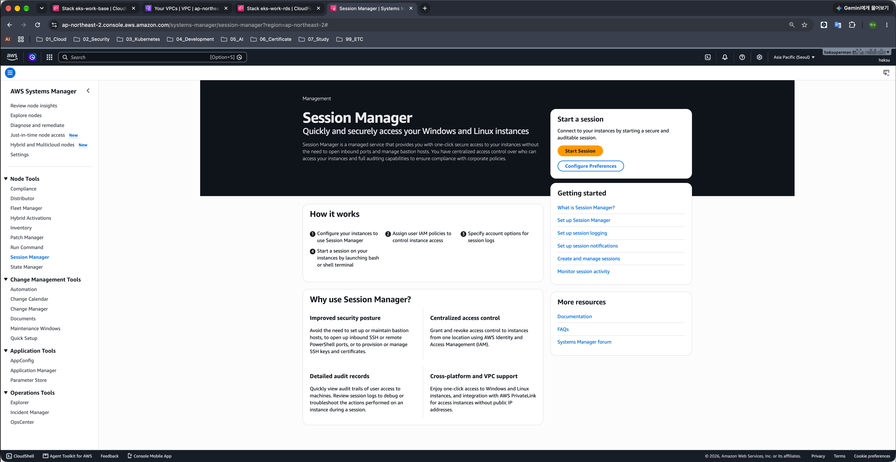
2. RDS 접속용 Bastion Host 선택 → Start Session
    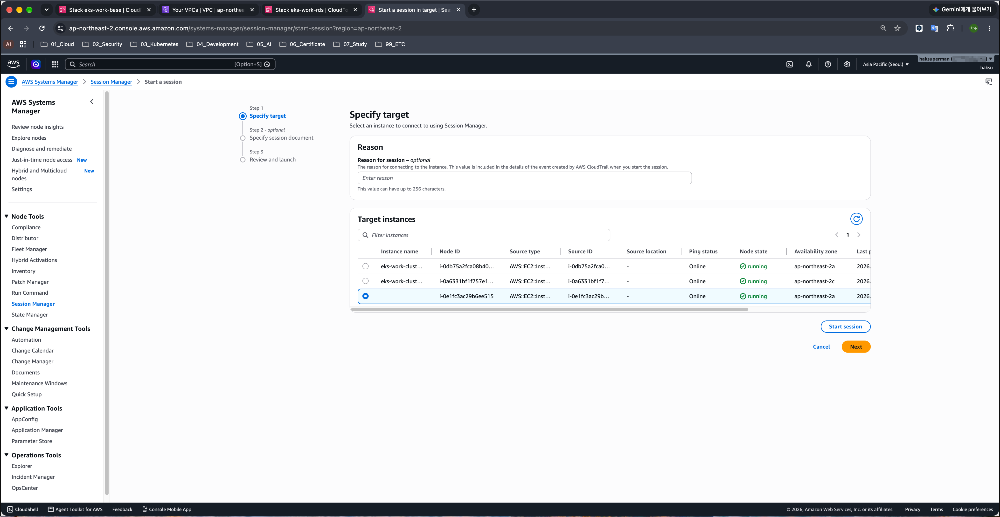
3. 접속 터미널 확인
    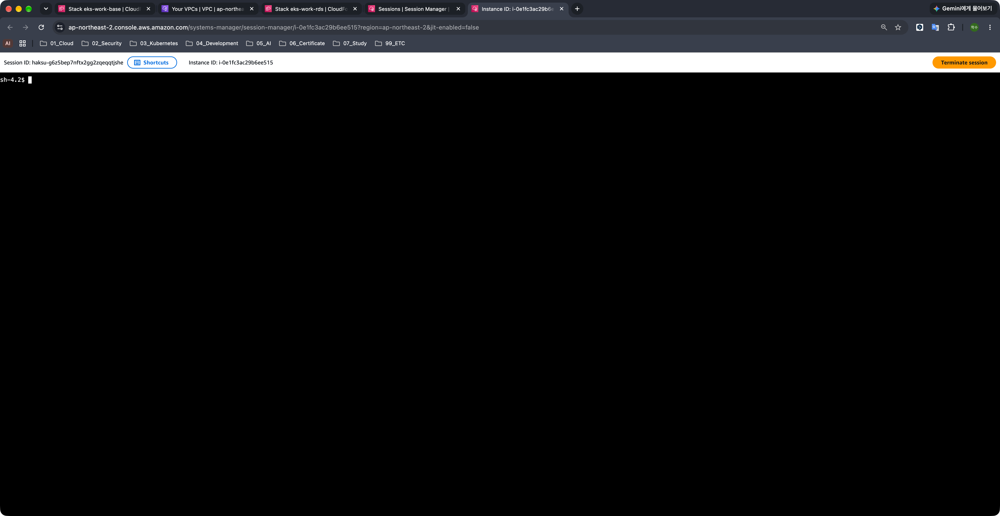

### 2.2. Bastion Host 내 도구 설치

1. `git` 설치

    ```bash
    sudo yum install -y git
    ```

    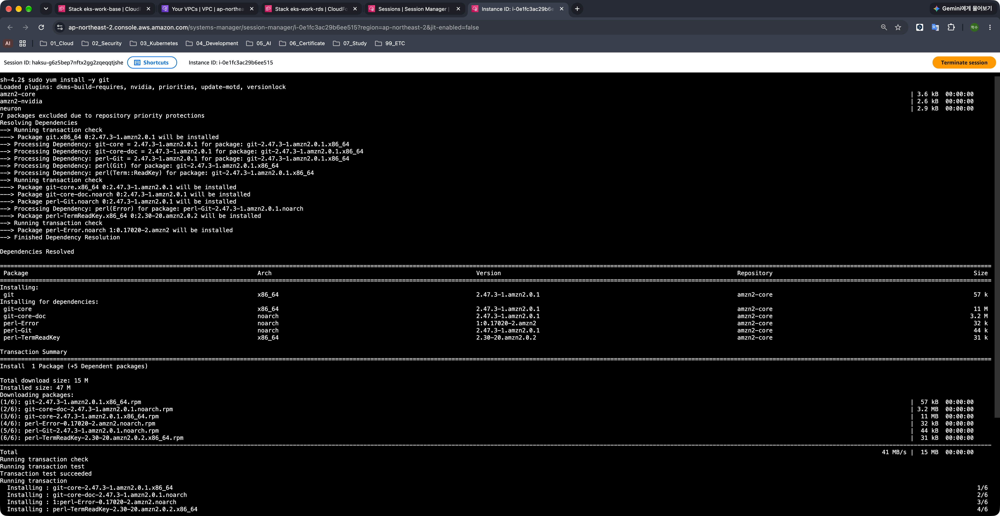
2. PostgreSQL Client 설치

    ```bash
    sudo amazon-linux-extras install -y postgresql11
    ```

    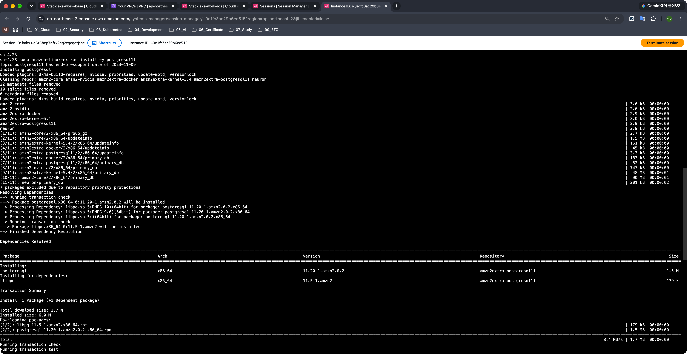

## 3. Repository Clone

```bash
cd

pwd

git clone https://github.com/dybooksIT/k8s-aws-book.git
```

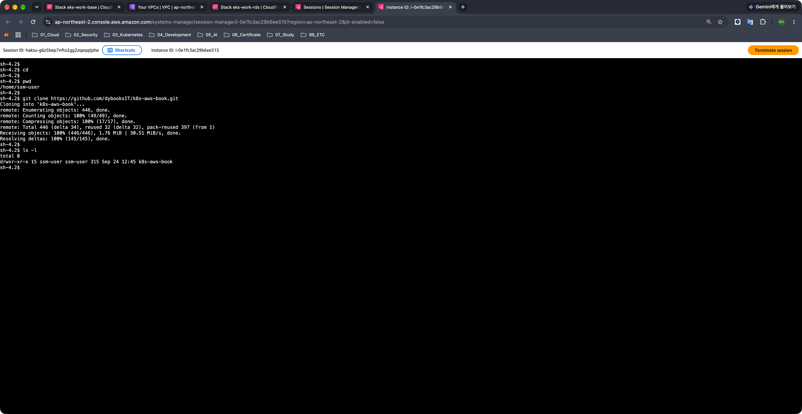

## 4. DB Endpoint 주소 및 관리자 패스워드 확인

### 4.1. DB Endpoint 주소

1. RDS 배포한 CloudFormation → Outputs 탭
    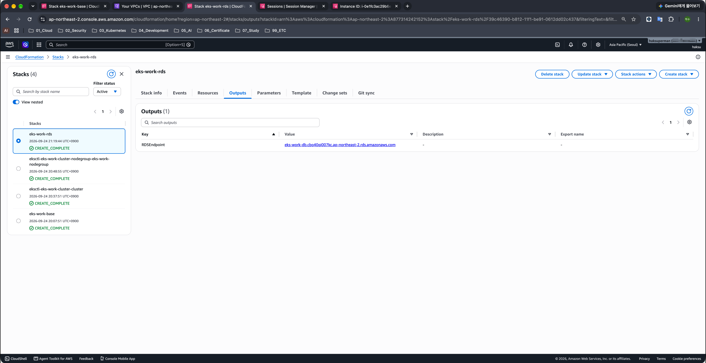

### 4.2. DB 관리자 패스워드

1. Secrets Manager → 생성된 RdsMasterSecret
    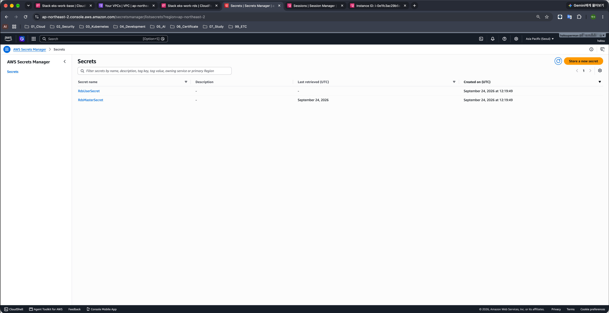
2. Secret value 검색
    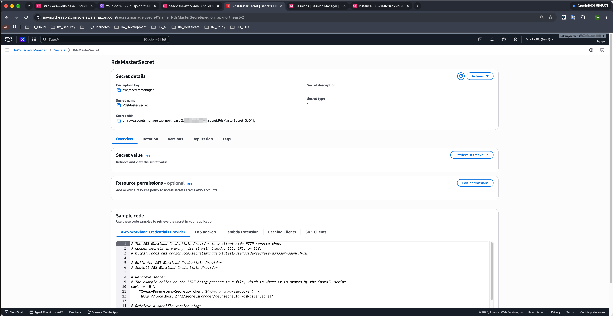
3. password 값 확인

### 4.3. DB 사용자 패스워드

1. Secrets Manager → 생성된 RdsUserSecret
    
2. Secret value 검색
    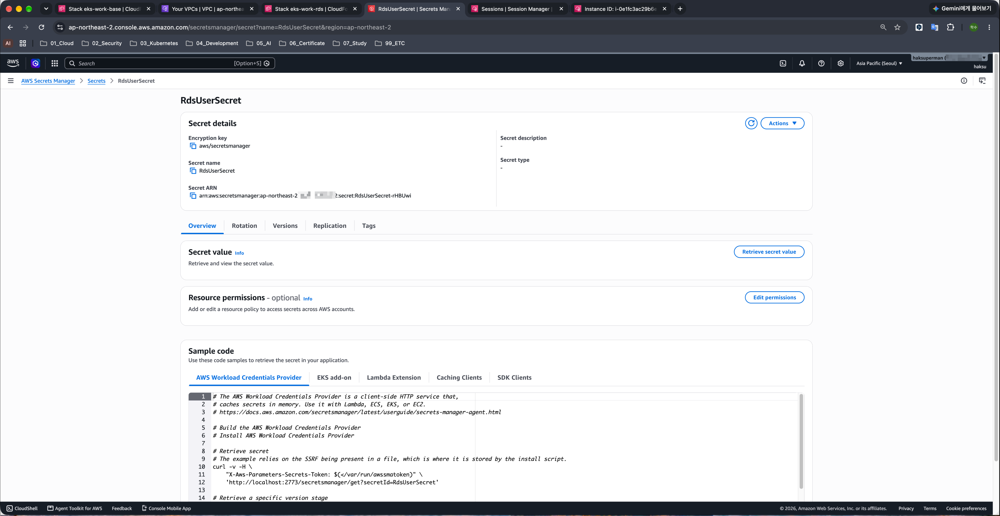
3. password 값 확인

## 5. 데이터베이스 작업

### 5.1. 애플리케이션용 사용자 생성

1. PostgreSQL Client에서 `createuser` 명령어 수행

    ```bash
    createuser -d -U eksdbadmin -P -h <RDS 엔드포인트 주소> mywork

    Enter password for new role: <RdsUserSecret password>
    Enter it again: <RdsUserSecret password>
    Password: <RdsMasterSecret password>
    ```

    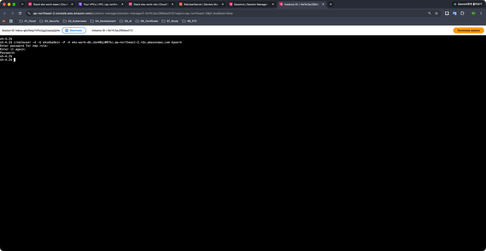

### 5.2. 애플리케이션용 데이터베이스 생성

1. PostgreSQL Client에서 `createdb` 명령어 수행

    ```bash
    createdb -U mywork -h <RDS 엔드포인트 주소> -E UTF8 myworkdb
    Password: <RdsUserSecret password>
    ```

    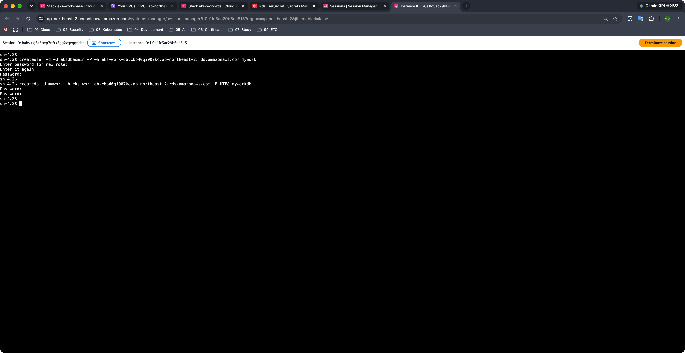

### 5.3. 데이터베이스 접속

1. PostgreSQL Client에서 `psql` 명령어 수행

    ```bash
    psql -U mywork -h <RDS 엔드포인트 주소> myworkdb
    Password for user mywork: <RdsUserSecret password>
    ```

    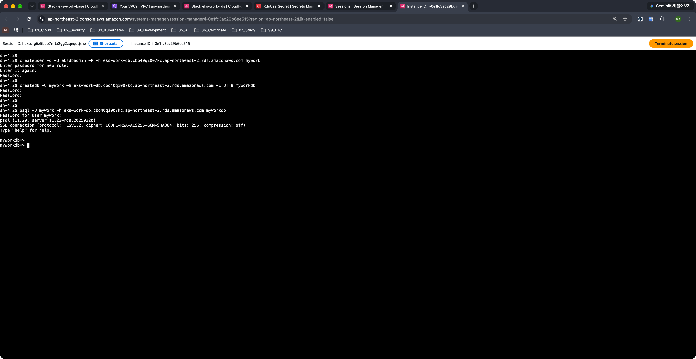

### 5.4. DDL 실행과 예제 데이터 불러오기

1. `\i` 명령을 통해 외부 스크립트 실행

    ```bash
    \i k8s-aws-book/backend-app/scripts/10_ddl.sql
    CREATE TABLE
    CREATE TABLE
    CREATE TABLE
    CREATE TABLE

    \i k8s-aws-book/backend-app/scripts/20_insert_sample_data.sql
    INSERT 0 1
    INSERT 0 1
    INSERT 0 1
    INSERT 0 1
    INSERT 0 1
    INSERT 0 1
    INSERT 0 1
    INSERT 0 1
    INSERT 0 1
    INSERT 0 1
    INSERT 0 1
    INSERT 0 1
    ```

    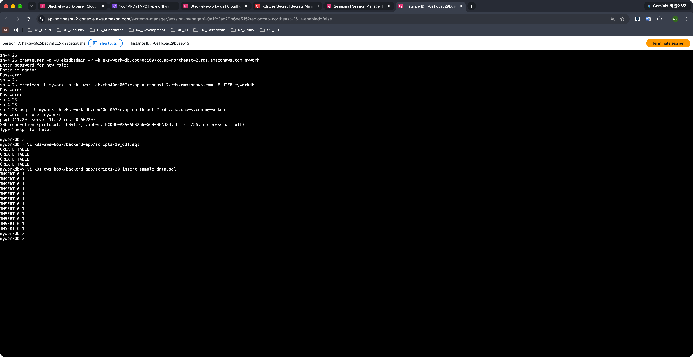
2. 로그아웃

    ```bash
    \q
    ```
