# 04. API 애플리케이션 빌드와 배포

> 마지막 편집: 2026-10-04T14:23:23.854Z

## 1. 사전 준비

### 1.1. Amazon Corretto

- Amazon Corretto 11 설치
    [https://docs.aws.amazon.com/corretto/latest/corretto-11-ug/downloads-list.html](https://docs.aws.amazon.com/corretto/latest/corretto-11-ug/downloads-list.html)
- OS에 맞는 설치파일 다운
    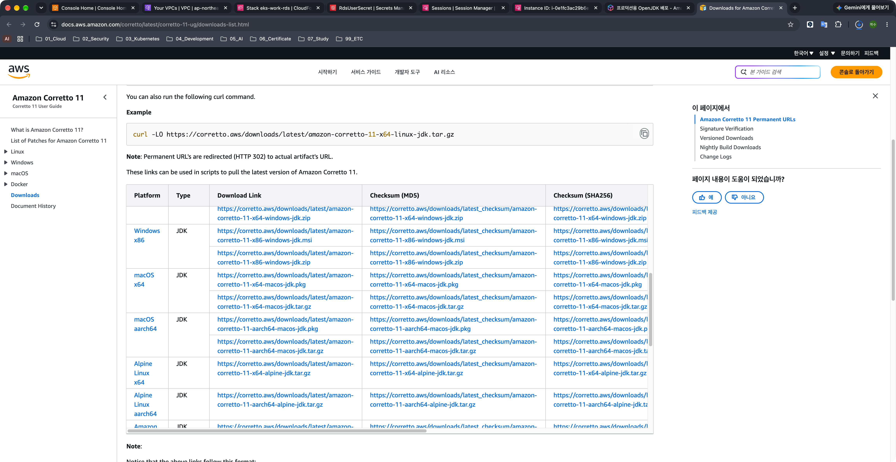
- 설치 확인

    ```bash
    javac --version
    java --version
    ```

    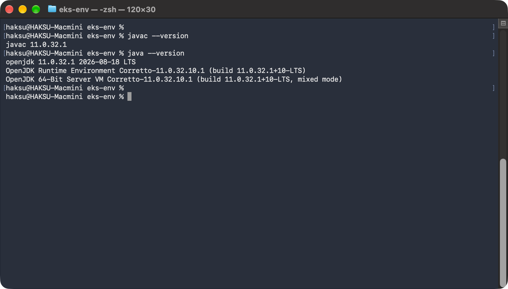

- JAVA_HOME 환경 변수 설정

    ```bash
    echo 'export JAVA_HOME=$(/usr/libexec/java_home -v 11)' >> ~/.zshrc
    ```

    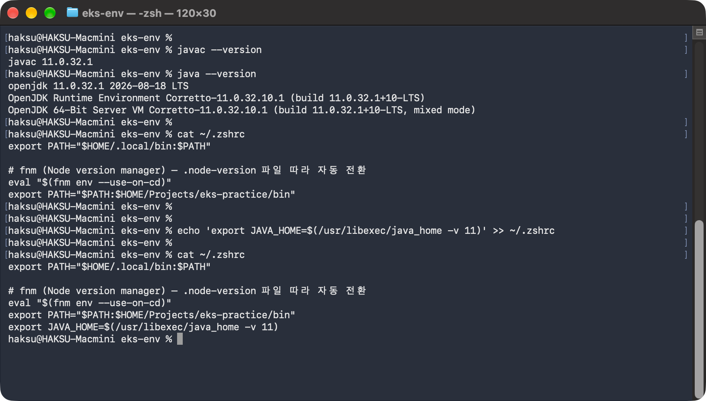

### 1.2. 도커 데스크탑

- 도커 데스크탑 설치
    [https://docs.docker.com/desktop/setup/install/mac-install/](https://docs.docker.com/desktop/setup/install/mac-install/)
- OS에 맞는 설치 파일 다운
    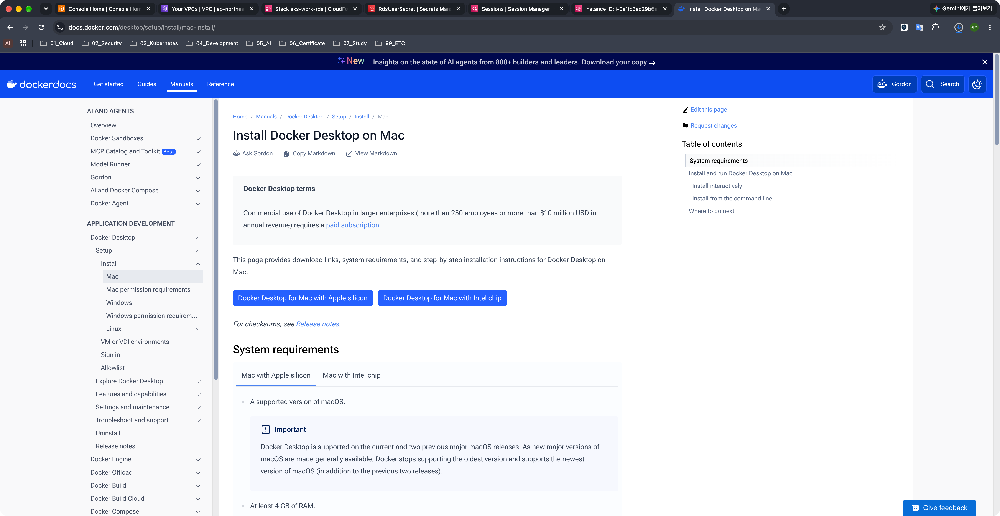
- 설치 확인

    ```bash
    docker version
    ```

    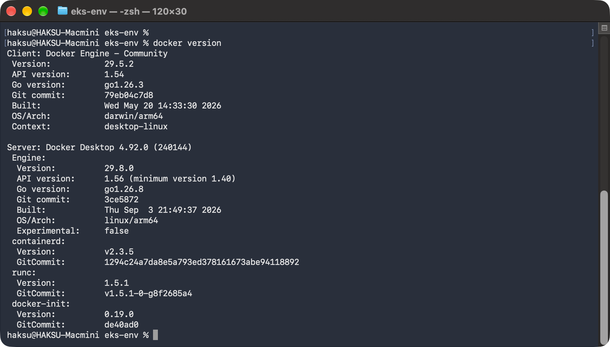

### 1.3. 도커 허브 계정 가입 및 로그인

- 이미 존재하여 생략

## 2. 소스 코드 빌드와 컨테이너 이미지 생성

### 2.1. 소스 코드 빌드
>
> 애플리케이션 빌드 도구인 Gradle 대신 Gradle Wrapper라는 구조를 사용해 Gradle이 설치되지 않은 환경에서도 빌드 가능

```bash
cd ~/Projects/k8s-aws-book/backend-app
sudo chmod 755 ./gradlew

## 의존성 라이브러리 다운
## 프로그램 컴파일
## 테스트 프로그램 컴파일
## 테스트 실행
## 프로그램 실행용 아카이브 파일(JAR 파일) 생성
./gradlew clean build
```

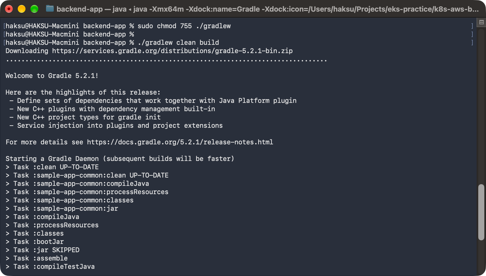
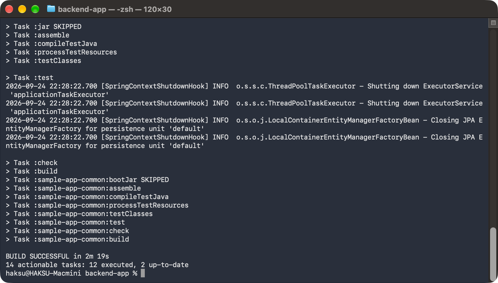

### 2.2. 컨테이너 이미지 생성

- Docker Desktop 실행
    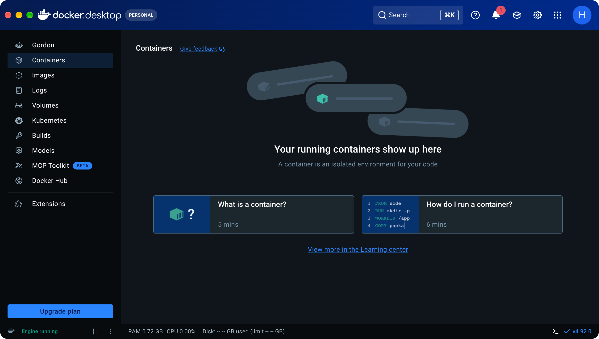
- `docker build` 명령 수행 (컨테이너 이미지 빌드)
    (ARM 아키텍처인 Mac에서 x86 아키텍처 이미지 빌드하여 `--platform` 옵션 필수)

    ```bash
    sudo docker build \
      --platform linux/amd64 \
      -t k8sbook/backend-app:1.0.0 \
      --build-arg JAR_FILE=build/libs/backend-app-1.0.0.jar \
      .
    ```

    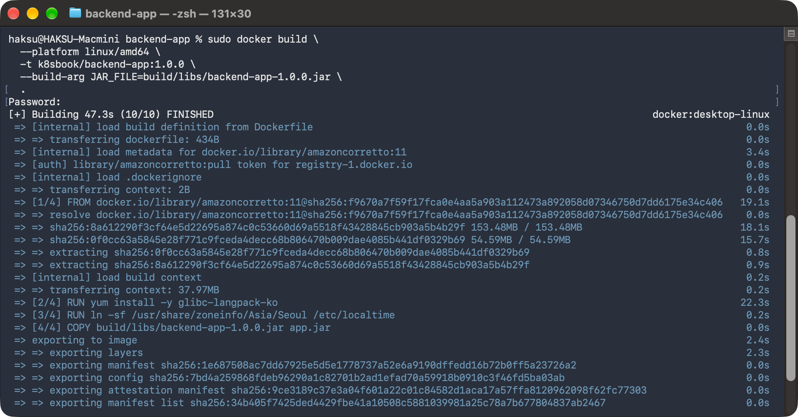

### 2.3. 컨테이너 레지스트리 생성

1. Elastic Container Registry → Create
    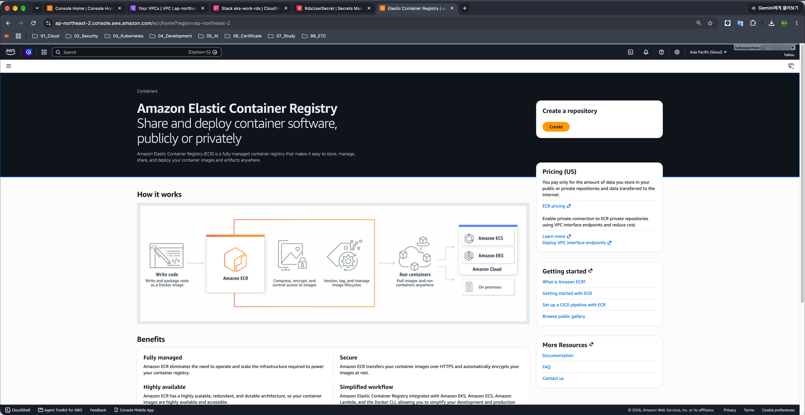
2. Repository name : \<AWS_ACCOUNT_ID\>.dkr.ecr.ap-northeast-2.amazonaws.com/`k8sbook/backend-app`
    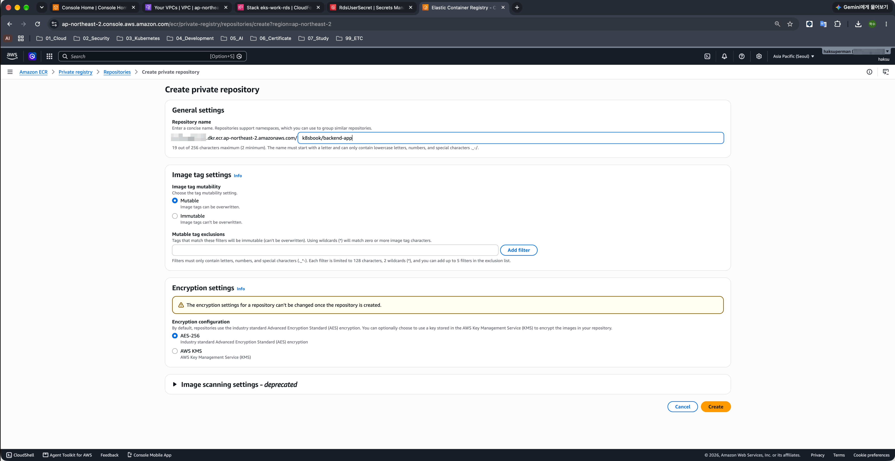
3. 생성 확인
    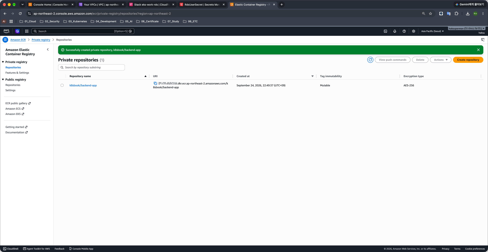

### 2.4. 컨테이너 이미지 푸시

1. ECR 로그인

    ```bash
    aws ecr get-login-password --region ap-northeast-2 | \
    docker login --username AWS --password-stdin \
    <AWS_ACCOUNT_ID>.dkr.ecr.ap-northeast-2.amazonaws.com
    ```

    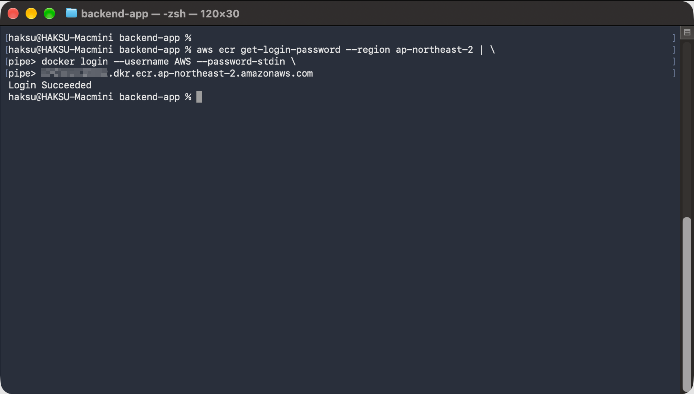

### 2.5. 컨테이너 이미지 태그 설정 및 푸시

1. `docker tag` 명령으로 컨테이너 이미지에 태그 설정

    ```bash
    docker tag k8sbook/backend-app:1.0.0 \
    <AWS_ACCOUNT_ID>.dkr.ecr.ap-northeast-2.amazonaws.com/k8sbook/backend-app:1.0.0
    ```

    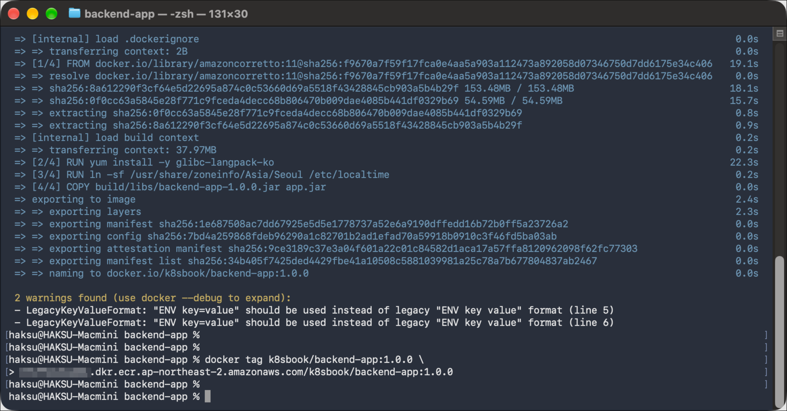
2. `docker push` 명령으로 ECR에 Push

    ```bash
    docker push <AWS_ACCOUNT_ID>.dkr.ecr.ap-northeast-2.amazonaws.com/k8sbook/backend-app:1.0.0
    ```

    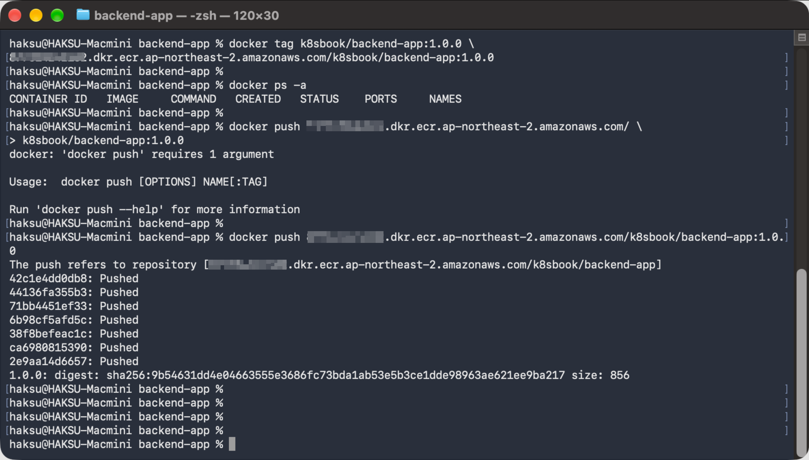

### 2.6. EKS 클러스터에 API 애플리케이션 배포

1. 네임스페이스 생성

    ```bash
    kubectl apply -f eks-env/20_create_namespace_k8s.yaml
    ```

    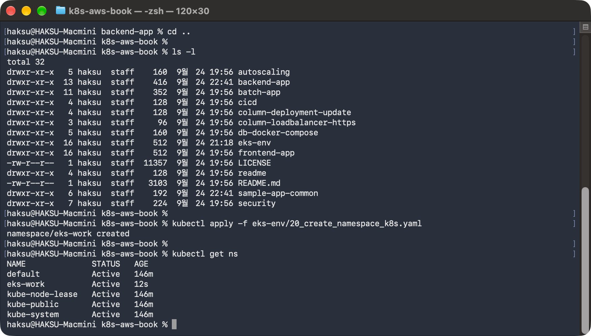
2. kubeconfig에 네임스페이스 반영

    ```bash
    ## 반영 전 확인

    kubectl config get-contexts

    ## 신규 컨텍스트 생성 및 활성

    kubectl config set-context eks-work --cluster <CLUSTER 값> \
      --user <AUTHINFO값> \
      --namespace eks-work

    ## 반영 후 확인

    kubectl config get-contexts
    ```

    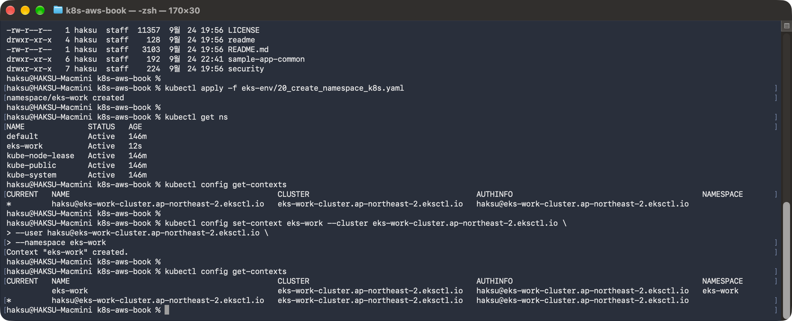
3. 데이터베이스 접속용 시크릿 등록

    ```bash
    DB_URL=jdbc:postgresql://<RDS 엔드포인트 주소>/myworkdb \
    DB_PASSWORD='<애플리케이션용 DB 사용자 패스워드>' \
    envsubst < 21_db_config_k8s.yaml.template | \
    kubectl apply -f -
    ```

    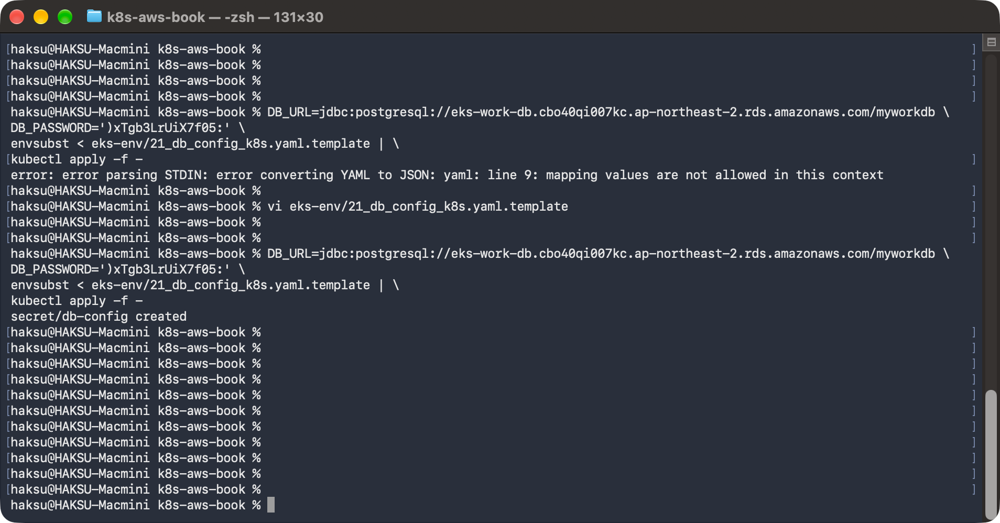

### 2.7. API 애플리케이션 배포

1. Deployment 배포

    ```bash
    ECR_HOST=<AWS_ACCOUNT_ID>.dkr.ecr.ap-northeast-2.amazonaws.com \
    envsubst < eks-env/22_deployment_backend-app_k8s.yaml.template | \
    kubectl apply -f -
    ```

    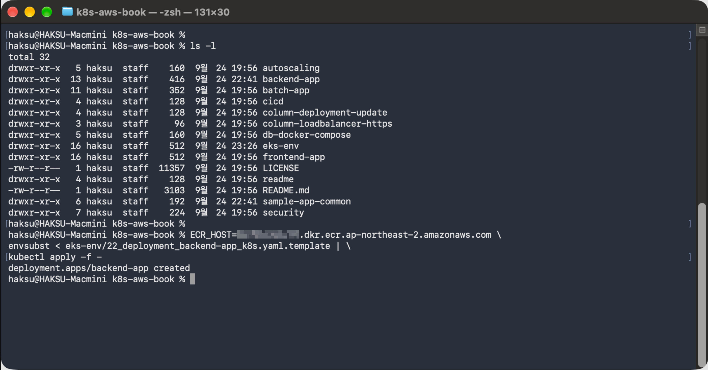
2. 생성 결과 확인

    ```bash
    kubectl get all
    ```

    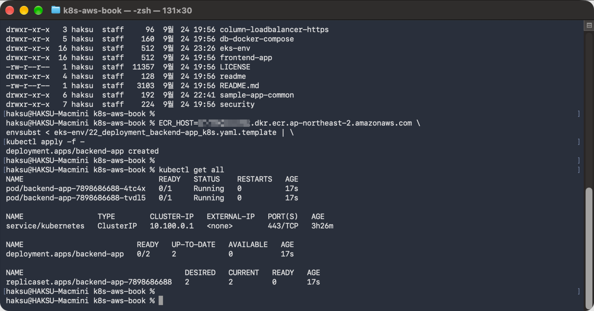

### 2.8. API 애플리케이션 외부 공개

1. Service 객체의 LoadBalancer 타입을 이용하여, 외부에서 API 애플리케이션 호출 가능하도록 노출

    ```bash
    kubectl apply -f eks-env/23_service_backend-app_k8s.yaml
    ```

    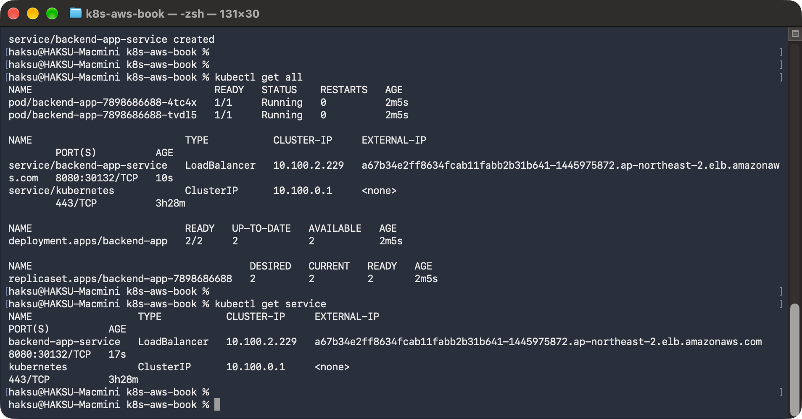
2. 생성된 로드밸런싱 확인 (EC2 → Load Balancers)
    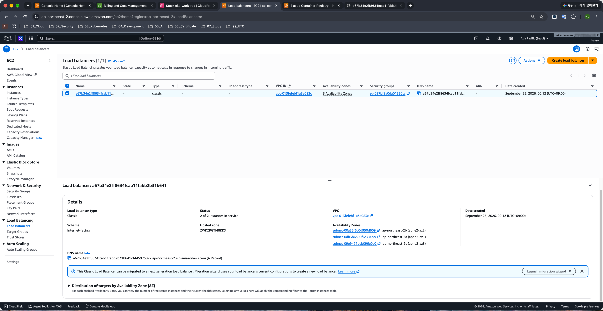
3. Target Instances 탭 → Health status 확인
    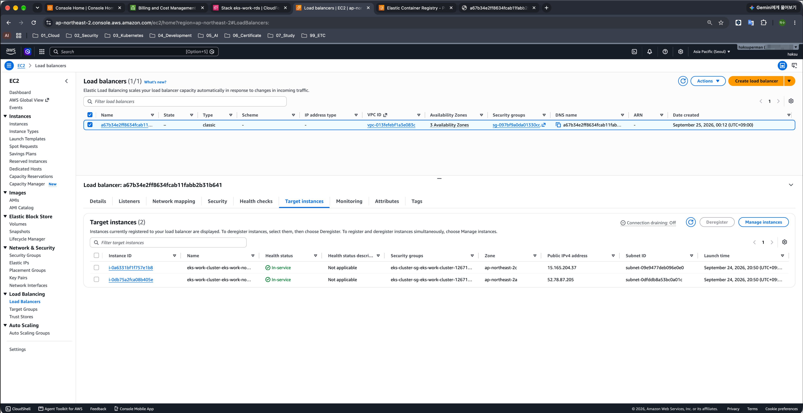
4. 정상 접속 확인
    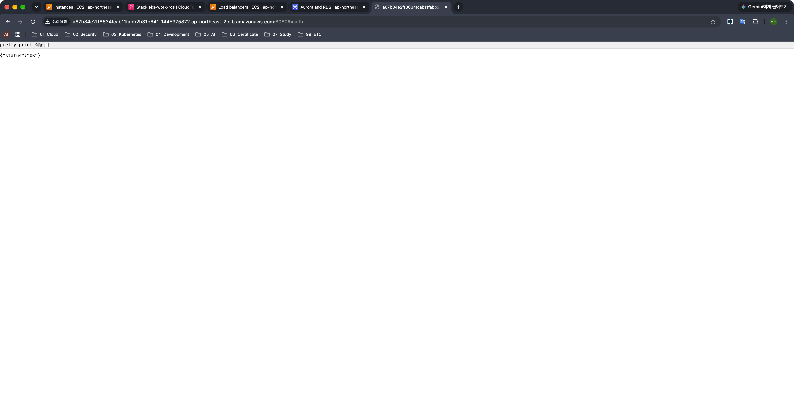
