# 05. 프런트엔드 애플리케이션 빌드와 배포

> 마지막 편집: 2026-10-05T06:12:48.551Z

## 1. NodeJS 설치

[Node.js 다운로드](https://nodejs.org/ko/download)

- 버전 및 OS 확인 및 설치 파일 다운
    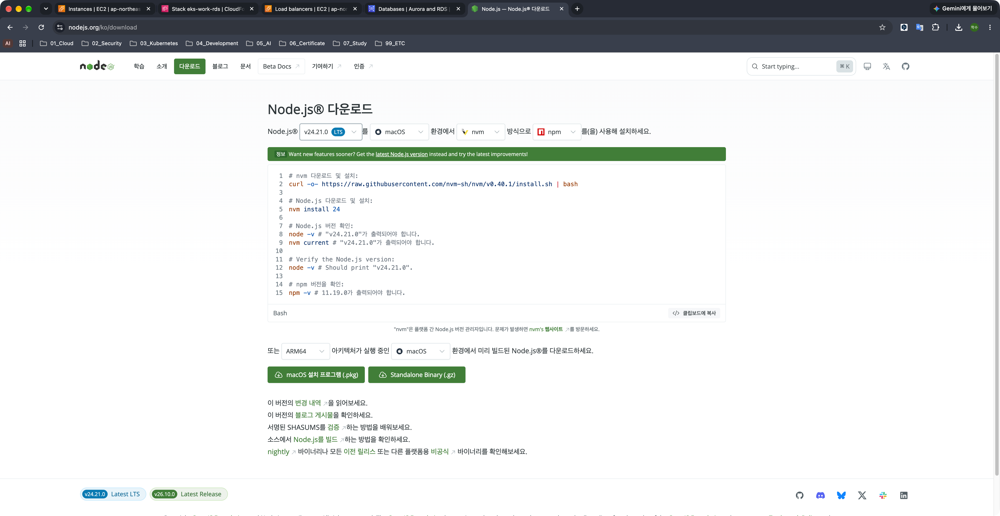
- 제공된 프로젝트에서 호환이 되지 않는 경우 호환 버전(Node12/npm6)의 컨테이너에서 라이브러리 설치 가능

## 2. 프런트엔드 애플리케이션 빌드

### 2.1. 라이브러리 다운로드

1. 경로 이동 및 라이브러리 다운

    ```bash
    cd ~/Projects/eks-practice/k8s-aws-book/frontend-app

    docker run --rm \
      --platform linux/amd64 \
      -v "$PWD:/app" \
      -w /app \
      node:12.22.12-buster \
      npm install
    ```

    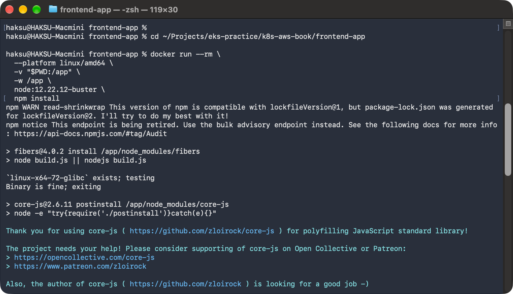

    > 제공된 프로젝트의 Node.js 버전과 호환되는 도커 컨테이너에서 `npm install` 명령을 수행하여 `frontend-app/node_modules` 생성

### 2.2. API 기본 URL 확인

1. 배포된 Service 객체의 Loadbalancer 타입의 URL 확인

    ```bash
    kubectl get all
    ```

    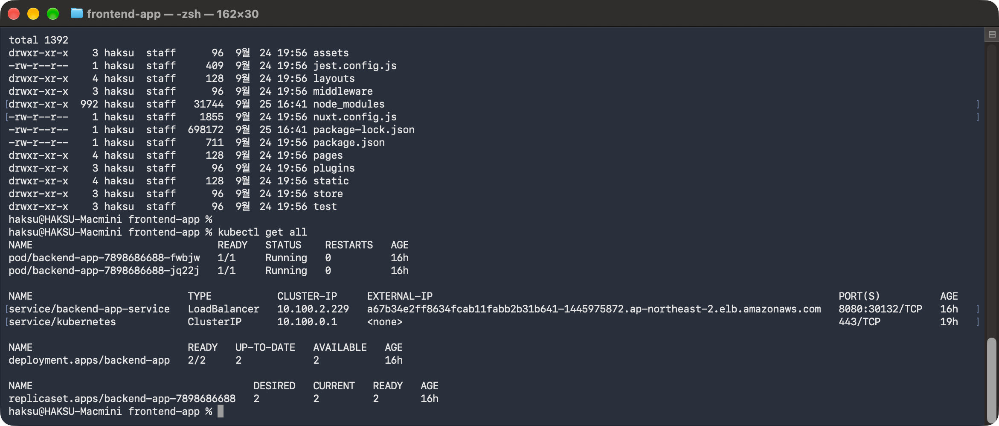

### 2.3. 빌드 실행

1. 호환되는 Node 12 컨테이너에서 빌드 수행

    ```bash
    docker run --rm \
      --platform linux/amd64 \
      -v "$PWD:/app" \
      -w /app \
      -e BASE_URL="http://<EXTERNAL-IP값>.ap-northeast-2.elb.amazonaws.com:8080" \
      node:12.22.12-buster \
      npm run build
    ```

    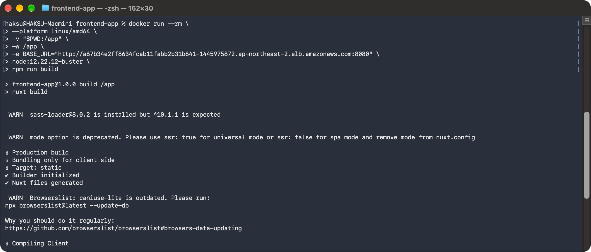
2. 결과 확인

    ```bash
    ls -l dist/
    ```

    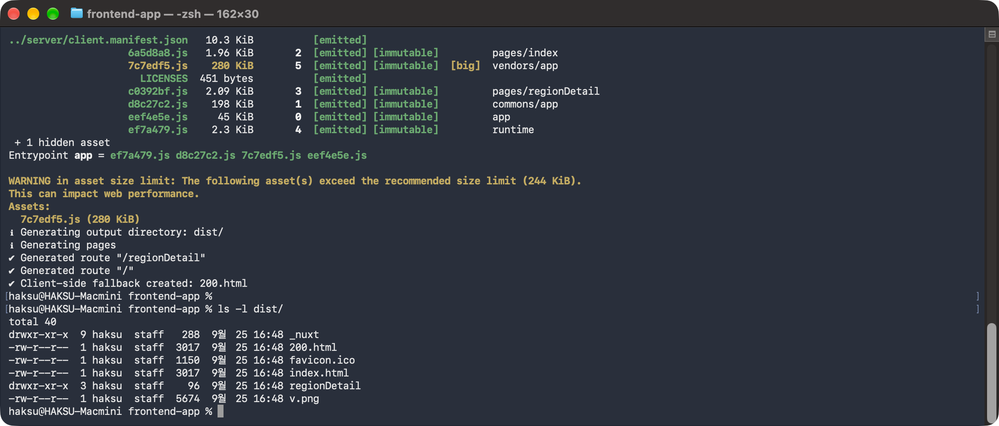

## 3. S3 버킷과 CloudFront 배포 생성

1. AWS Management Console → CloudFormation → Create stack → With new resources (Standard)
    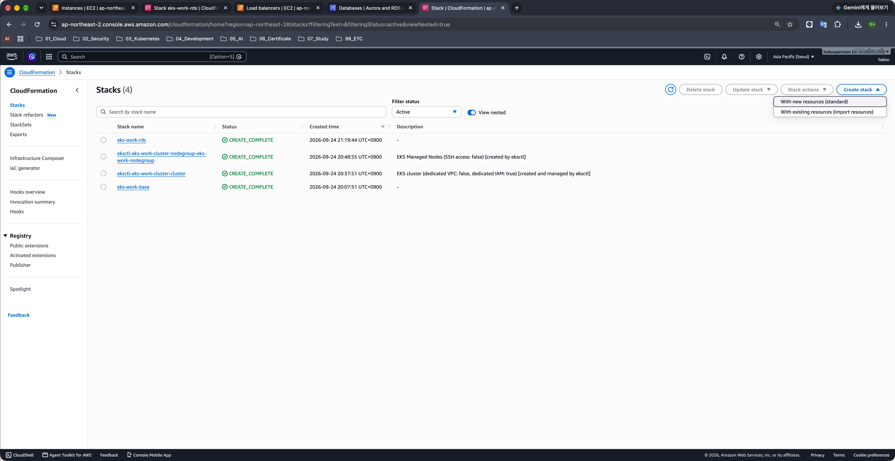
2. eks-env/30_s3_cloudfront_cfn.yaml 업로드 → Next
    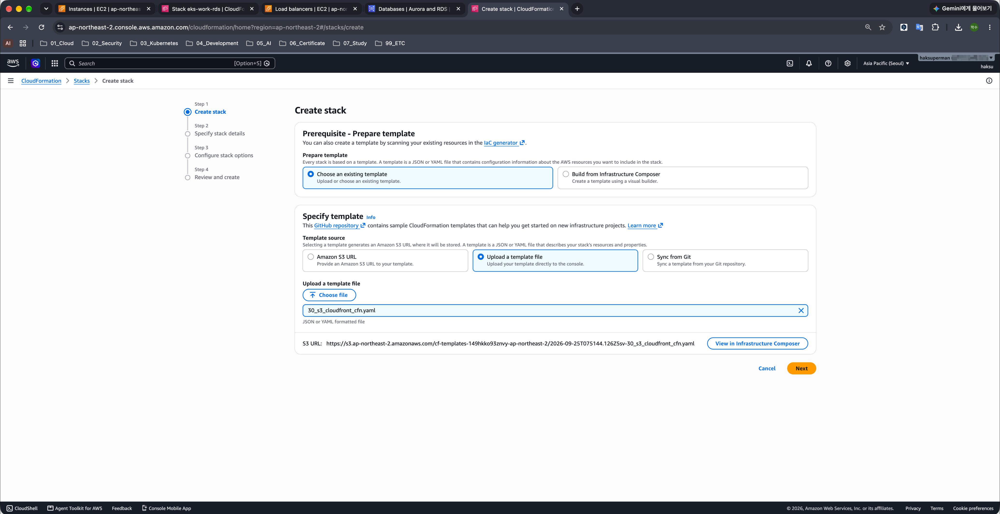
3. Stack name : eks-work-frontend
4. Bucket suffix : haksu<br>(임의 문자열, 중복 x)
    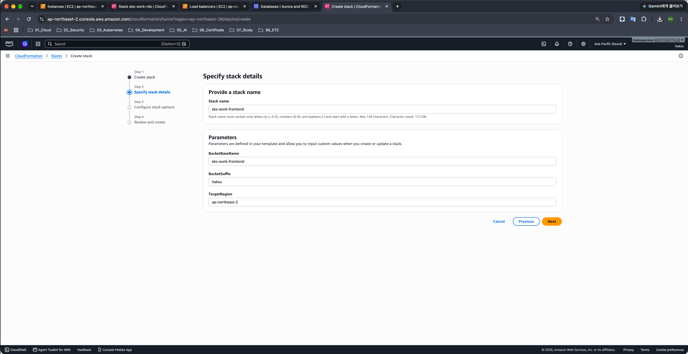
5. 생성 확인
    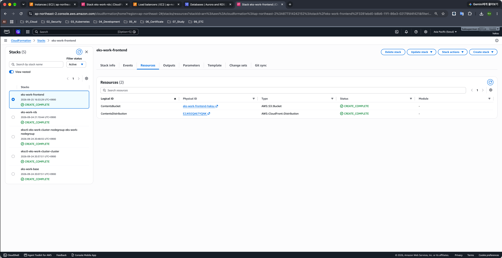

## 4. 콘텐츠 업로드

### 4.1. AWS CLI를 통해 업로드

```bash
aws s3 sync dist s3://eks-work-frontend-haksu \
--delete
```

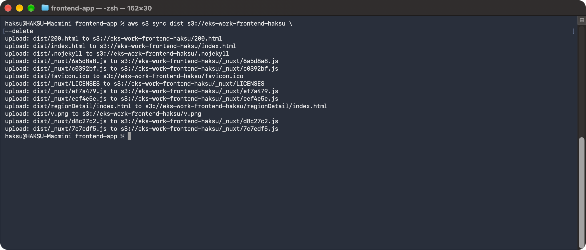

### 4.2. S3 Policy

```json
{
    "Version": "2012-10-17",
    "Statement": [
        {
            "Sid": "PublicReadGetObject",
            "Effect": "Allow",
            "Principal": "*",
            "Action": "s3:GetObject",
            "Resource": "arn:aws:s3:::eks-work-frontend-haksu/*"
        }
    ]
}
```

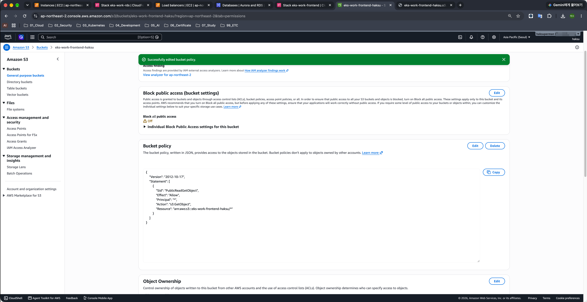

### 4.3. CloudFront 배포 캐시 무효화

1. CloudFront는 S3 콘텐츠를 캐시하여 S3에 접속하지 않고 요청에 응답할 수 있는 구조이다.
2. 해당 캐시를 무효화해 반영한 콘텐츠를 배포를 즉시 확인 가능하다.
3. DistributionID 확인 (eks-work-frontend Stack → Outfut 탭)
    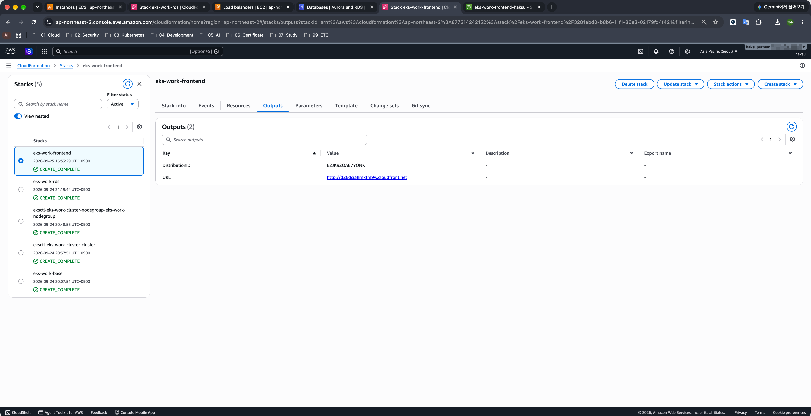
4. AWS CLI 명령으로 캐시 무효화 수행

    ```bash
    aws cloudfront create-invalidation --distribution-id E2JK92QA67YQNK --paths "/*"
    ```

    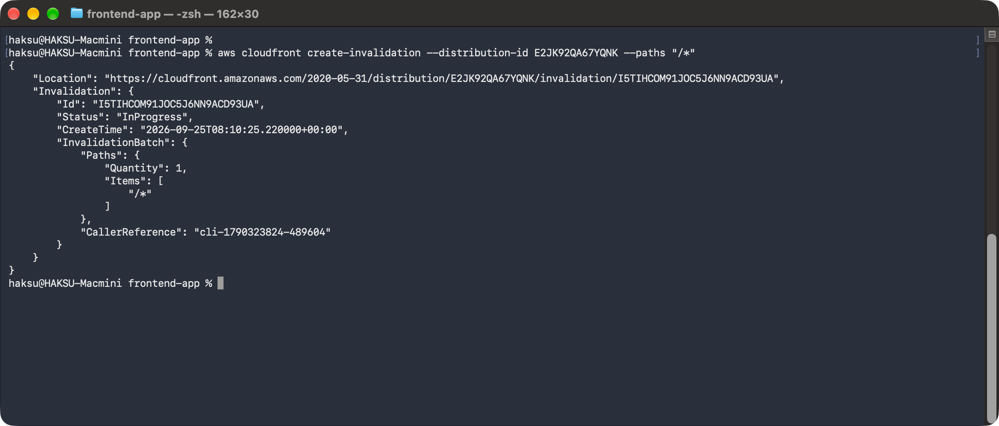

### 4.4. 프런트엔드에서 애플리케이션 동작 확인

1. CloudFront URL 확인 (eks-work-frontend Stack → Outfut 탭)
    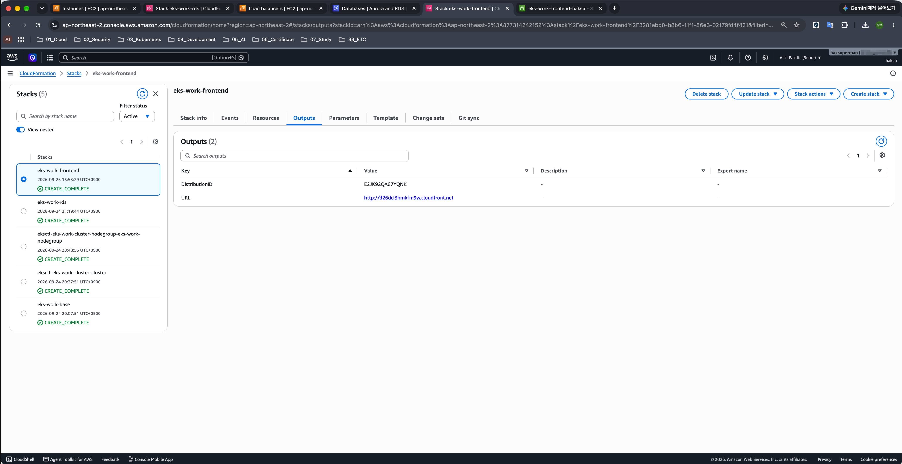
2. 접속 확인<br>(프런트엔드 애플리케이션-API 애플리케이션-데이터베이스의 정상 연계 확인)
    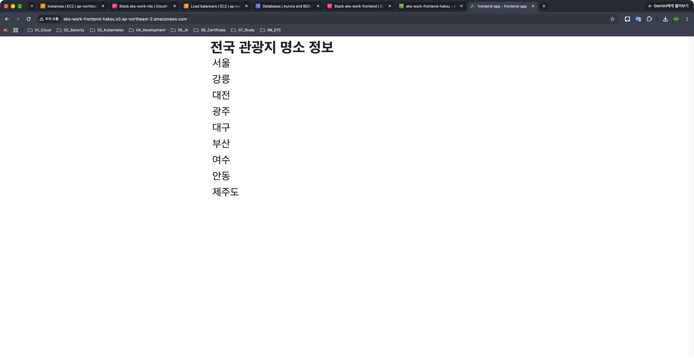

> 404 Not Found가 출력되는 경우 ‘Home Page’ 링크를 클릭하면 된다.
