# 06. 배치 애플리케이션 빌드와 배포

> 마지막 편집: 2026-10-04T14:35:19.674Z

## 1. 개요
- 자바와 스프링 부트를 이용하여 구축한 애플리케이션 (추가 설치 필요 x)
- 환경 변수로 설정된 S3 Bucket의 파일을 다운로드 → 파일 내용을 DB에 등록
- 해당 S3 Bucket은 특정 사용자만 접속할 수 있도록 구성
- Kubernetes의 크론잡을 통해 정기적으로 동작(5분에 1번)
## 2. 배치 애플리케이션 빌드와 컨테이너 이미지 생성
### 2.1. 소스 코드 빌드
1. 배치 애플리케이션 프로젝트 경로 이동 및 빌드 수행
	```plain text
cd k8s-aws-book/batch-app

./gradlew clean build
	```
	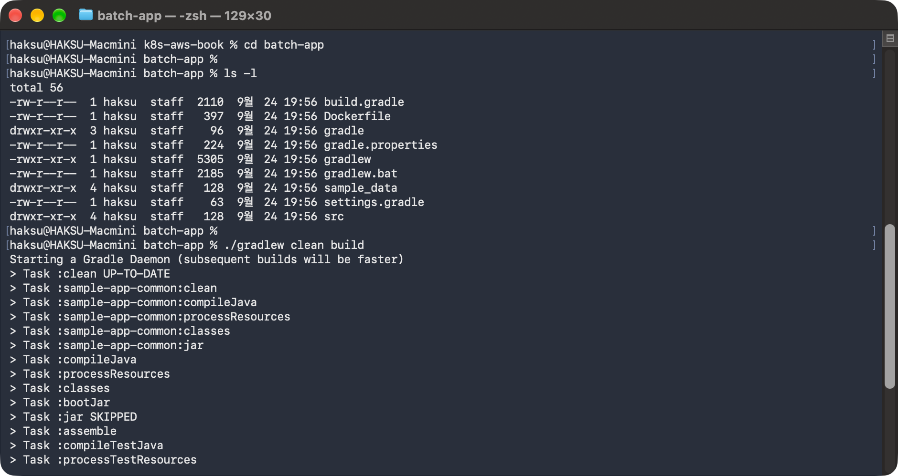
2. 결과 파일 확인
	```plain text
ls -l build/libs
	```
	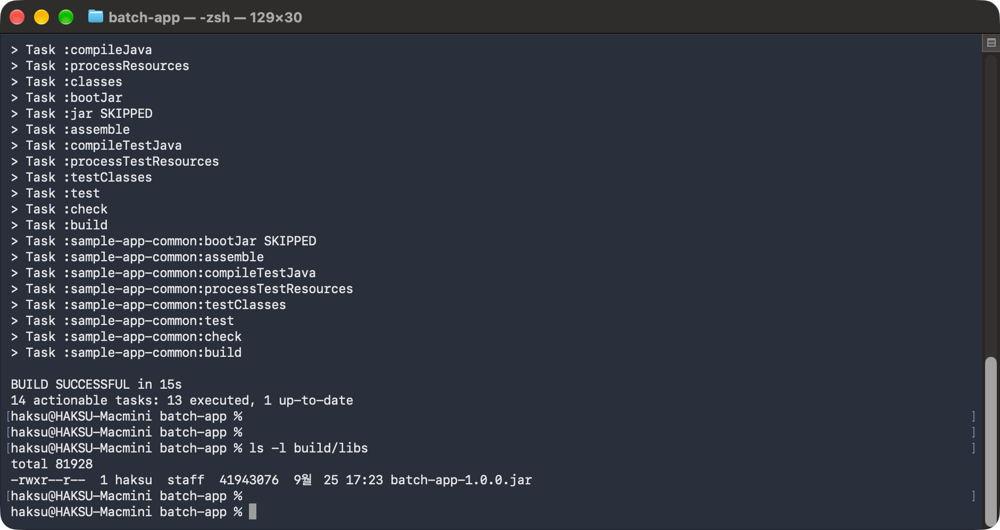
### 2.2. 컨테이너 이미지 생성
```plain text
docker build \
  --platform linux/amd64 \
  -t k8sbook/batch-app:1.0.0 \
  --build-arg JAR_FILE=build/libs/batch-app-1.0.0.jar \
  .
```
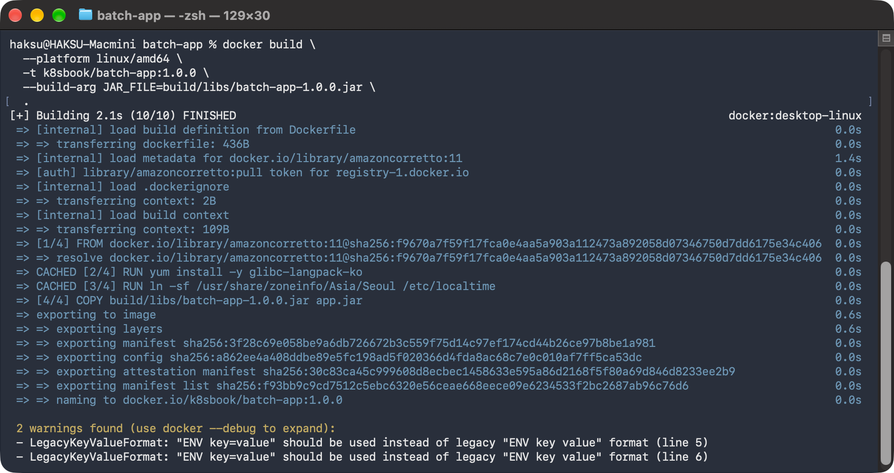
## 3. ECR 레포지토리 생성
1. AWS Management Console → Create repository
2. Repository name : `k8sbook/batch-app` → Create
	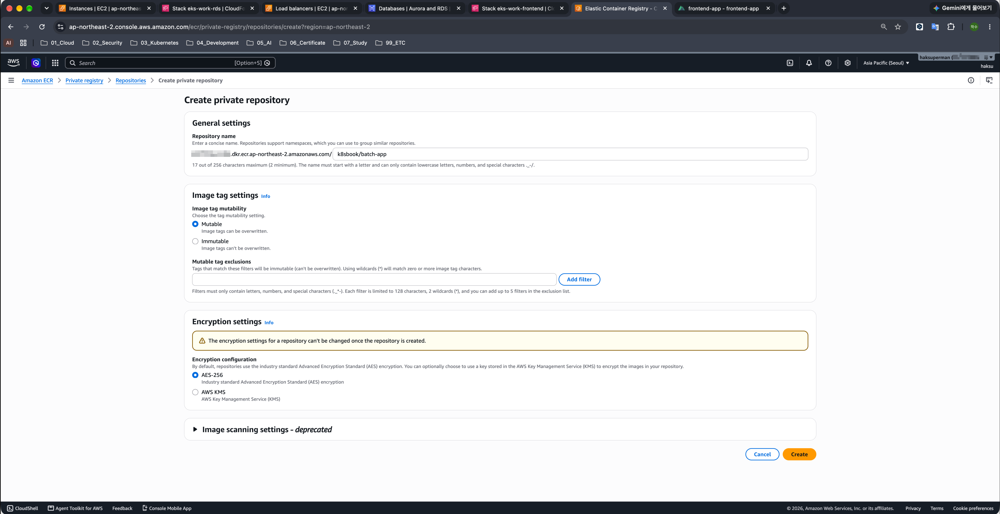
3. 생성 확인
	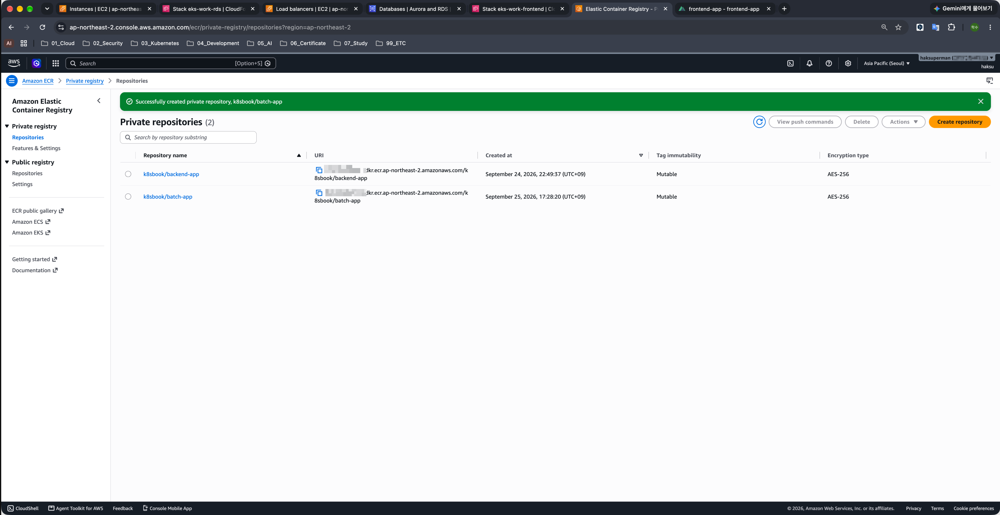
## 4. 컨테이너 이미지 푸시
### 4.1. ECR 로그인
1. AWSCLI 명령을 통해 로그인<br>(로그인 후 12시간이 지난 경우 재로그인 필요)
	```bash
aws ecr get-login-password --region ap-northeast-2 | \
pipe> docker login --username AWS --password-stdin \
pipe> &lt;AWS_ACCOUNT_ID&gt;.dkr.ecr.ap-northeast-2.amazonaws.com
	```
	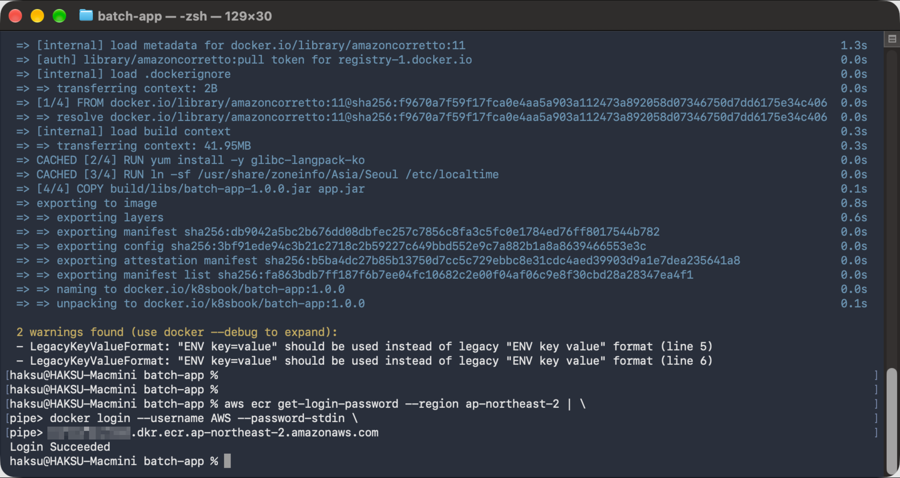
### 4.2. 컨테이너 이미지 태그 생성과 푸시
1. 태그 부착
	```bash
docker tag k8sbook/batch-app:1.0.0 \
&lt;AWS_ACCOUNT_ID&gt;.dkr.ecr.ap-northeast-2.amazonaws.com/k8sbook/batch-app:1.0.0
	```
	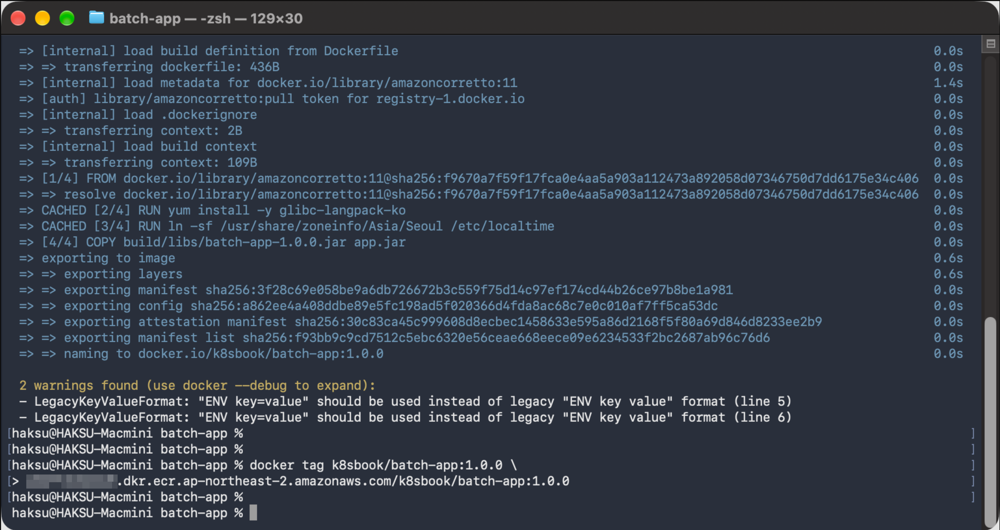
2. ECR에 이미지 푸시
	```bash
docker push &lt;AWS_ACCOUNT_ID&gt;.dkr.ecr.ap-northeast-2.amazonaws.com/k8sbook/batch-app:1.0.0
	```
	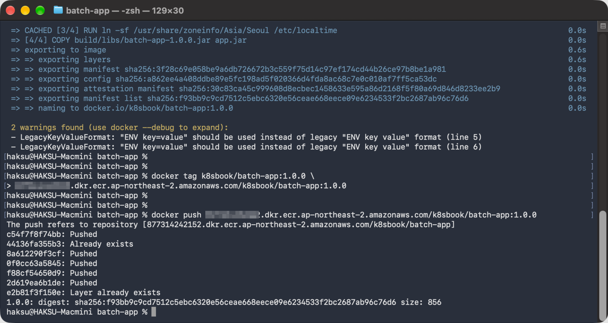
## 5. S3 버킷 생성
1. AWS Management Console → CloudFormation → Create stack → With new resources (Standard)
2. eks-env/40_s3_batch_cfn.yaml 업로드
	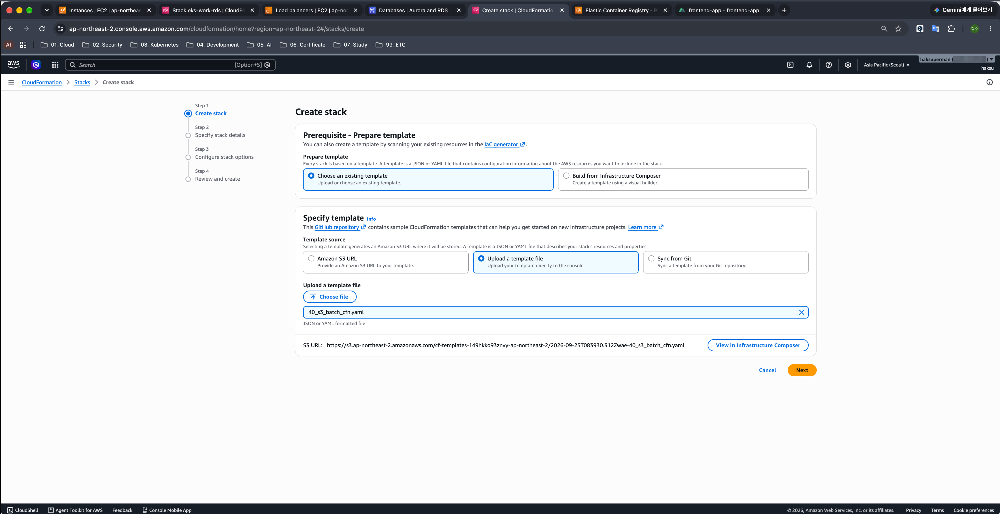
3. Stack name : eks-work-batch
4. BucketSuffix : haksu
	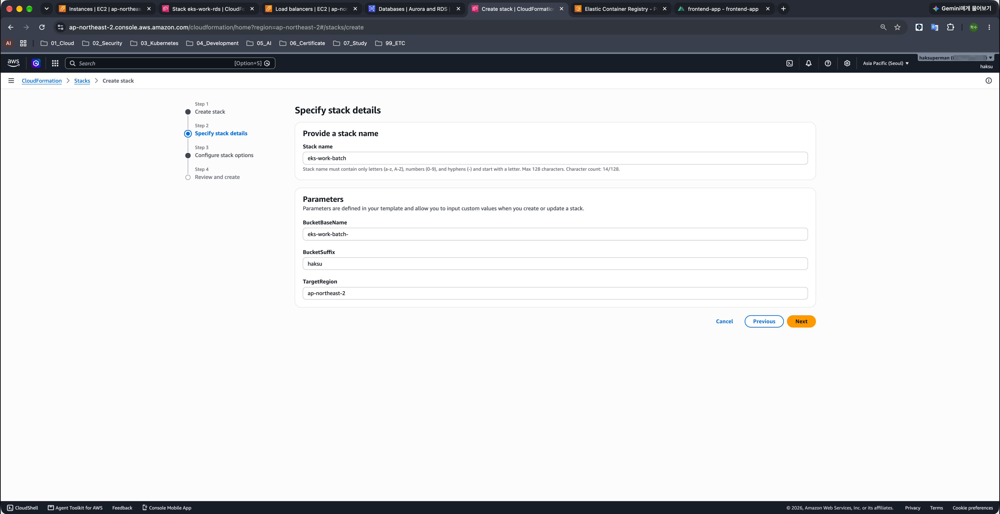
5. 생성 확인
	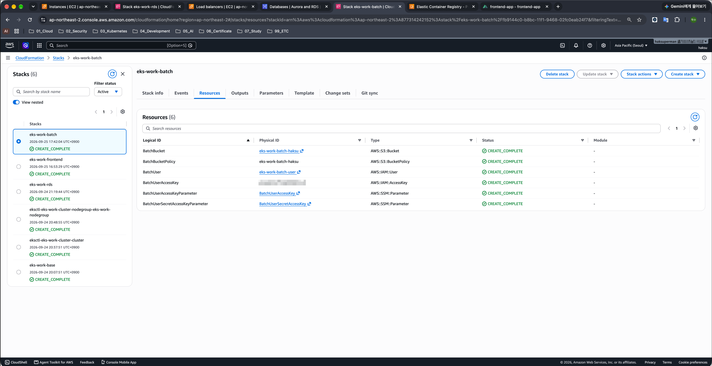
## 6. 컨피그맵 생성
1. Kubernetes에서 설정 값 등을 보관하기 위한 구조로, S3 버킷 이름과 S3의 디렉터리 이름을 보관
2. 경로 이동 및 ConfigMap 생성
	```bash
cd k8s-aws-book/eks-env

BUCKET_SUFFIX=<eks-work-batch 스택의 BucketSuffix 값> \
envsubst < 41_config_map_batch_k8s.yaml.template | kubectl apply -f -
	```
	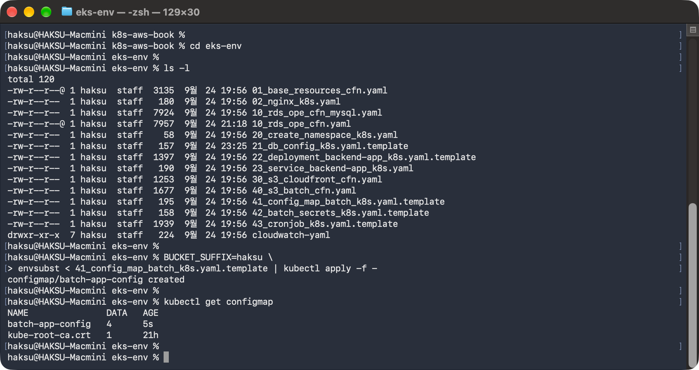
## 7. S3 접속용 액세스 키 확인과 시크릿 생성
### 7.1. 액세스 키 확인
1. AWS Management Console → Systems Manager → Parameter Store
2. BatchUserAccessKey / BatchUserSecretKey 확인
	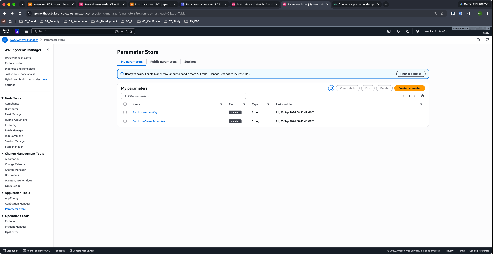
### 7.2. Secret 생성
1. Parameter Store 내 각 Value 확인
2. Kubernetes Secret 생성
	```bash
AWS_ACCESSKEY=&lt;AccessKey&gt; \
AWS_SECRETKEY=&lt;SecretKey&gt; \
envsubst < 42_batch_secrets_k8s.yaml.template | kubectl apply -f -
	```
	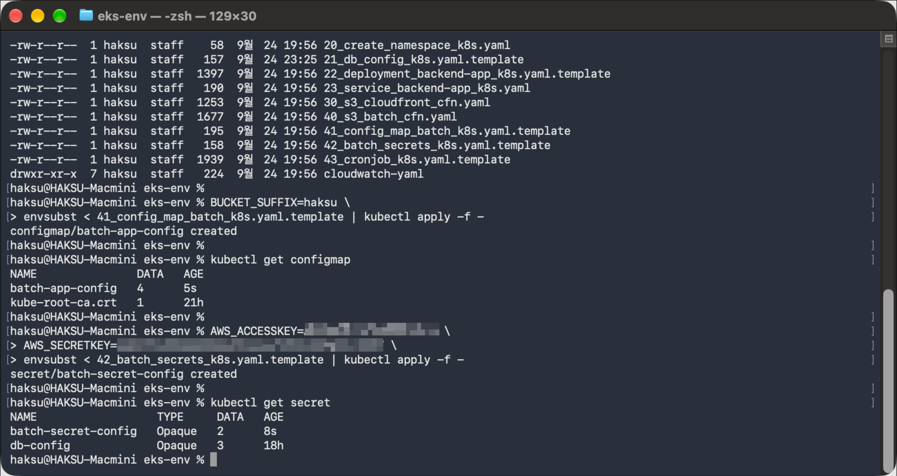
## 8. 입력 파일 업로드
1. AWSCLI를 통해 배치 애플리케이션이 사용할 입력 파일 업로드
	```bash
aws s3 sync ../batch-app/sample_data/normal \
s3://eks-work-batch-<BucketSuffix값>/locationData --delete --include "*"
	```
	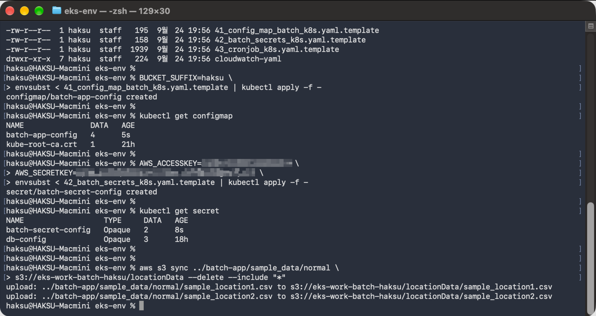
## 9. 배치 애플리케이션 배포
배치 프로그램 실행 전후 비교를 위해 사전 DB 내용 확인 예정
### 9.1. 데이터베이스 내용 확인
1. AWS Management Console → Session Manager → Start Session
2. Bastion Host 선택 → Start session
	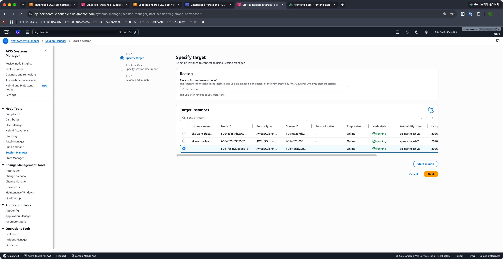
3. RDS 접속
	```bash
psql -U mywork -h <RDS 엔드포인트 주소> myworkdb
Password for user mywork: <RDS 사용자 패스워드>
	```
	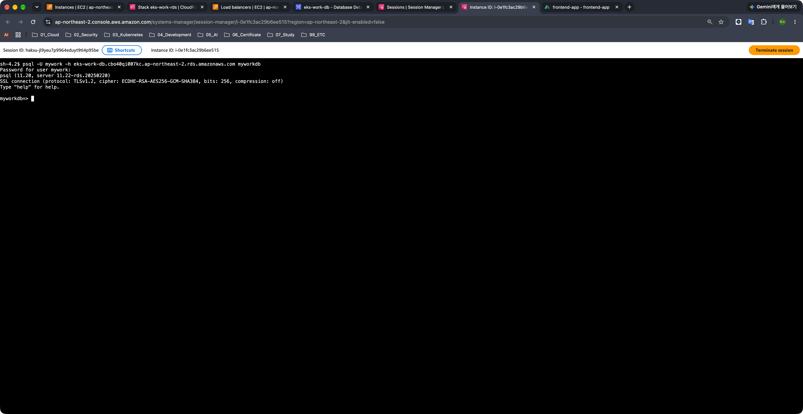
4. location 테이블 확인
	```sql
select * from location limit 50;
	```
	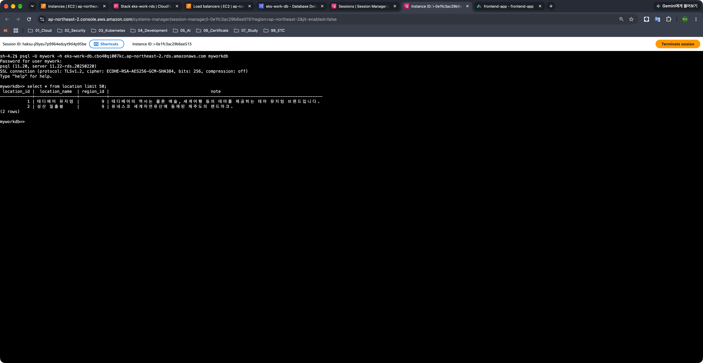
### 9.2. S3 버킷 상태 확인
1. AWS Management Console → S3 → `eks-work-batch-`로 시작하는 버킷 선택
2. locationData 폴더 확인
	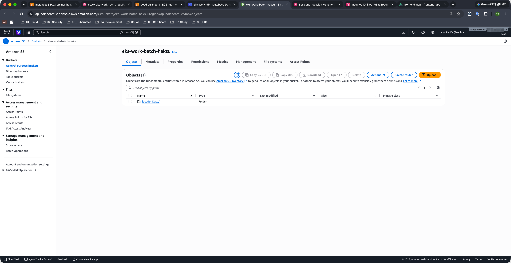
3. locationData 폴더 내 파일 확인
	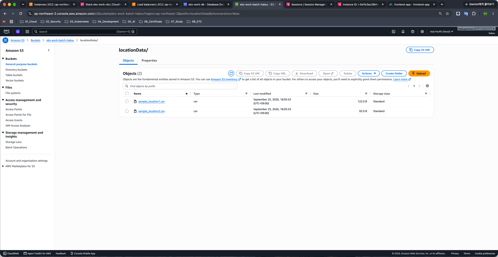
### 9.3. 배치 애플리케이션 배포
1. 크론잡 배포
	```bash
ECR_HOST=&lt;AWS_ACCOUNT_ID&gt;.dkr.ecr.ap-northeast-2.amazonaws.com \
envsubst < 43_cronjob_k8s.yaml.template | \
kubectl apply -f -
	```
	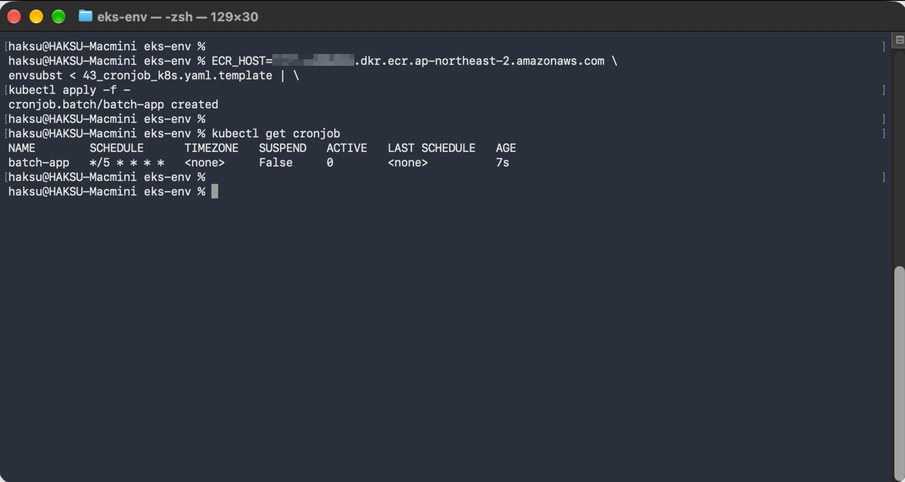
2. 크론잡 동작 확인 (1) - 배치 프로그램 파드 생성
	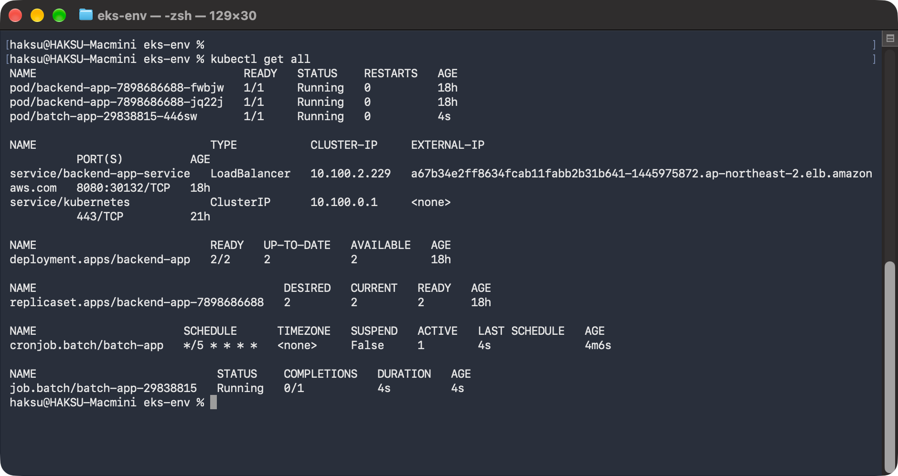
3. 크론잡 동작 확인 (2) - 배치 프로그램 파드 Completed 상태
	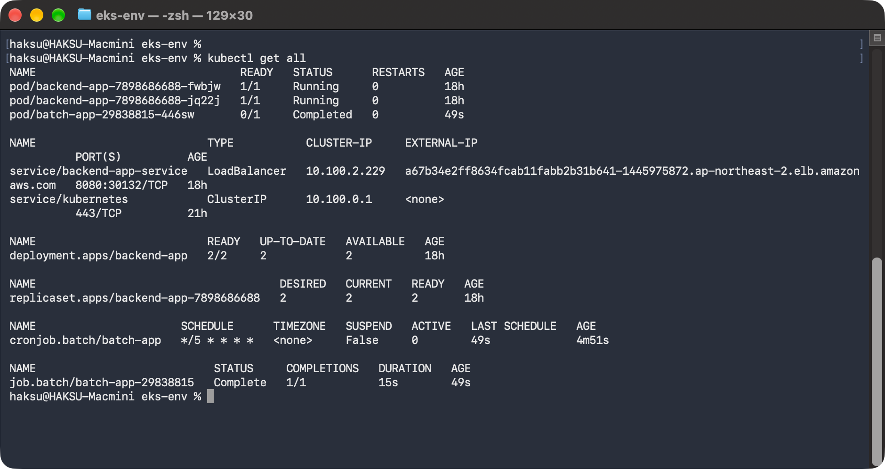
→ pod/batch-app- 라는 이름으로 시작되는 파드는 5의 배수 분만큼의 시간이 지날 때마다 하나씩 생성되고 완료된다.
### 9.4. 배치 애플리케이션 실행 후 확인
1. location 테이블 재확인
	```sql
select * from location limit 50;
	```
	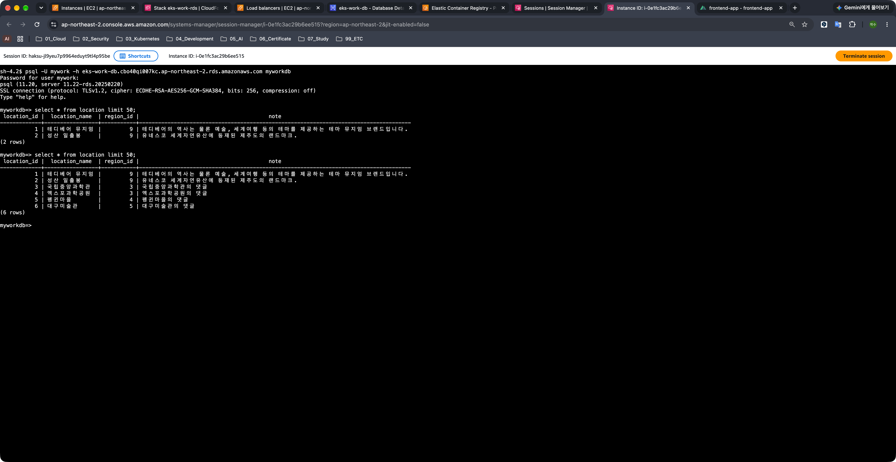
2. S3 데이터 파일(.csv) 확인 → DB에 등록된 대상 데이터 파일 삭제된 것 확인
	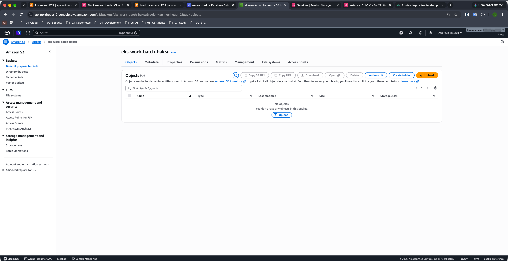
