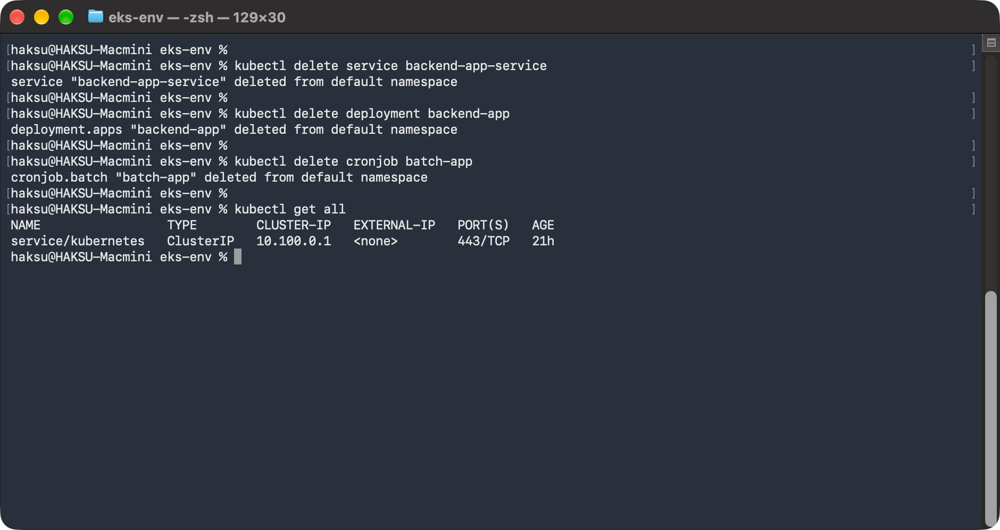
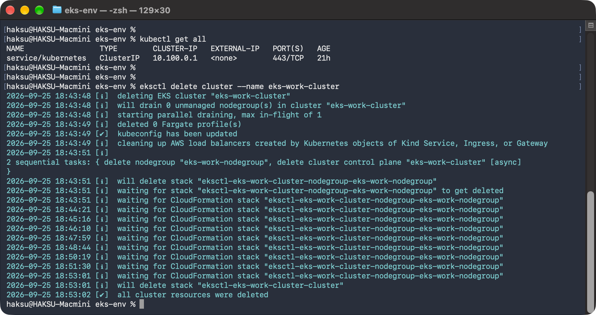
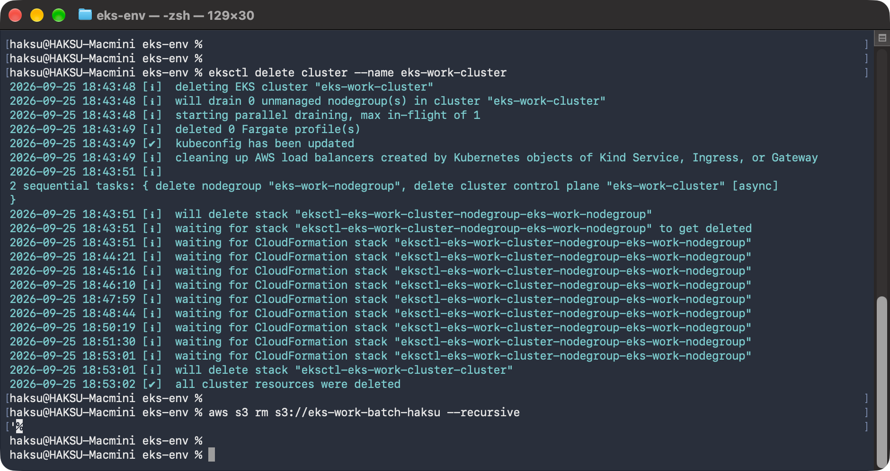
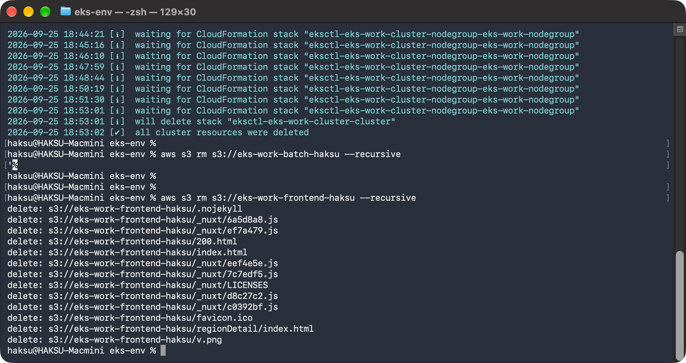

# 07. 예제 애플리케이션 삭제

> 마지막 편집: 2026-09-25T09:58:02.222Z

## 1. 리소스 삭제 순서

1. Kubernetes 상의 애플리케이션, 서비스 삭제
2. EKS 클러스터 삭제
3. 배치 애플리케이션용 S3 버킷 비우기
4. 프론트엔드 애플리케이션용 S3 버킷 비우기
5. 배치 애플리케이션용 S3 버킷 삭제
6. 프론트엔드 애플리케이션용 S3 버킷과 CloudFront 배포 삭제
7. 데이터베이스와 Bastion Host 삭제
8. 기본 리소스 삭제

## 2. Kubernetes 상의 애플리케이션, 서비스 삭제

```bash
kubectl delete service backend-app-service

kubectl delete deployment backend-app

kubectl delete cronjob batch-app

kubectl get all
```



## 3. EKS 클러스터 삭제

```bash
eksctl delete cluster --name eks-work-cluster
```



## 4. 배치 애플리케이션용 S3 버킷 비우기

```bash
aws s3 rm s3://eks-work-batch-haksu --recursive
```



## 5. 프론트엔드 애플리케이션용 S3 버킷 비우기

```bash
aws s3 rm s3://eks-work-frontend-haksu --recursive
```



## 6. 배치 애플리케이션용 S3 버킷 삭제

eks-work-batch Stack 삭제

## 7. 프론트엔드 애플리케이션용 S3 버킷과 CloudFront 배포 삭제

eks-work-frontend Stack 삭제

## 8. 데이터베이스와 Bastion Host 삭제

eks-work-base Stack 삭제
