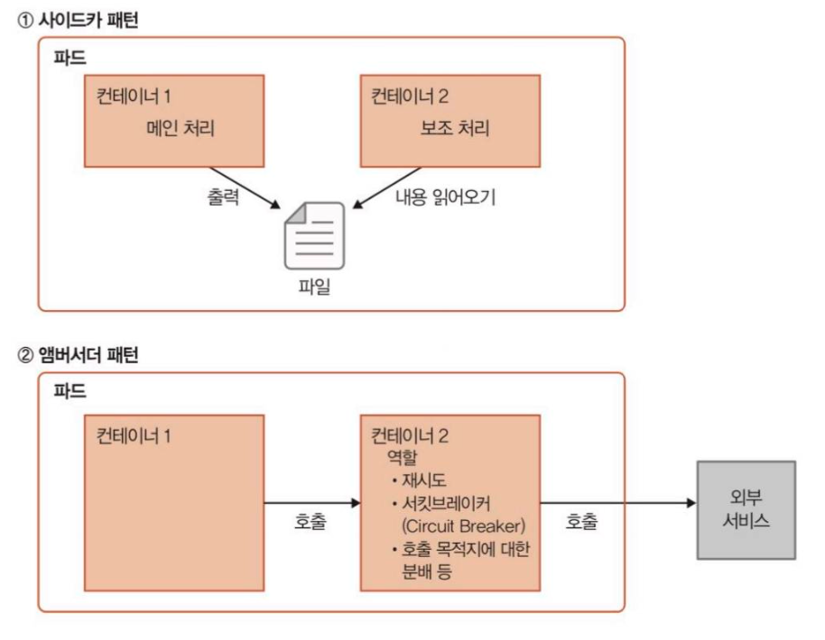
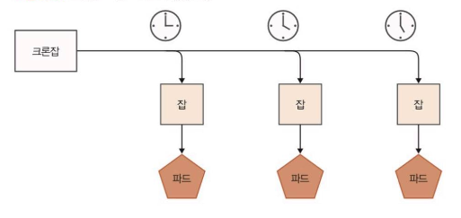

# 08. 컨테이너를 동작시키기 위한 리소스

> 마지막 편집: 2026-09-26T10:48:23.735Z

## 1. 쿠버네티스에서 프로그램을 동작시키는 기본 단위 ‘파드’

### 1.1. 정의

- 쿠버네티스에서 프로그램을 동작시킬 때 생성되는 오브젝트의 최소 단위는 컨테이너가 아닌 파드(Pod)다.
- 파드(Pod)란, 서로 관련성이 있는 하나 이상의 컨테이너를 합쳐놓은 오브젝트이다.

### 1.2. nginx 컨테이너 단독 구성

아래 명령은 `kubectl`이라는 쿠버네티스 클러스터 관리 도구를 이용해 YAML 형식으로 작성된 매니페스트를 클러스터에 적용하는 명령이다.

```bash
kubectl apply -f 02_nginx_k8s.yaml
```

즉, 02_nginx_k8s.yaml 파일에 정의된 오브젝트가 쿠버네티스 위에 생성된다.<br>(생성된 경우 업데이트)

```yaml
apiVersion: v1
kind: Pod
metadata:
  name: nginx-pod
  labels:
    app: nginx-app
spec:
  containers:
  - name: nginx-container
    image: nginx
    ports:
      - containerPort: 80
```

1. `apiVersion:`
1. v1은 이 매니페스트 파일에서 정의된 오브젝트가 준수해야 하는 사양의 버전을 설정한다.
1. 여기서는 파드를 정의하는 사양에는 v1이라는 버전이 있고 그것을 설정한 것이다.
1. `kind:`
1. Pod는 이 매니페스트 파일이 파드라는 종류의 오브젝트라는 것을 의미한다.
1. `metadata:`
1. `name:` : nginx-pod는 파드 이름을 설정하는 것으로 nginx-pod라는 이름을 선언한다.
1. `app:` nginx-pod는 labels 아래에 있는 내용으로 파드에 레이블을 설정한다.<br>(Key-Value 형식으로 app이라는 키에 대해 nginx-app라는 값을 설정)
1. `spec:`
1. `containers:` : 배열을 통해 여러 개의 컨테이너를 구성할 수 있다.
1. `name:` : nginx-container는 컨테이너의 이름이다.
1. `image:` : 어떤 컨테이너 이미지를 사용할지 설정한다.
1. `containerPort:` 이 컨테이너를 공개할 포트를 설정한다.

### 1.3. 쿠버네티스의 레이블

Deployment나 Service 같은 다양한 리소스를 식별하기 위해 레이블을 사용한다.
즉, 리소스들이 대상으로 하는 파드를 특정 짓기 위해 레이블을 이용한다.<br>(Deployment나 Service 매니페스트의 Selector: 항목에 대상 파드의 레이블을 입력)
nodeSelector를 통해 파드를 동작시킬 노드를 지정할 수도 있다.

### 1.4. 컨테이너 여러 개를 포함한 파드

컨테이너 여러 개가 모여 하나의 통합된 서비스를 제공하는 경우 사용된다.
파드 하나에 포함되는 여러 컨테이너들은 아래의 특징이 있다.

- 로컬 호스트(localhost)로 서로 통신 가능
- 스토리지(볼륨) 공유 가능
- 반드시 함께 동작 및 정지
→ 어떤 컨테이너가 다른 컨테이너와 네트워크나 스토리지를 공유하여 밀접하게 처리해야 하는 작업이 있고, 컨테이너끼리 1:1로 대응해야 한다면 컨테이너들이 파드 하나에 포함되어야 한다.
- 메인 처리를 실행하는 컨테이너가 출력한 로그를 다른 컨테이너가 읽어 들여 로그 수집 서버나 메트릭 수집 서버에 전송
- 메인 처리를 실행하는 컨테이너가 외부 시스템에 접속할 경우, 또 다른 컨테이너가 프록시로 되어 목적지를 할당하거나 요청이 제대로 처리되지 않았을 때 재시도 수행
→ 메인 처리를 실행하는 컨테이너 옆에 보조 역할을 하는 컨테이너를 배치하는 구성을 사이드카 패턴이라고 한다. <br>특히 2번과 같이 파드 외부와 통신 구조 사이에 프록시가 배치되어 통신에 대한 보조적인 역할을 하는 구성을 앰버서더 패턴이라고 한다.

메인 처리하는 컨테이너에 보조 기능을 함께 구현하면 애플리케이션이 복잡해진다.
이때 사이드카 패턴을 사용해 메인 처리하는 컨테이너에서 보조 기능을 분리하여 메인 처리를 단순화해 구현할 수 있다.
또 보조 기능을 다른 컨테이너로 분리하면 사이드카 부분의 재사용이 쉬워진다.

### 1.5. 파드 초기화 컨테이너 (Pod Init Container)

메인 컨테이너를 동작시키기 위해 초기화 처리를 위해 구성하는 컨테이너이다.
Init Container는 여러 개 설정할 수 있다.
초기화 컨테이너에 의한 처리는 메인 컨테이너 안에서 구현할 수도 있다. 하지만 초기화 컨테이너로 분리하면 아래의 장점을 얻을 수 있다.

- 애플리케이션 자체에 필요 없는 도구를 사용하여 초기화 처리 가능
- 메인 컨테이너의 보안성을 낮추는 도구를 초기화 컨테이너에 분리시켜 안전하게 초기화 처리 가능
- 초기화 처리와 애플리케이션을 서로 독립시켜 빌드, 배포 가능
- 초기화 처리에만 필요하고 애플리케이션 처리에는 필요 없는 비밀 정보를 메인 컨테이너에서 제외 가능<br>(초기화 컨테이너에서는 참조할 수 있지만 메인 컨테이너에서는 참조할 수 없는 시크릿을 설정)
- 메인 컨테이너를 생성시키는 어떤 조건을 설정하고 그 조건이 성립될 때까지 메인 컨테이너 생성 차단 가능<br>(초기화 컨테이너가 모두 종료될 때까지 메인 컨테이너가 시작되지 않음)

## 2. 파드의 다중화, 버전 업데이트, 롤백을 구현하는 디플로이먼트

## 3. 디플로이먼트 하위에서 생성되는 레플리카셋

## 4. kubectl describe 명령으로 상세 정보 수집

## 5. 크론잡으로 스케줄 동작

### 5.1. 크론잡의 정의

리눅스 등의 OS에서 사용하는 크론과 같은 개념으로, 쿠버네티스 클러스터에서 동작하기 때문에 크론잡이 동작시키는 대상은 컨테이너이다.
아래 예제와 같이 ECR 주소를 `envsubst` 명령어로 치환한 매니페스트를 `kubectl apply` 명령으로 적용하는 활용도 가능하다.

```bash
ECR_HOST=<AWS_ACCOUNT_ID>.dkr.ecr.ap-northeast-2.amazonaws.com \
envsubst < 43_cronjob_k8s.yaml.template | \
kubectl apply -f -
```

치환한 매니페스트의 예제는 다음과 같다.

```yaml
apiVersion: batch/v1
kind: CronJob
metadata:
  name: batch-app
spec:
  schedule: "*/5 * * * *" # min hour day-of-month month day-of-week
  jobTemplate:
    spec:
      template:
        spec:
          containers:
          - name: batch-app
            image: 999988887777.dkr.ecr.ap-northeast-2.amazonaws.com/k8sbook/batch-app:1.0.0
            imagePullPolicy: Always
            env:
            - name: DB_URL
              valueFrom:
                secretKeyRef:
                  key: db-rul
                  name: db-config
            - name: DB_USERNAME
              valueFrom:
                secretKeyRef:
                  key: db-username
                  name: db-config
            - name: DB_PASSWORD
              valueFrom:
                secretKeyRef:
                  key: db-password
                  name: db-config
            - name: CLOUD_AWS_CREDENTAIL_ACCESSKEY
              valueFrom:
                secretKeyRef:
                  key: aws-accesskey
                  name: batch-secret-config
            - name: CLOUD_AWS_CREDENTAIL_SECRETKEY
              valueFrom:
                secretKeyRef:
                  key: aws-secretkey
                  name: batch-secret-config
            - name: CLOUD_AWS_REGION_STATIC
              valueFrom:
                configMapKeyRef:
                  key: aws-region
                  name: batch-app-config
            - name: SAMPLE_APP_BATCH_BUCKET_NAME
              valueFrom:
                configMapKeyRef:
                  key: bucket-name
                  name: batch-app-config
            - name: SAMPLE_APP_BATCH_FOLDER_NAME
              valueFrom:
                configMapKeyRef:
                  key: folder-name
                  name: batch-app-config
            - name: SAMPLE_APP_BATCH_RUN
              valueFrom:
                configMapKeyRef:
                  key: batch-run
                  name: batch-app-config
          restartPolicy: OnFailure
```

1. `apiVersion:` : 크론잡에 대한 API 버전
2. `kind:` : 크론잡이라는 리소스 타입 설정
3. `metadata:<br>  name: batch-app` : 크론잡의 이름
4. `spec:`
5. `schedule: "*/5 * * * *" # min hour day-of-month month day-of-week` : 크론잡의 스케줄 정의 (5분 마다 실행)
6. `jobTemplate:` : 매번 실행되는 내용(잡)
7. `containers:` : 실행할 컨테이너의 정의
8. `env:` : 여러 개의 Secret과 configMap에서 값을 가져온 환경 변수
9. `restartpolicy:` 크론잡을 재시작하는 조건

## 6. 크론잡에서의 실행 내용

### 6.1. 실행 구조

실행 시각이 되면 내부적으로 잡이라는 리소스가 생성 → 잡 안에 파드 생성 → 파드에서 컨테이너 동작은 디플로이먼트와 동일


### 6.2. 잡 리소스

잡(Job)은 일정한 처리를 수행하고 완료하는 태스크를 실행하기 위한 것이다.
디플로이먼트의 경우, 디플로이먼트→레플리카셋→파드라는 계속적으로 동작하는 것을 기대하는 반면,
잡의 경우, 잡→파드라는 흐름으로 일정한 처리가 끝나면 프로그램을 종료하고 태스크로도 ‘완료’ 상태가 되기를 원하는 경우 사용한다.

## 7. 잡 리소스의 동작

### 7.1. 잡 실행 수

잡 리소스는 설정 내용에 따라 여러 개의 처리를 병렬로 실행할 수 있다.
`.spec.completions` 는 그 잡이 완료될 때까지 실행 종료해야 하는 파드 수를 나타낸다.<br>기본 값은 1로, 파드 하나가 정상 종료되면 그 잡은 완료됨을 의미한다.
`.spec.parallelism` 은 그 잡을 실행할 때 병렬로 실행되는 파드 수를 의미한다.<br>기본 값은 1로, 병렬 실행을 수행하지 않음을 의미한다.

### 7.2. 잡 실행 패턴

두 파라미터를 이용해 다음과 같은 잡 실행 패턴을 구현할 수 있다.

1. 단일 파드를 실행하는 실행 패턴
    `.spec.completions` 와 `.spec.parallelism` 모두 기본 값(1)을 사용하는 경우, 잡 리소스 1에 대해 파드 하나가 생성되며 그 파드가 정상 종료되면 잡이 완료된다.
2. 완료해야 할 파드 수를 설정하는 실행 패턴
    `.spec.completions` 를 설정한 경우 `.spec.completions` 로 설정한 수의 파드가 정상 종료되면 그 잡은 완료된다.
    이 때, `.spec.parallelism` 은 필수가 아니지만 설정한 수만큼 파드가 병렬로 실행된다. (미설정 시 병렬 실행 없이 하나씩 실행)
3. 작업 큐형 실행 패턴
    동시에 파드 여러 개를 실행하고 작업 큐를 순차적으로 처리하는 패턴이다.
    큐, 데이터베이스, 파일 등 상관없이 외부 처리 대상을 유지하고 그것을 순차적으로 처리한다.
    처리 대상이 없어지면 완료 처리가 된다.
    `.spec.completions` 은 설정하지 않고, `.spec.parallelism` 을 설정하여 실행한다.

### 7.3. 잡 재시도 횟수

`.spec.backoffLimit` 파라미터는 잡에서 생성된 파드가 비정상 종료한 경우 몇 번을 재실행할지 설정하는 것으로, 기본 값은 6이다.
지수 백오프 지연(exponential back-off)는 처리를 여러 번 재실행할 때 횟수가 증가함에 따라 재실행을 다시 할 때까지의 대기 시간을 지수 함수적으로 증가시키는 것이다.
같은 간격으로 처리 재실행을 반복하면 비정상 종료한 처리가 많아질 수 있다. 그러나 **지수 백오프를 사용하면 처음 처리가 진행된 후 시간이 지나면서 재실행 간격이 늘어나기 때문에 비정상 종료한 처리 수보다 동시에 실행되는 처리 수가 줄어들게 된다.**
지수 백오프는 처리가 증가하는 상황을 막기 위해 사용한다.
잡 리소스에서 지수 백오프는 상한이 6분으로 되어 있어 최대 6분 간격으로 재실행한다.

## 8. 크론잡 고유의 설정과 유의점

### 8.1. 스케줄 정의

`.spec.schedule` 은 잡 실행의 스케줄을 정의하는 것으로, 크론과 같이 스페이스로 구분한 문자열로 설정한다.
각 항목은 ‘분’, ‘시’, ‘일’, ‘월’, ‘요일’을 의미한다.
<table>
<colgroup>
<col width="75.6640625">
<col width="224.66666666666666">
<col width="170.6640625">
<col width="168.015625">
</colgroup>
<tr>
<td>No</td>
<td>설정값</td>
<td>값의 범위</td>
<td>비고</td>
</tr>
<tr>
<td>1</td>
<td>분</td>
<td>0\~59</td>
<td></td>
</tr>
<tr>
<td>2</td>
<td>시</td>
<td>0\~23</td>
<td></td>
</tr>
<tr>
<td>3</td>
<td>일</td>
<td>1\~31</td>
<td></td>
</tr>
<tr>
<td>4</td>
<td>월</td>
<td>1\~12</td>
<td></td>
</tr>
<tr>
<td>5</td>
<td>요일</td>
<td>0\~6</td>
<td>0은 일요일을 의미</td>
</tr>
</table>
아래의 예제는 매 시 0분, 5분, 10분과 같이 5분 간격으로 실행한다는 것을 의미한다.

```bash
*/5 * * * *
```

또한, 3-58/5와 같이 범위를 지정하여, 매 시 3분, 8분, 13분, … 58분과 같이 0분으로 시작하지 않는 형태의 간격으로도 실행 가능하다.
크론잡에서 설정한 시각은 마스터 노드의 타임존에 따라 달라지며, EKS에서는 Control Plane의 kube-controller-manager에 의해 정해진다.
따라서, cronJob 매니페스트에 `spec.timeZone:` 을 명시하는 것이 바람직하다.

### 8.2. 동시 실행 제어

`.spec.concurrencyPolicy` 는 이전에 스케줄링된 잡 실행이 미완료인 상태에서 다음 스케줄 시각에 도달 했을 때 어떻게 동작할지를 결정한다.
Allow, Forbid, Replace의 값 설정이 가능하며, 기본 값은 Allow이다.
<table>
<colgroup>
<col width="112.6640625">
<col width="224.66666666666666">
<col width="275.6015625">
</colgroup>
<tr>
<td>No</td>
<td>설정 값</td>
<td>비고</td>
</tr>
<tr>
<td>1</td>
<td>Allow</td>
<td>동시 실행 허가 (기본 값)</td>
</tr>
<tr>
<td>2</td>
<td>Forbid</td>
<td>실행 중인 잡을 남기고 신규 잡 생성은 건너뛰기</td>
</tr>
<tr>
<td>3</td>
<td>Replace</td>
<td>실행 중인 잡을 종료하고 신규로 잡 생성</td>
</tr>
</table>
### 8.3. 크론잡으로 동작시키는 컨테이너를 개발할 때의 주의점
기본적으로 크론잡은 한 번의 실행 시점에 잡 하나가 생성되고, 드물게 여러 개의 잡이 생성되는 경우도 있으므로 잡은 멱등성을 갖도록 작성해야 한다.<br>즉, 잡을 몇 번을 실행해도 같은 상태가 되어야 한다.
배치 애플리케이션은 멱등성을 갖도록 만드는 것이 운영을 고려했을 때 많은 장점을 갖는다.
## 9. 컨테이너를 동작시키기 위한 기타 리소스
### 9.1. 노드 각각에 반드시 파드 하나를 동작시키는 데몬셋
데몬셋은 정의된 파드가 클러스터에 속한 워커 노드 별로 하나씩 동작하게 된다.
로그 수집용 에이전트를 노드 각각에 배포해야 하는 상황에 주로 사용된다.
일반적인 애플리케이션 개발에 사용하기 위한 것으로, 컨테이너를 동작시키기 위한 리소스는 아니다. 클러스터 내부에서 공통으로 사용하는 기능을 구현하기 위한 리소스라고 생각하면 쉽다.
### 9.2. 영구 데이터를 다루기 위한 스테이트풀셋
레플리카셋 혹은 디플로이먼트를 사용하면 파드가 비정상 종료된 경우에도 자동으로 파드를 재시작하거나 다른 노드에 재생성하여 특정 파드 수를 유지할 수 있는 구조도 되어 있다.
하지만 이 경우 재시작된 파드는 항상 초기화된 상태로 동작한다. (컨테이너 이미지를 통해 생성되기 때문)
저장해서 유지해야 할 데이터가 필요한 경우 파드를 재시작하면 데이터가 초기화되어 문제가 될 수 있다.
이를 위해 **파드 외부에 볼륨 형태로 데이터를 저장한 후 파드가 재시작되더라도 사용했던 볼륨을 그대로 사용할 수 있도록 스테이트풀셋 리소스가 사용된다.**
> Stateless vs Stateful
> - 스테이트리스(Stateless) : 고유의 상태를 갖지 않고, 모든 파드가 같은 상태를 갖는 것<br>ex. ReplicaSet, Deployment
> - 스테이트풀(Stateful) : 파드 별로 고유의 상태를 갖는 것<br>ex. StatefulSet
## 10. 네임스페이스
### 10.1. 기본 표준 네임스페이스
1. default : 명시적으로 네임스페이스를 설정하지 않았을 때 사용되는 네임스페이스
2. kube-system : 쿠버네티스에 의해 생성하는 오브젝트가 사용하는 네임스페이스
3. kube-public : 모든 사용자(미인증 사용자 포함)가 참조할 수 있는 네임스페이스
### 10.2. 사용자 정의 네임스페이스
eks-work라는 네임스페이스를 별도로 생성해 Deployment와 CronJob과 같은 리소스를 해당 네임스페이스에 생성할 수 있다.
kubectl get 명령에서는 네임스페이스를 명시적으로 설정하지 않은 경우, 컨텍스트에서 설정된 네임스페이스의 리소스만 표시된다.
네임스페이스를 분리하여 사용자 또는 그룹 별로 할당해 사용하면 리소스를 구별하기 쉬우며, 같은 이름이 충돌하거나 다른 사용자의 리소스를 실수로 변경하는 등의 사고를 막을 수 있다.
kubectl 명령어의 —namespace 옵션을 통해 다른 네임스페이스에 대한 리소스 조작이 가능하다. (아래 리소스 제한 설정이 없을 때)
### 10.3. 네임스페이스를 이용한 클러스터 리소스 제한
단순 리소스를 배치하는 논리적 구분 외에도 리소스 쿼터, 네트워크 정책, RBAC의 구조가 있다.<br>이를 함께 사용하면 리소스 사용량과 네트워크 통신 제한 또는 클러스터에 대한 권한 제어를 실행할 수 있다.
쿠버네티스 클러스터를 여러 사용자 또는 그룹에서 공용으로 사용할 경우 네임스페이스를 이용해 여러 가지 제약을 설정해야 하며, 운영상 중요한 역할을 담당한다.
### 10.4. 네임스페이스를 정의할 매니페스트 파일
예제 코드는 다음과 같다.

```yaml
apiVersion: 1
kind: Namespace
metadata:
  name: eks-work
```

1. `kind:` : 네임스페이스를 설정하고 이 매니페스트 파일이 네임스페이스의 정의임을 나타낸다.
2. `metadata:<br>  name: eks-work` : 생성한 네임스페이스 이름을 설정한다.
<br>
