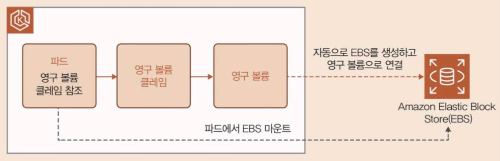

# 10. 설정 정보 등을 안전하게 저장하는 구조

> 마지막 편집: 2026-09-26T11:37:00.656Z

## 1. 환경 변수 값 전달

모던 애플리케이션 개발 방법론으로 The Twelve-Factor App이 자주 소개된다. 그 중 ‘애플리케이션 설정 정보는 환경 변수에 저장한다.’라는 정의가 있다.
개발 환경, 스테이징 환경, 서비스 환경 등에서 취급하는 설정 정보가 다르다는 점 때문에 애플리케이션을 다시 빌드하는 일이 없도록 하기 위해서다.
쿠버네티스에서도 이와 같은 설정 정보를 파드의 환경 변수로 안전하게 전달하는 구조가 있다.

## 2. 시크릿을 이용한 비밀 정보 전달

안전한 장소에 등록해두고 그 정보를 참조하는 방식으로 서비스를 구성해야 한다.<br>쿠버네티스에서는 시크릿(Secret)이라는 리소스를 이용해 그 구조를 구현한다.
다음 예제는 시크릿 리소스를 구성하는 매니페스트의 예제이다.

```yaml
apiVersion: v1
kind: Secret          # 1.
type: Opaque          # 2.
metadata:
  name: db-config     # 3.
stringData:           # 4.
  db-url: jdbc:postgresql://<RDS 엔드포인트 주소〉/myworkdb
  db-username: mywork
  db-password: 〈애플리케이션용 데이터베이스 사용자 비밀번호〉
```

1. `kind: Secret` : 시크릿 리소스를 사용한다는 의미이다.
2. `type: 0paque` : 시크릿 타입을 설정한다. Key-Value 형식의 쌍으로 등록할 경우 값을 0paque로 설정한다.
3. `name: db-config` : 시크릿 리소스의 이름이다.
4. `stringData:` : 실제 등록할 데이터를 Key-Value 형식으로 설정하며, 여러 개의 데이터를 입력할 수 있다.
다음 예제는 파드에서 시크릿을 참조하는 부분이다.

```yaml
        env:
        - name: DB_URL             # 1.
          valueFrom:
            secretKeyRef:          # 2.
              key: db-url          # 3.
              name: db-config      # 4.
        - name: DB_USERNAME
          valueFrom:
            secretKeyRef:
              key: db-username
              name: db-config
        - name: DB_PASSWORD
          valueFrom:
            secretKeyRef:
              key: db-password
              name: db-config
```

1. `name: DB_URL` : 파드에 설정할 환경 변수 이름을 설정한다.
2. `secretKeyRef:` : 시크릿에서 값을 참조함을 선언한다.
3. `key: db-url` : 시크릿 데이터 키 이름이다.
4. `name: db-config` : 시크릿 리소스 이름이다.
DB_URL, DB_USERNAME, DB_PASSWORD라는 환경 변수 3개가 dbconfig라는 이름의 시크릿에서 각각 db-rul, db-username, db-password라는 키에 설정된 값을 참조한다.

## 3. 시크릿을 사용할 때 주의할 점

쿠버네티스에 등록된 시크릿은 값을 직접 참조할 수 없다. 그러나 base64로 인코딩 되어 있는 경우 다음 실행 예제와 같이 해독하려고 하면 해독이 가능하다.
즉, 시크릿에 저장해 두는 것만으로는 보안이라고 말할 수 없다.
또한, 시크릿을 설정하는 매니페스트 파일을 그대로 깃허브에 공개하지 않도록 주의해야 한다.
구성 관리를 실행하는 경우 매니페스트 안의 비밀 정보를 암호화해두고 클러스터 내부에서 복호화하여 시크릿으로 등록하는 구조를 검토하는 것이 좋다.

```bash
# 시크릿 내용은 base64 인코딩되어 저장되어 있음
kubectl get secret db-config -o json | jq -r '.data'
{
 "db-password": "bj B2NmN3Vk3vUFBHdz9MKQ=",
 "db-url"： "amRiYzpwb3N0Z331c3FsOi8vZWtzLXdvcmstZGIuYzl4enF5Y2FlYzZyLmFwLW5vcnRoZWFzdC0yLnJkcy5hbWF6b25hd3MuY29tL215d29ya2Ri",
 "db-username"： "bX13b3Jr"
}
```

```bash
# base64로 디코딩하면 평문으로 출력 가능
kubectl get secret db-config -o json | jq -r.data["db-password"]' | \
base64 -d test-DB-URL # 실제 설정한 데이터베이스 비밀번호가 출력
```


## 4. 컨피그맵을 이용한 설정 정보 전달

비밀 정보가 아니라면 시크릿을 이용해 암호화할 필요 없이 평문으로 등록해도 된다. 이러한 경우에는 컨피그맵을 이용한다.
컨피그맵을 등록해두고 그것을 파드에서 참조하는 방식으로 이용한다. (시크릿과 거의 동일)

```yaml
apiVersion: v1
kind: ConfigMap             # 1.
metadata:
  name: batch-app-config    # 2.
data:                       # 3.
  bucket-name: eks-work-batch-${BUCKET_SUFFIX}
  folder-name: locationData
  batch-run: "true"
  aws-region: ap-northeast-2
```

1. `kind: ConfigMap` : 컨피그맵 리소스를 의미한다.
2. `name: batch-app-config` : 컨피그맵 리소스의 이름을 의미한다.
3. `data:` : 실제 등록한 데이터를 Key-Value 형식으로 설정하며, 여러 개를 등록할 수 있다.

```yaml
            env:
            - name: DB_URL
              valueFrom:
                secretKeyRef:
                  key: db-url
                  name: db-config
            - name: DB_USERNAME
              valueFrom:
                secretKeyRef:          # 1.
                  key: db-username
                  name: db-config
            - name: DB_PASSWORD
              valueFrom:
                secretKeyRef:
                  key: db-password
                  name: db-config
            - name: CLOUD_AWS_CREDENTIALS_ACCESSKEY
              valueFrom:
                secretKeyRef:
                  key: aws-accesskey
                  name: batch-secret-config
            - name: CLOUD_AWS_CREDENTIALS_SECRETKEY
              valueFrom:
                secretKeyRef:
                  key: aws-secretkey
                  name: batch-secret-config
            - name: CLOUD_AWS_REGION_STATIC
              valueFrom:
                configMapKeyRef:
                  key: aws-region
                  name: batch-app-config
            - name: SAMPLE_APP_BATCH_BUCKET_NAME
              valueFrom:
                configMapKeyRef:
                  key: bucket-name
                  name: batch-app-config
            - name: SAMPLE_APP_BATCH_FOLDER_NAME
              valueFrom:
                configMapKeyRef:
                  key: folder-name
                  name: batch-app-config
            - name: SAMPLE_APP_BATCH_RUN
              valueFrom:
                configMapKeyRef:
                  key: batch-run
                  name: batch-app-config
```

1. `configMapRef:` : 컨피그맵을 참조하며, 참조 방식은 시크릿과 매우 유사하다.<br>시크릿의 경우 valueFrom 아래를 secretKeyRef라고 설정했지만, 컨피그맵의 경우 valueFrom아래를 configMapKeyRef라고 설정한다.
등록된 컨피그맵은 시크릿과 달리 kubectl 명령으로 값을 참조할 수 있다.

> 쿠버네티스의 영구 볼륨(PV), 영구 볼륨 클레임(PVC)
> 파드 내부의 데이터는 파드가 정지되면 모두 삭제된다. 파드 내부의 데이터를 저장하고 싶은 경우 별도의 데이터를 영구 저장할 스토리지가 필요하다.
> 쿠버네티스에서는 영구 볼륨(PV)이라는 리소스로 스토리지를 정의하고, 영구 볼륨 클레임(PVC)이라는 리소스를 사용해 파드에서 참조하여 그 스토리지를 사용할 수 있다.
> AWS에는 EBS라는 디스크 서비스가 있으며, 쿠버네티스에서도 EBS를 영구 볼륨(PV)으로 사용할 수 있다. <br>또 EKS에는 사전에 EBS나 영구 볼륨(PV)을 준비하지 않아도 영구 볼륨 클레임(PVC)을 정의하거나, 파드에서 참조되는 시점에 자동으로 EBS를 생성해 파드에 마운트하는 ‘동적 프로비저닝’ 기능이 있다.
> 
> 하지만, 특정 EBS 자체를 다른 파드와 공유할 수 없기 때문에 결국 파드의 라이프사이클에 의존하는 형태가 된다. (=Read Write Once)
> 파일 단위로 여러 파드와 데이터를 공유해야 하는 경우 NFS를 사용하는 것도 방법이다 (=Read Write Many)
