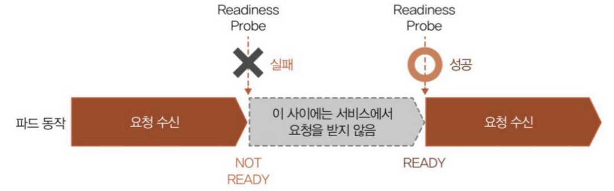
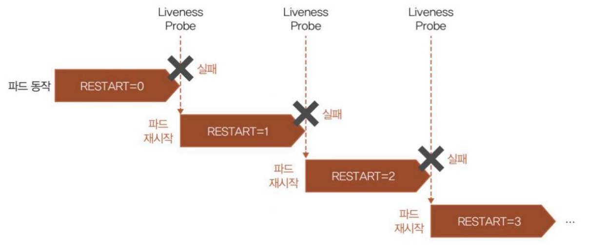
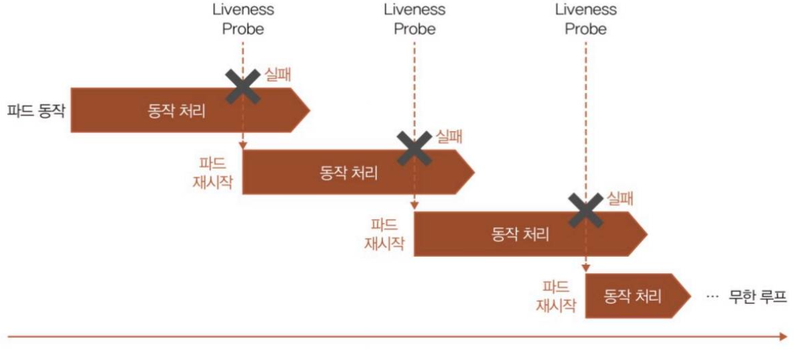

# 11. 파드를 안전하게 외부로 공개하기 위한 헬스 체크

> 마지막 편집: 2026-09-26T12:33:17.372Z

## 1. Readiness Probe로 파드와 연결된 서비스 모니터링하기

Readiness Probe는 애플리케이션이 공개 가능한 상태인지의 여부를 확인하고 정상이라고 판단된 경우 처음으로 서비스를 통해 트래픽을 수신한다.
예를 들어, 애플리케이션이 동작할 때 헬스 체크 응답용 페이지를 생성해두고 HTTP로 그 페이지에 접속해 상태 코드가 200으로 돌아오면 서비스를 통해 접속하는 등의 방법을 사용할 수 있다.
아래 예제는 Deployment 매니페스트 파일 중 /health 라는 경로에 대해 30초 간격으로 8080번 포트에 접속해 정상 응답을 받을 때만 요청을 받는 예제이다.

```yaml
        readinessProbe:
          httpGet:
            port: 8080
            path: /health
          initialDelaySeconds: 15
          periodSeconds: 30
```

Readiness Probe가 실패하면 파드 상태가 비정상으로 판단되어 Ready 상태가 되지 않으며, 서비스에서 트래픽을 보내지 않는다.
다시 성공 조건을 충족하면 파드는 Ready 상태가 되고 서비스에서 트래픽을 보내게 된다.


## 2. Liveness Probe로 파드 상태 모니터링

### 2.1. 정의

Liveness Probe는 파드의 상태 모니터링으로 볼 수 있으며, 실행 중인 파드가 정상적으로 동작하는지 모니터링한다.
설정 내용은 Readiness Probe와 동일하다.

```yaml
        livenessProbe:
          httpGet:
            port: 8080
            path: /health
          initialDelaySeconds: 30
          periodSeconds: 30
```

Liveness Probe가 실패하면 파드는 재시작을 시도한다. 또한 파드 이벤트에 그 내용이 출력되고 재시작 횟수를 센다.


### 2.2. 초기화 처리에 걸리는 시간 고려

Readiness Probe에서는 파드 상태가 비정상으로 판단될 경우 서비스에서 트래픽이 전달되지 않을 뿐이다.<br>하지만 **Liveness Probe에서는 헬스 체크에 실패하면 파드가 재시작 된다.**
따라서, Liveness Probe 실행은 Readiness Probe가 성공한 후에 하지 않으면 파드의 재시작 루프에 빠질 수 있다.<br>(애플리케이션이 올라오는 도중에 Liveness Probe가 실행되면 무한하게 파드를 재시작할 수 있음)
즉, 애플리케이션으로 정상적인 응답이 가능한 상태가 된 후 실행해야 한다.

이를 방지하기 위해 쿠버네티스에서는 초기화 지연(Initial Delay)이라는 설정으로 파드가 동작한 후 첫 번째 헬스 체크를 시작하기까지 유예 시간을 설정할 수 있다.<br>애플리케이션 동작에 필요한 시간을 의식하며 이 값을 반드시 설정해 두어야 한다.
아래 예제는 Readiness Probe는 파드 동작 후 15초 후부터, Liveness Probe는 파드 동작 후 30초 후부터 시작하도록 설정된 예제이다.

```yaml
        readinessProbe:
          httpGet:
            port: 8080
            path: /health
          initialDelaySeconds: 15
          periodSeconds: 30
        livenessProbe:
          httpGet:
            port: 8080
            path: /health
          initialDelaySeconds: 30
          periodSeconds: 30
```
