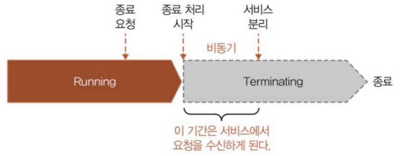
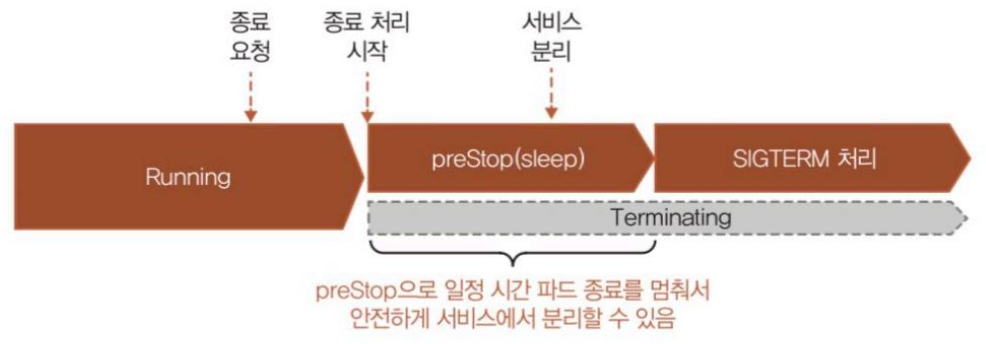

# 12. 파드를 안전하게 종료하기 위해 고려해야 할 사항

> 마지막 편집: 2026-09-26T12:47:02.299Z

## 1. 파드 종료 시의 상태 변화 이해

명시적인 종료 뿐만 아니라 어떤 이상이 발생하거나 다양한 이유로 파드가 종료되는 경우가 있다.<br>쿠버네티스 입장에서 종료 요청이 오면 비동기적으로 종료 처리를 시작하고 Terminating 상태로 변경시키는 흐름으로 동작한다.
종료 처리는 SIGTERM 처리, SIGKILL 처리(필요에 따라) 순서로 실행된다. 이와 병행하여 서비스에서 제외되는 처리가 이루어진다.
SIGTERM 처리, SIGKILL 처리와 서비스에서 제외되는 처리가 비동기로 이루어진다는 것은 파드를 종료할 때 서비스에서 제외되기 전 SIGTERM 처리를 할 수 있다는 의미이다.<br>(각 작업의 상태를 기다리지 않고 동시에 수행시킬 수 있음)
즉, 서비스에서 제외되기 전에 파드가 클라이언트 요청에 정상적으로 응답할 수 없는 상태가 될 수 있다는 의미이다.

이런 현상을 방지하기 위해 preStop 처리로 일정 시간 파드 종료를 대기시키는 방법을 사용할 수 있다.
preStop 처리는 SIGTERM 처리 전에 임의의 명령을 실행하는 기능으로 매니페스트에 작성하여 실행할 수 있다.
컨테이너 설정 내에서 `.lifecycle.preStop.exec.command` 를 정의하고 sleep 명령어를 실행하여 서비스 제외 처리가 끝나는 것을 기다리게 할 수 있다.

```yaml
    spec:
      containers:
      - name: backend-app
        image: ${ECR_HOST}/k8sbook/backend-app:1.0.0
        imagePullPolicy: Always
        ports:
        # ...중간 생략...
        resources:
          requests:
            cpu: 100m
            memory: 512Mi
          limits:
            cpu: 250m
            memory: 768Mi
        lifecycle:
          preStop:
            exec:
              command: ["/bin/sh", "-c", "sleep 2"]
```


