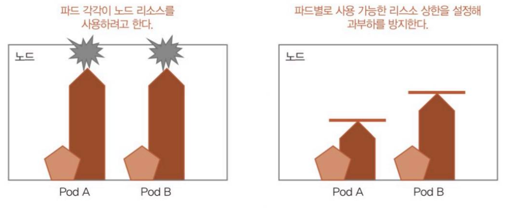
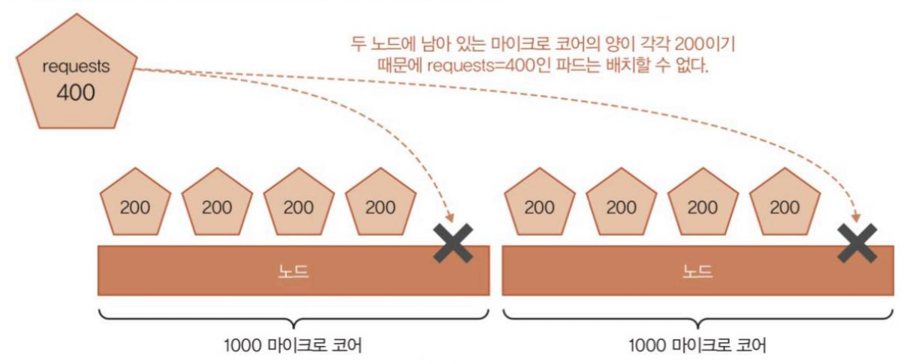
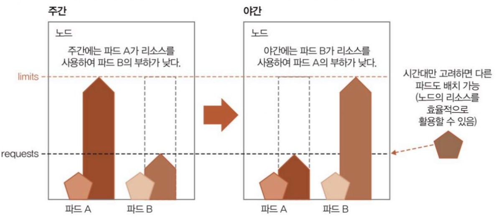
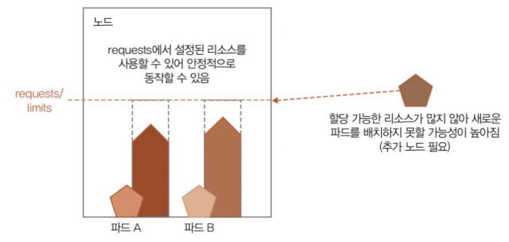
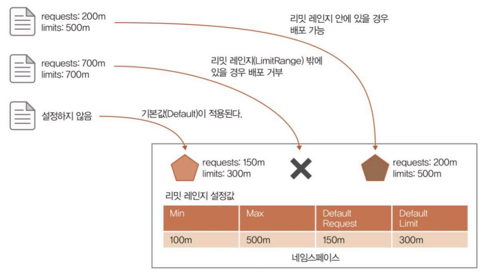
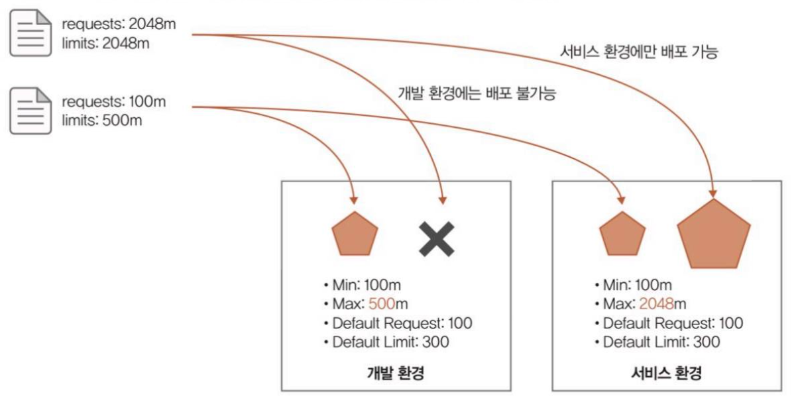
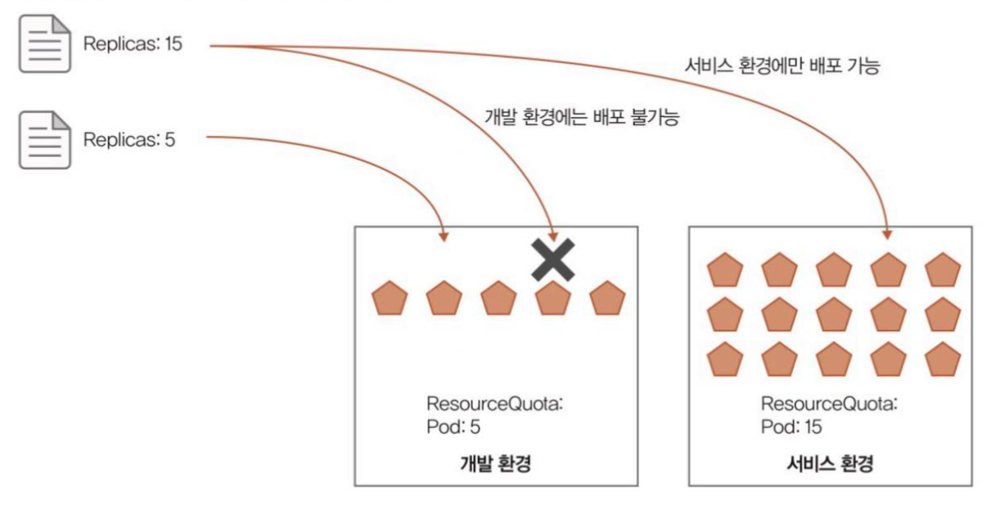

# 13. 리소스 관리

> 마지막 편집: 2026-09-26T13:33:04.528Z

## 1. 파드의 리소스양을 명시하는 requests와 limits
쿠버네티스에서는 파드가 사용할 CPU/Memory 양을 설정하고 필요 이상으로 호스트 쪽에 부하를 주지 않도록 하는 구조가 있다.

구체적으로는 디플로이먼트의 매니페스트 내에 requests와 limits을 설정한다.
```yaml
        resources:
          requests:
            cpu: 100m
            memory: 512Mi
          limits:
            cpu: 250m
            memory: 768Mi
```
`limits`에는 파드가 사용할 수 있는 리소스 상한을 설정한다. 이 설정으로 노드의 과부하를 막을 수 있다.
`requests` 에는 파드 배포 시 호스트에게 리소스를 최소한으로 사용할 때 필요한 양을 설정한다. 이를 충족하지 않는 호스트에는 파드가 배치되지 않는다.

모든 호스트에 requests로 설정된 리소스양에 여유가 없을 경우 Pending 상태가 되어 정상적으로 파드를 동작시킬 수 없다.
## 2. requests와 limits의 차이
### 2.1. 차이를 크게 했을 경우
파드 배치는 requests 값을 기준으로 결정되므로 실제 부하가 많은 호스트라도 requests를 받을 수 있는 여유가 있다면 새로운 파드가 배치된다. 이것이 오버 커밋(Overcommit)이라는 상태다.<br>이 상태가 발생하면 쿠버네티스는 일정 조건으로 파드 동작을 정지시킨다.
예를 들어 시간대별로 부하가 발생하는 파드가 나뉘어 있고 시간대별로 리소스를 효율적으로 사용하고 싶은 경우가 있을 것이다.
이때 양쪽 파드 모두가 배치될 수 있을 정도의 requests를 설정하고 limits는 한쪽 파드가 필요로 하는 양을 설정해두면 효율적으로 호스트 리소스를 사용할 수 있게 된다.
```plain text
## 주간

Node CPU = 4

Pod A
████████████ 3 CPU 사용   ← 바쁨

Pod B
████         1 CPU 사용   ← 한가함

총 4 CPU

===================================

## 야간
Node CPU = 4

Pod A
████         1 CPU 사용   ← 한가함

Pod B
████████████ 3 CPU 사용   ← 바쁨

총 4 CPU

===================================

          주간              야간

Pod A     3 CPU             1 CPU
Pod B     1 CPU             3 CPU
         -------           -------
          4 CPU             4 CPU
```

### 2.2. 차이를 작게(같게) 했을 경우
오버 커밋은 없지만 리소스 최적화 성능이 낮아지면 효율적인 리소스 사용이 불가능해진다.<br>그 결과 필요한 호스트 수가 늘어 비용도 늘어날 가능성이 있다.
파드에 필요한 리소스양이 어느 정도인지 미리 알고 있고, 예상치 못한 부하가 발생하지 않는다면 requests와 limits를 동일하게 맞춰둘 경우 파드를 안정적으로 운영할 수 있을 것이다.

## 3. 파드가 요청 가능한 리소스 사용량을 관리하는 리밋 레인지
requests와 limits 설정 없이 파드가 배포되는 경우 불필요하게 많은 리소스를 요구하는 파드가 존재할 수 있다.
이를 해결하기 위해 쿠버네티스에서는 리밋 레인지(LimitRange)라는 기능이 있다.<br>파드가 요구하는 CPU나 Memory requests와 limits의 하한, 상한 및 기본 값을 설정할 수 있으며 과도한 리소스를 요청하는 파드의 배포를 거부하거나 설정하지 않은 파드에 대해 자동으로 requests와 limits를 적용할 수도 있다.

또한 이 기능은 네임스페이스 단위로 설정된다. 서비스 환경, 개발 환경을 네임스페이스 단위로 나눌 경우 개발 환경에는 리소스가 많이 필요한 파드를 생성하지 못하게 하는 등의 제한을 설정할 수 있다.

## 4. 리소스의 총 요구량을 관리하는 리소스 쿼터
리소스 쿼터(ResourceQuota)는 네임스페이스 단위로 사용할 수 있는 총 리소스양의 상한을 관리하는 기능이다.
파드 하나하나의 리소스 사용량이 적당하더라도 많은 파드가 배포되면 클러스터 전체의 리소스가 모자른 상황이 발생할 위험이 있다. 리소스 쿼터는 이러한 위험을 방지해준다.
리소스 쿼터도 리밋 레인지와 같이 네임스페이스 단위로 설정한다.<br>CPU/Memory 뿐만 아니라 배포 가능한 파드 수 등도 제한할 수 있다.

