# 14. 모니터링

> 마지막 편집: 2026-10-04T14:39:06.058Z

## 1. 클러스터 상태 파악
EKS 컨트롤 플레인은 AWS를 통해 운영되는 관리형 서비스이다. 관리자는 클러스터에 문제가 발생하지 않았는지 클러스터의 상태를 파악하는 정도로 충분히 활용할 수 있다.
데이터 플레인을 EC2로 구축하는 경우에는 노드를 스스로 관리해야 한다.
반면, EKS Managed Node Group으로 데이터 플레인을 구축하는 경우 내부적으로 EC2 Auto Scaling Group을 통해 자동으로 관리해준다.
또, 데이터 플레인 전체의 부하 상태는 Amazon CloudWatch에서 확인할 수 있다. 오토스케일링 그룹 단위의 CPU 사용률 등을 볼 수 있다.
## 2. CloudWatch의 Container Insights로 애플리케이션 상태 파악
### 2.1. Container Insights의 구조
CloudWatch의 Container Insights라는 기능을 통해 클러스터 노드, 파드, 네임스페이스, 서비스 레벨의 메트릭을 참조할 수 있다.
CloudWatch 에이전트를 데몬셋으로 동작시킨 후 필요한 메트릭을 CloudWatch로 전송하는 구조이다.
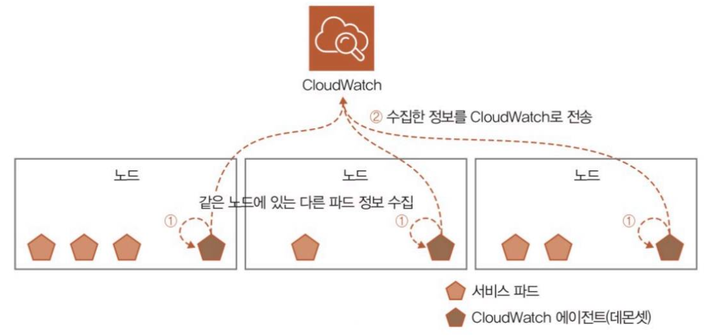
### 2.2. 데이터 노드의 IAM 역할에 정책 추가
1. AWS Management Console → EC2
2. Worker Node 1개 선택 → Security 탭 → IAM Role 링크 선택
	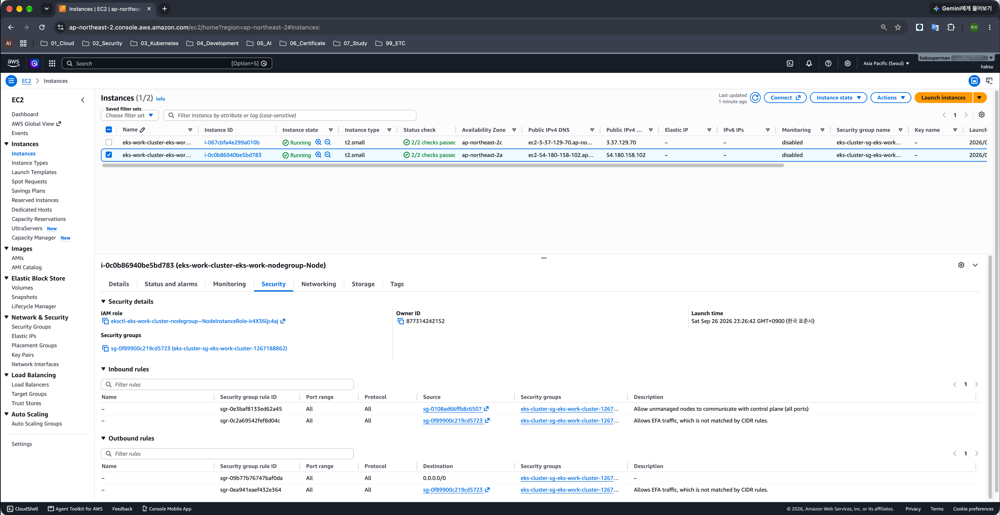
3. Add permissions → Add policies
	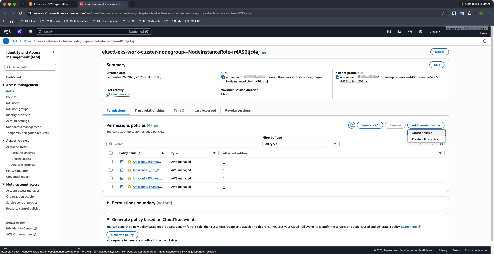
4. CloudWatchAgentServerPolicy 선택 → Attach permissions
	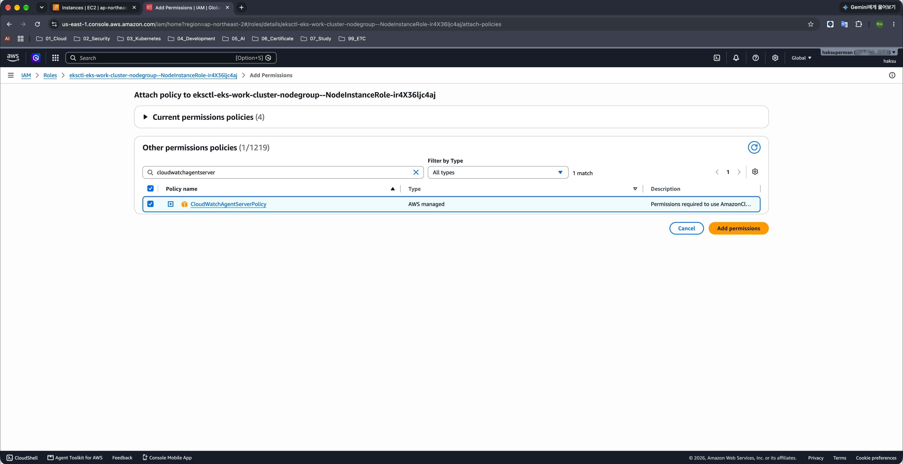
5. 정책 부여 확인
	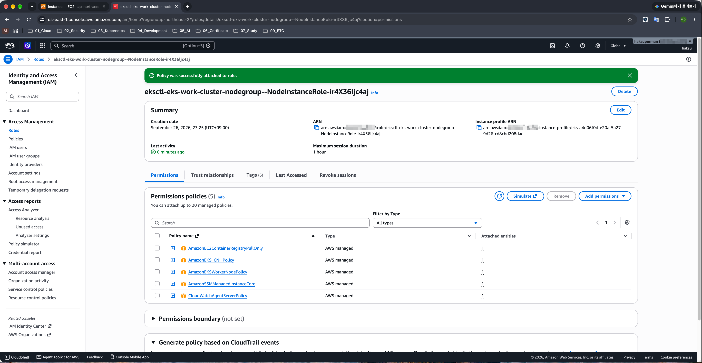
### 3.2. CloudWatch용 네임스페이스 생성
```yaml
cd eks-env/cloudwatch-yaml

kubectl apply -f cloudwatch-namespace.yaml
```
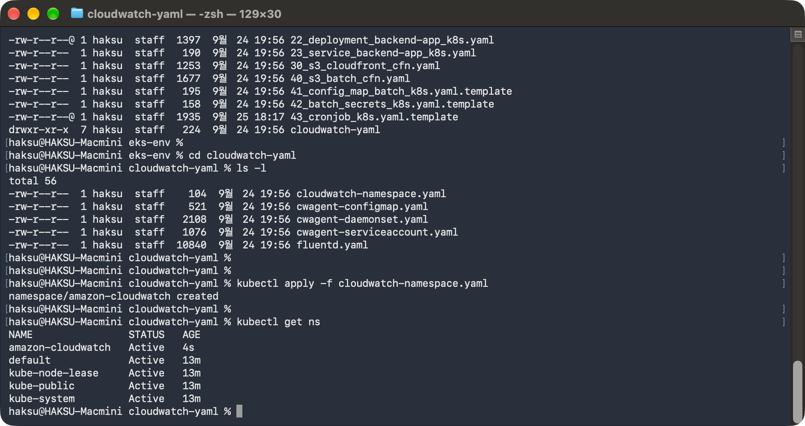
### 3.3. CloudWatch용 서비스 계정 생성
CloudWatch 에이전트 파드가 사용할 서비스 계정(Service Account)을 생성한다.
OS에서 톰캣(Tomcat)을 실행하는 경우, OS 계정이 톰캣 프로세스를 동작시키는 것과 같이,<br>파드를 동작시키는 계정을 서비스 계정이라고 한다.
서비스 계정과 롤을 연결하면 그 서비스 계정이 클러스터 내부에서 어떤 조작을 인가(Authorization)할지 제어할 수 있다.
```yaml
kubectl apply -f cwagent-serviceaccount.yaml
```
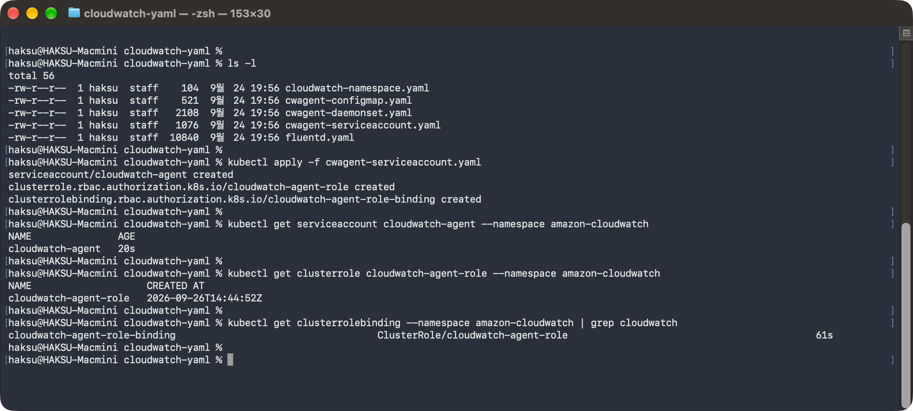
### 3.4. CloudWatch 에이전트가 사용할 컨피그맵 생성
CloudWatch 에이전트 파드는 컨피그맵을 사용해 각종 설정을 불러오므로 이 컨피그맵을 생성해둔다.
```yaml
vi cwagent-configmap.yaml

# cluster name이 다른 경우 아래 항목 수정
            "cluster_name": "eks-work-cluster"
            
kubectl apply -f cwagent-configmap.yaml
```
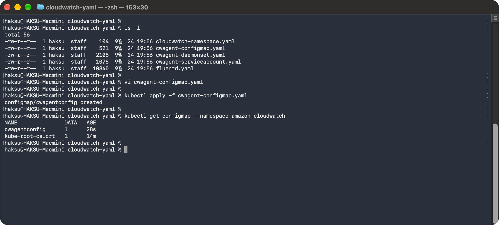
### 3.5. CloudWatch 에이전트를 데몬셋으로 동작시키기
```yaml
kubectl apply -f cwagent-daemonset.yaml
```
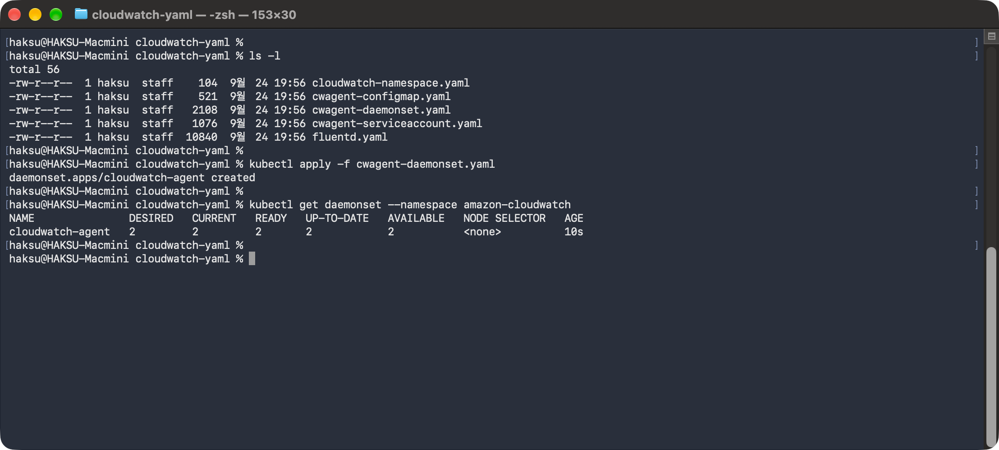
CloudWatch 에이전트는 Container Insights로 메트릭을 보내는 동시에 CloudWatch Logs에 데이터도 전송한다.
CloudWatch Logs → Log Groups → /aws/containerinsights/eks-work-cluster/performance 로그 그룹이 생성된 것을 확인할 수 있다.
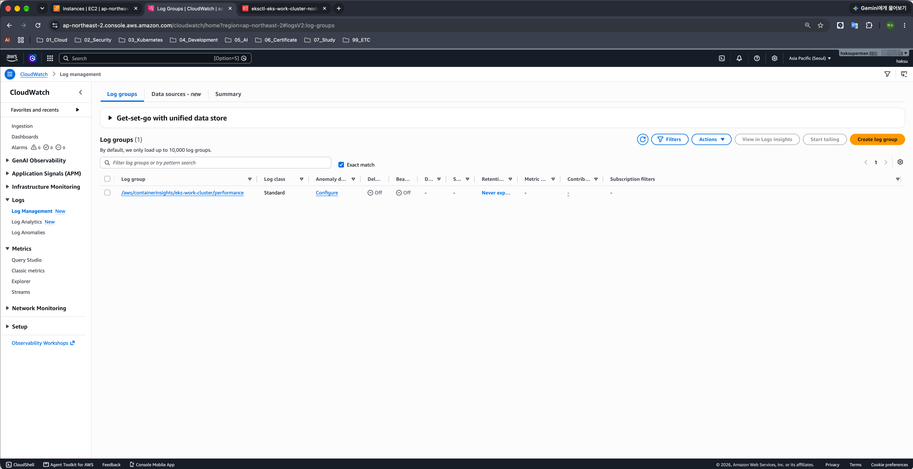
### 3.6. Container Insights에서 수집한 메트릭 확인
자신이 보고 싶은 메트릭을 커스텀해서 대시보드를 직접 구성하거나, 자주 사용하는 메트릭 집합의 대시보드를 프리셋으로 확인할 수 있다.
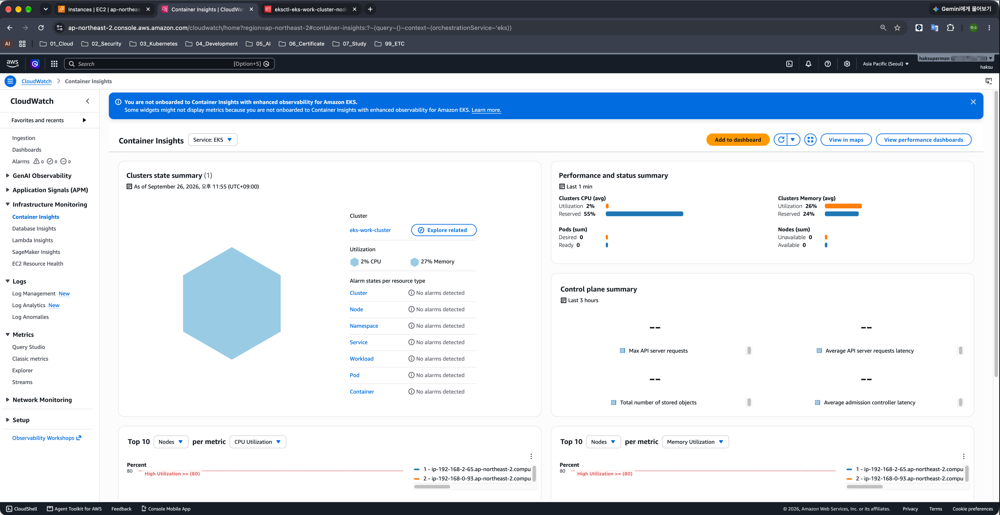
## 4. CloudWatch 경보를 이용한 통지
Container Insights로 수집한 메트릭은 AWS의 일반적인 메트릭과 같다.<br>즉, 메트릭 값에 임계치를 설정하여 CloudWatch 경보를 생성할 수 있다.
CloudWatch 경보에서는 상태 체크가 실패했을 때 특정 조건으로 통지할 수 있다.<br>예를 들어, ‘데이터 플레인의 CPU 사용률이 90%를 넘을 경우’, ‘예제 애플리케이션 파드의 CPU 사용률이 상한 사용률의 80%를 넘을 경우’ 등의 조건으로 경보를 보낼 수 있다.
## 5. 리소스 삭제
1. 아래 명령으로 cwagent-로 구성한 리소스들을 삭제할 수 있다.
	```yaml
kubectl delete -f .
	```
	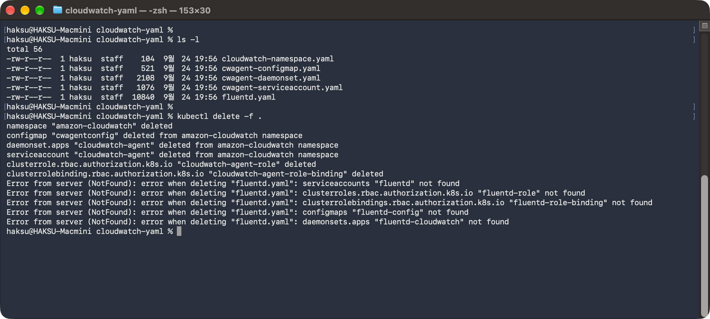
2. DaemonSet에 의해 자동 생성된 로그 그룹 삭제
	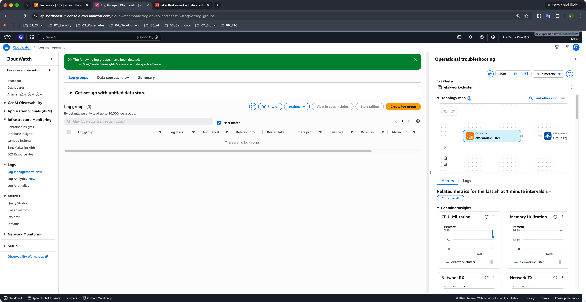
3. Worker Node에 추가한 CloudWatchAgentServerPolicy 삭제
	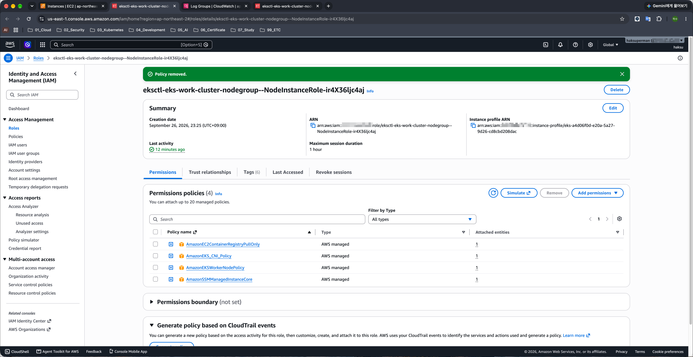
