# 15. 로그 관리와 운영

> 마지막 편집: 2026-10-04T14:45:08.382Z

> EKS에서 효율적으로 수집, 저장, 모니터링, 시각화 하는 예시
> - 수집 : Fluentd 컨테이너를 데몬셋으로 동작시키고 파드의 로그를 CloudWatch Logs에 전송
> - 저장 : CloudWatch Logs에 로그를 저장하도록 설정
> - 모니터링 : 메트릭 디렉터리를 설정하고 CloudWatch 사용자 메트릭을 생성하여 그 메트릭의 경보를 생성
> - 시각화 : CloudWatch의 Logs Insights를 사용하여 대상 로그를 분석하고 CloudWatch의 대시보드로 시각화
## 1. 원래 애플리케이션 로그는 어디에 저장해야 하는가
기존 서버에서 애플리케이션을 배포하는 경우 배포된 서버의 특정 디렉터리에 로그 파일로 출력해서 저장하도록 했을 것이다.
그러나 쿠버네티스에서 동작하는 애플리케이션은 개념이 조금 다르다.<br>원래 어떤 호스트에서 동작 중인지 알 수 없으며, 재시작 등을 하게 되면 호스트가 변경될 가능성이 있기 때문이다.
이런 특성 때문에 쿠버네티스 상의 애플리케이션 로그 출력은 표준 출력으로 구성하는 것을 추천한다.
`kubectl logs <파드 이름>` 으로 파드가 표준 출력한 정보를 참조할 수 있다. 또 `kubectl logs -l app=backend-app` 과 같이 레이블을 지정하여 특정 레이블에 있는 모든 파드의 로그를 참조할 수도 있다.
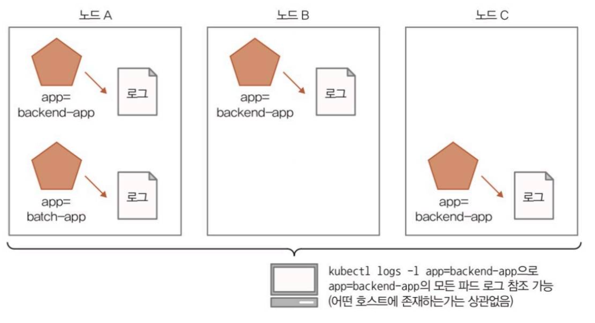
표준 출력이라 명시적으로 애플리케이션이 출력한 내용 외에 로그도 포함될 가능성이 있지만, 파드 안의 모든 정보를 표준 출력으로 스트림하여 쌓아두는 것이 좋다.
## 2. 로그 수집
### 2.1. 개요
AWS에서는 애플리케이션이 출력한 로그를 수집하는 구조로 CloudWatch Logs라는 서비스를 제공하고 있다. EC2에 CloudWatch 에이전트를 설치하고 수집 대상 로그 파일을 설정하면 AWS 로그 저장 공간으로 전송할 수 있다.
EKS에서도 동일한 방법을 구현할 수 있지만 여기서는 Fluentd 컨테이너를 동작시켜 파드 각각이 표준 출력한 로그를 확인하고 CloudWatch Logs로 수집, 관리하는 방법으로 진행한다.
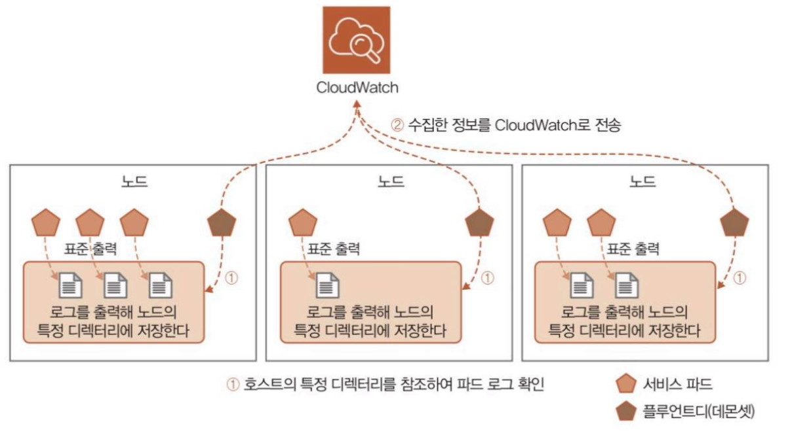
### 2.2. 데이터 노드의 IAM 역할에 정책 추가
1. AWS Management Console → EC2
2. Worker Node 1개 선택 → Security 탭 → IAM Role 링크 선택
	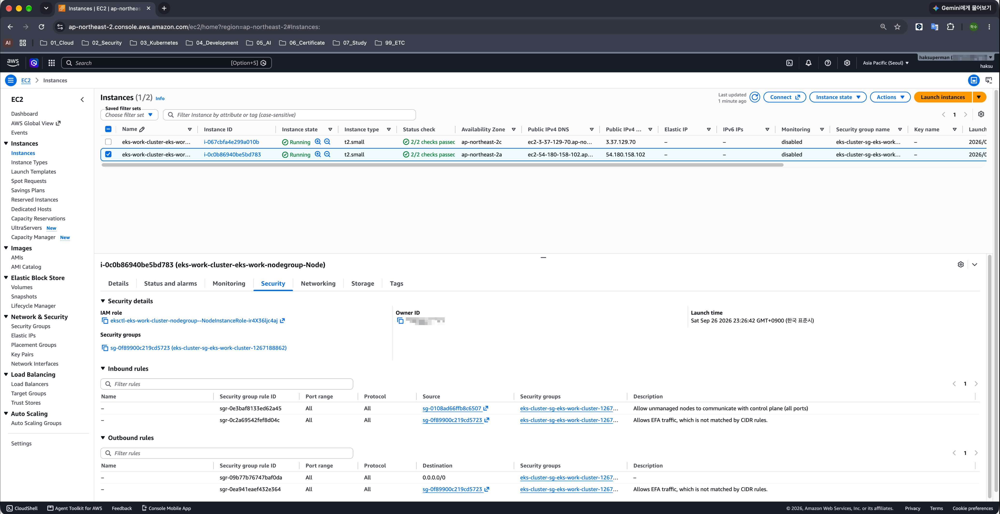
3. Add permissions → Add policies
	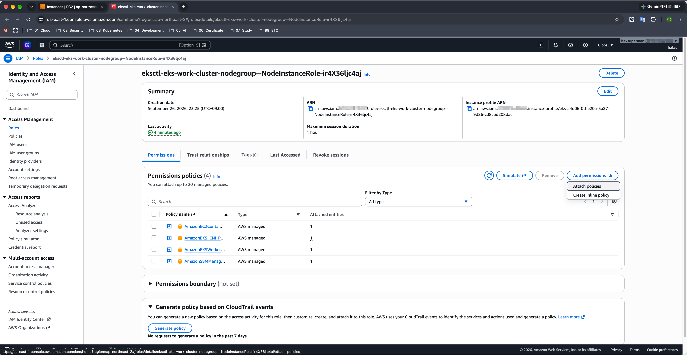
4. CloudWatchAgentServerPolicy 선택 → Attach permissions
	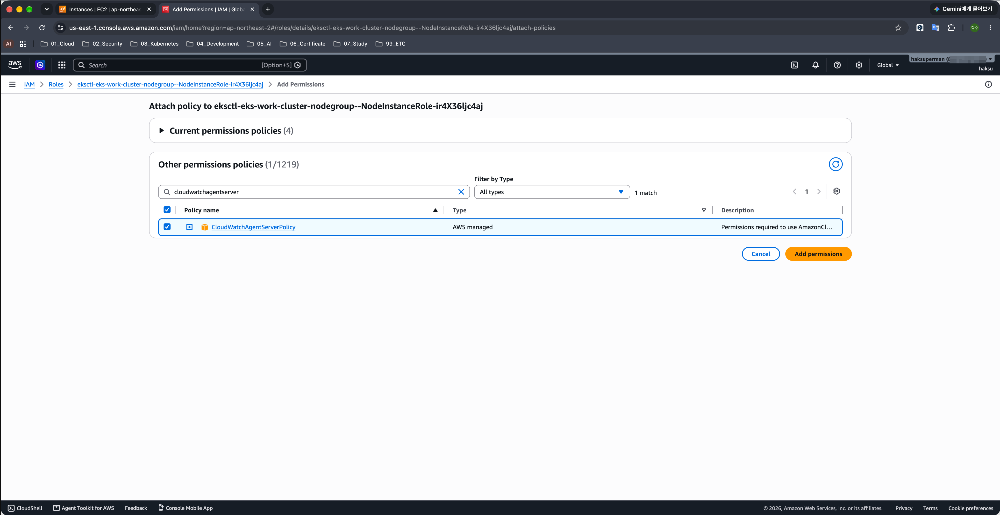
5. 정책 부여 확인
	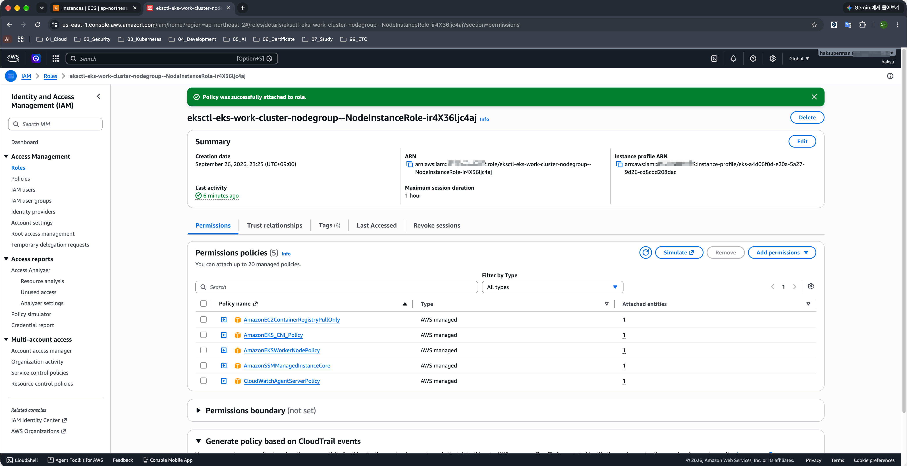
### 2.3. CloudWatch용 네임스페이스 생성
```yaml
cd eks-env/cloudwatch-yaml

kubectl apply -f cloudwatch-namespace.yaml
```
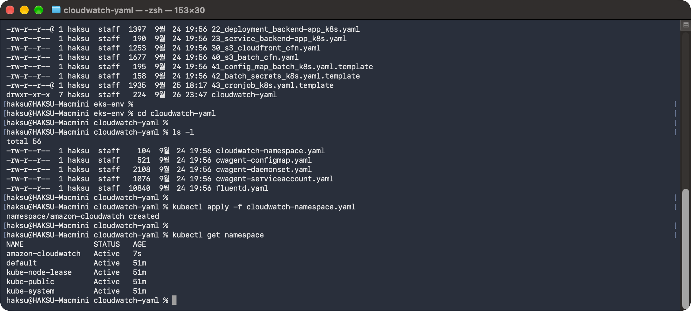
### 2.4. Fluentd 컨테이너를 데몬셋으로 동작시키기
1. Cluster 이름과 리전명을 컨피그맵에서 참조시키는 방식이므로, 컨피그맵 생성
	```yaml
kubectl create configmap fluent-bit-cluster-info \
  --from-literal=cluster.name=eks-work-cluster \
  --from-literal=http.server=On \
  --from-literal=http.port=2020 \
  --from-literal=read.head=Off \
  --from-literal=read.tail=On \
  --from-literal=logs.region=ap-northeast-2 \
  -n amazon-cloudwatch
	```
	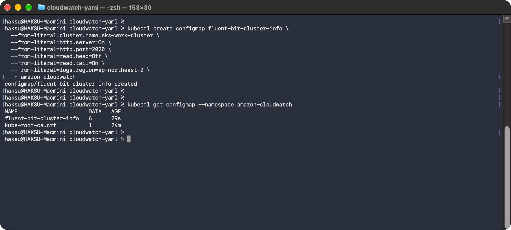
2. Fluentd 컨테이너를 데몬셋으로 동작
	```yaml
curl -L \
  -o fluent-bit.yaml \
  https://raw.githubusercontent.com/aws-samples/amazon-cloudwatch-container-insights/latest/k8s-deployment-manifest-templates/deployment-mode/daemonset/container-insights-monitoring/fluent-bit/fluent-bit.yaml

vi fluent-bit.yaml
# 아래 CPU reqeusts 값 수정
        resources:
            limits:
              memory: 200Mi
            requests:
              cpu: 100m
              memory: 100Mi

kubectl apply -f fluent-bit.yaml
	```
	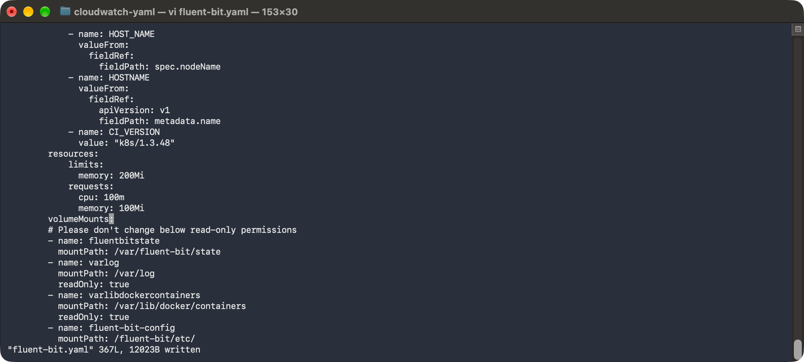
	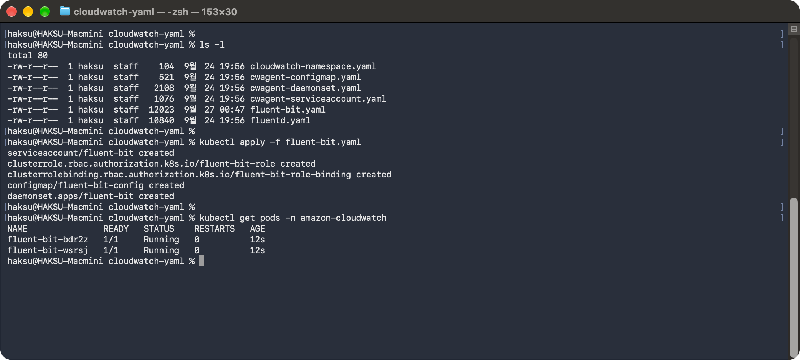
3. 데몬셋 동작으로 인한 CloudWatch Log Group 자동 생성 확인<br>( /aws/containerinsights/eks-work-cluster/application<br>  /aws/containerinsights/eks-work-clsuter/host<br>  /aws/containerinsights/eks-work-cluster/dataplane )
	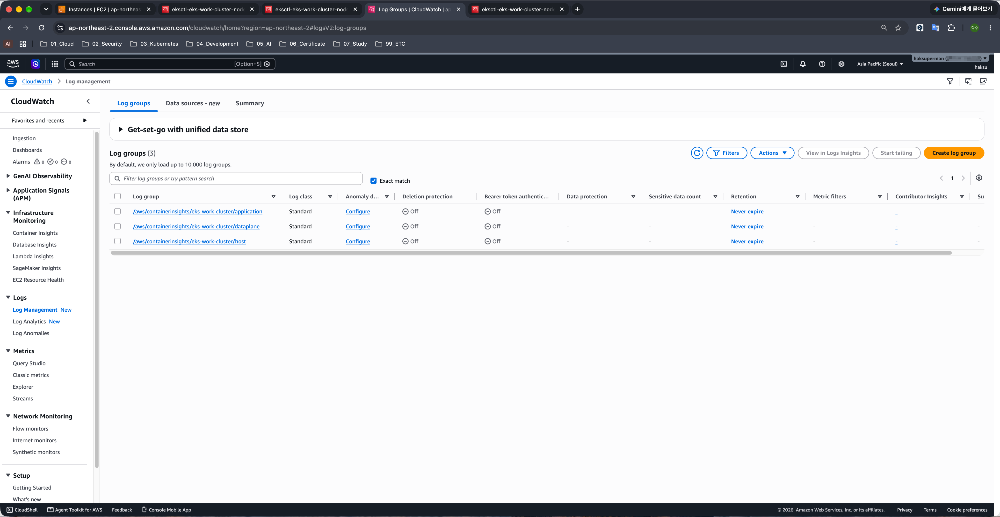
## 3. 로그 저장
### 3.1. 개요
CloudWatch Logs로 전송된 로그는 기본적으로 기간 제한 없이 저장되며, 저장되는 로그는 용량에 따라 과금된다.
용도에 맞게 저장 기간을 설정해 사용하는 것이 일반적이다.
### 3.2. CloudWatch Logs에서 보관 기간 설정
CloudWatch Logs에서는 로그 그룹 단위로 로그 저장 기간을 설정할 수 있다.
application, host, dataplane으로 로그 그룹을 나누었기 때문에 이 단위로만 보관 기간 설정이 가능하다.<br>예를 들어 모든 파드의 로그는 application 로그 그룹에 저장되므로 애플리케이션 별로 다른 보관 기간을 가질 수 없다.
가장 오래 저장하고 싶은 로그에 맞춰 기간을 설정해야 로그 유실을 막을 수 있다.
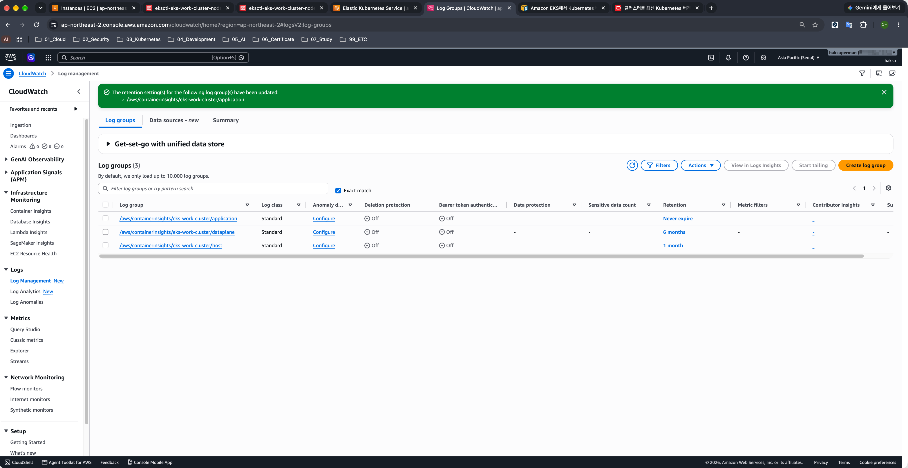
## 4. 로그 모니터링
### 4.1. CloudWatch 경보를 사용한 통지
에러가 발생했을 때 통지를 보내기 위해 메트릭 필터에서 에러 대상 로그를 추출하고 CloudWatch 메트릭으로 등록해 메트릭 경보를 생성할 수 있다.
예를 들어 ERROR라는 로그가 출력된 경우 통지를 보내고 싶은 경우 다음과 같은 설정 방법으로 실행할 수 있다.
1. 메트릭 필터 조건을 ‘ERROR’로 설정하고 출력 횟수를 메트릭에 등록
2. 출력 횟수 메트릭 통보 생성 (5분간 1회 이상 발생하면 통지 등)
메트릭 필터도 로그 그룹 단위로 설정해야 하기 때문에 ‘어떤 애플리케이션에서 발생한 에러인지’에 대해 미리 추출 조건을 포함시키는 것이 좋다.
예를 들어, 앱 A, 앱 B가 있을 경우 ERROR라는 문자열만 추출하면 통지 내용만으로 어떤 애플리케이션에서 에러가 발생했는지 판단할 수 없다. 이런 경우를 위해 메트릭 필터에는 앱 A 에러, 앱 B 에러와 같이 별도로 필터와 경보를 생성할 수 있다.
그러나 이렇게 서비스별로 세분화하여 메트릭 필터를 설정하면 CloudWatch 사용자 메트릭이 증가하여 그만큼 비용이 발생하는 것이다. 각 비용이 아주 높은 것은 아니지만 상세하게 분류하여 설정할 경우 개수가 많아지므로 비용을 생각하면서 설정하는 것이 좋다.
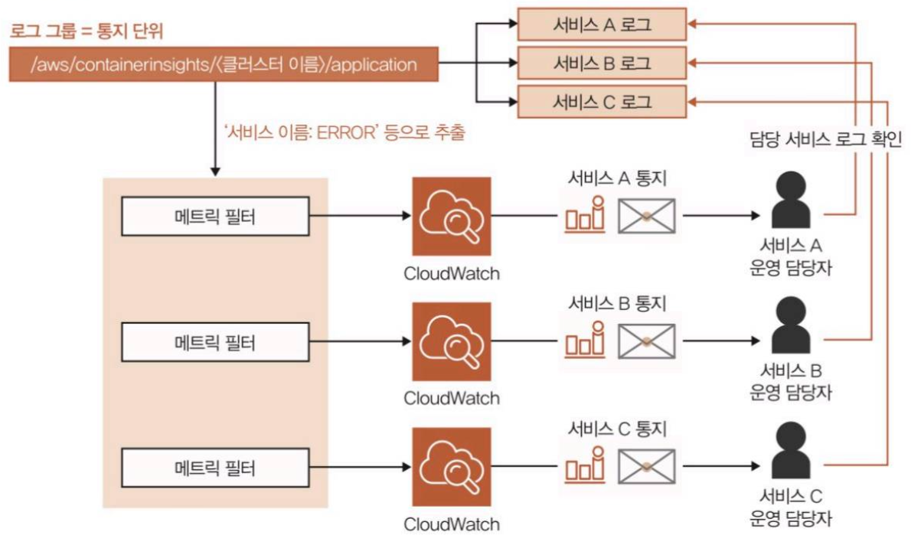
### 4.2. CloudWatch Logs 이벤트 검색을 이용한 디버그 예
예제 애플리케이션 로그는 표준 출력으로 되어 있지만, CloudWatch Logs에서는 JSON으로 저장된다.
예제 애플리케이션의 로그는 CloudWatch 페이지의 `/aws/containerinsights/eks-work-cluster/application` 에서 확인 가능하다.
1. `/aws/containerinsights/eks-work-cluster/application` -\> 우측 상단 Search log group
	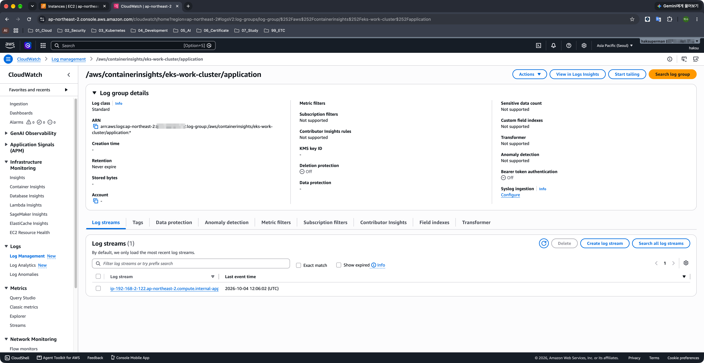
	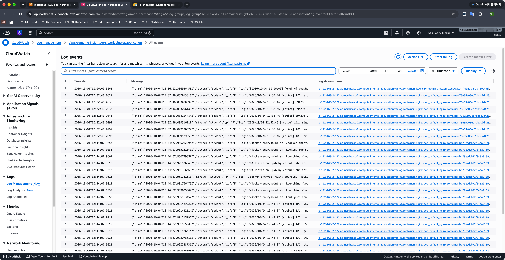
2. 필터 적용
	```plain text
# 이벤트 검색 조건 예시
# 애플리케이션 이름이 nginx-container AND "warn"이나 "error"가 포함된 조건

{ $.kubernetes.container_name = "nginx-container" && ( $.log = "*[warn]*" || $.log = "*[error]*" ) }
	```
	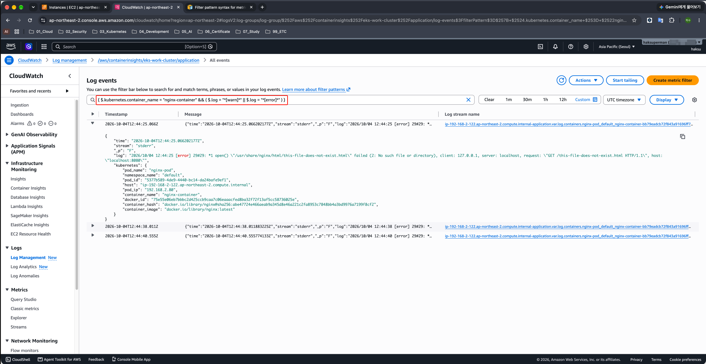
3. 우측 로그 스트림 이름 링크를 클릭하면 해당 행을 강조 표시한 로그 스트림 전체를 참조할 수 있다.
	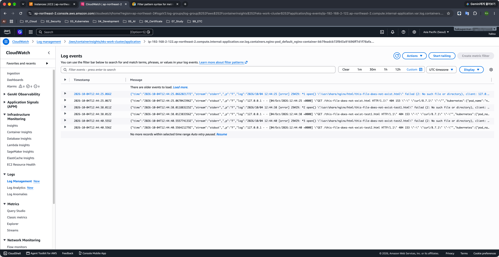
## 5. 로그의 시각화와 분석
### 5.1. 개요
수집한 로그에서 에러를 추출하고 통지하는 것은 문제가 생겼을 때의 실시간 대응 속도를 향상시키는 것을 목적으로 한다.
반면 시각화와 분석은 로그 내용에서 다양한 패턴을 파악하여 장애를 사전에 방지하거나 개발이 필요한 내용을 찾아내는 것이다.<br>즉, 향후 안정적인 운영과 대응 속도를 개선하는 데 목적을 두고 있다.
CloudWatch Logs에서 저장된 로그를 검색하고 시각화하는 기능은 CloudWatch Logs Insights를 제공한다.
Log group 선택 → 우측 상단 View Logs Insights 선택하여 사용할 수 있다.
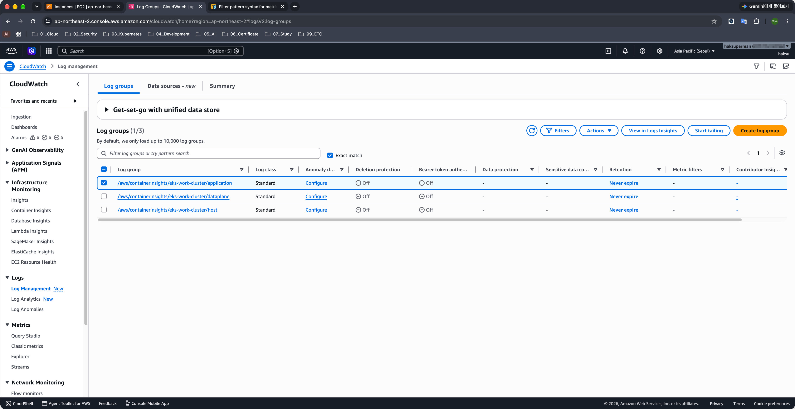
### 5.2. 액세스 로그 확인
```plain text
# 접속 횟수
stats count(*) as ACCESS_COUNT
| filter kubernetes.container_name = "nginx-container"
| filter stream = "stdout"
| filter log like /"(GET|POST|PUT|DELETE|PATCH|HEAD|OPTIONS) /
```
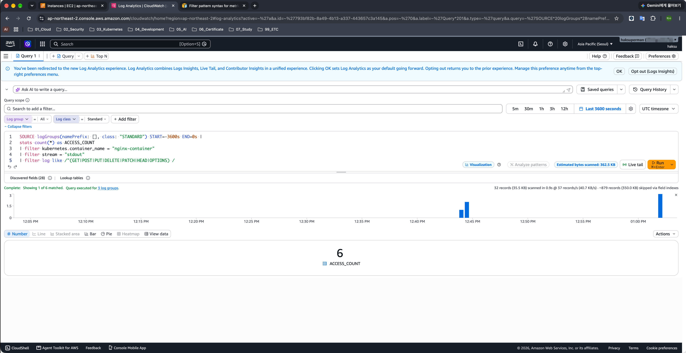
```plain text
# 에러 발생 횟수
stats count(*) as ERROR_COUNT by kubernetes.container_name as APP
| filter kubernetes.container_name = "nginx-container"
| filter stream = "stderr"
| filter log like /\[warn\]/ or log like /\[error\]/
```
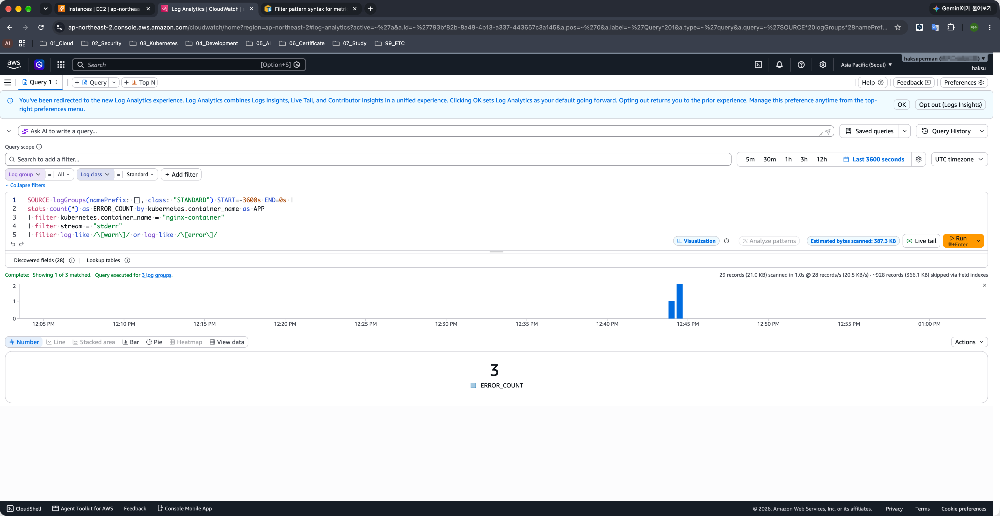
### 5.3. 쿼리 결과를 대시보드에 저장
Logs Insights 쿼리 결과는 CloudWatch 대시보드에 저장할 수 있다. (수집할 정보를 매번 쿼리로 입력하는 것은 비효율적)
팀 성격에 맞춰 대시보드를 구성할 수 있다.
1. 우측 상단 Actions → Add to dashboard
	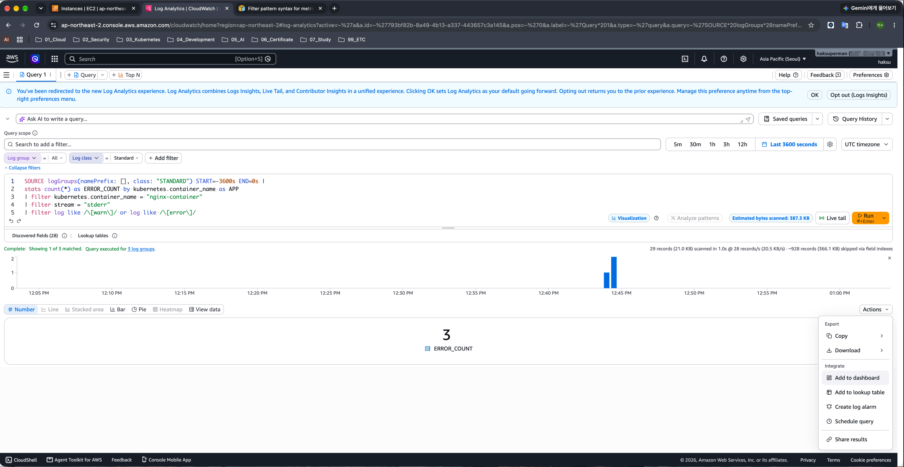
2. Dashboard명 / Widget Type / Widget Title 입력 → Add to dashboard
	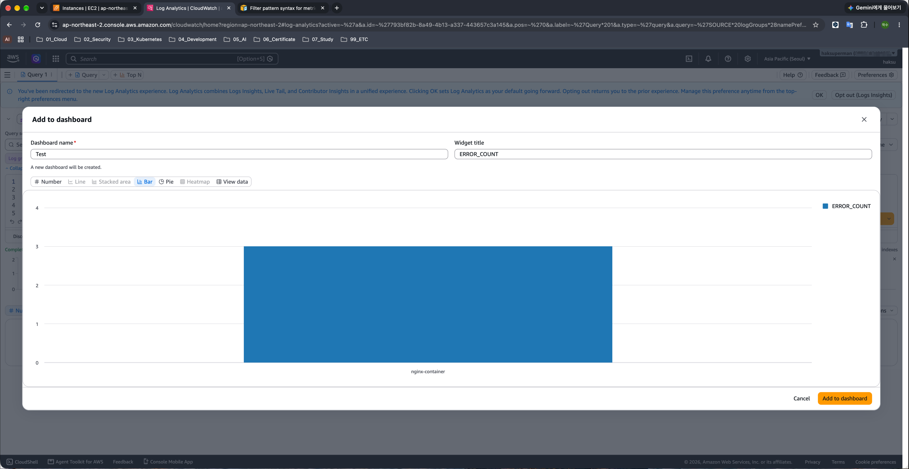
3. CloudWatch 대시보드 확인
	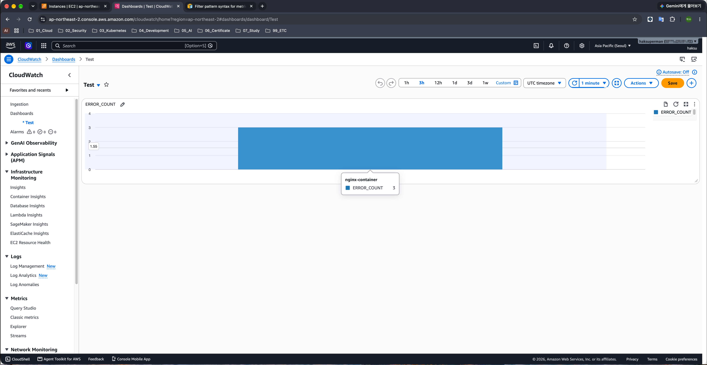
## 6. 리소스 삭제
```bash
# 수동으로 생성한 ConfigMap 삭제
kubectl delete cm cluster-info -n amazon-cloudwatch

# Container Insights 관련 리소스 삭제
kubectl delete -f fluentd-bit.yaml
```
