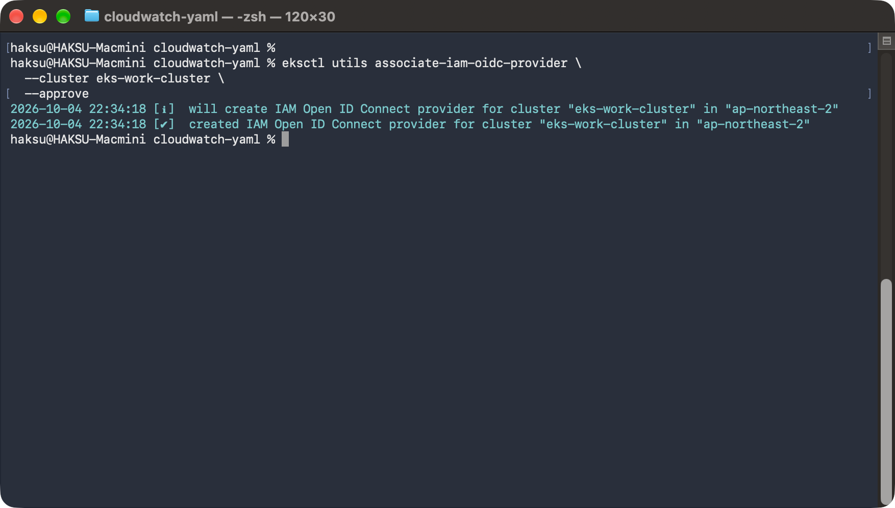
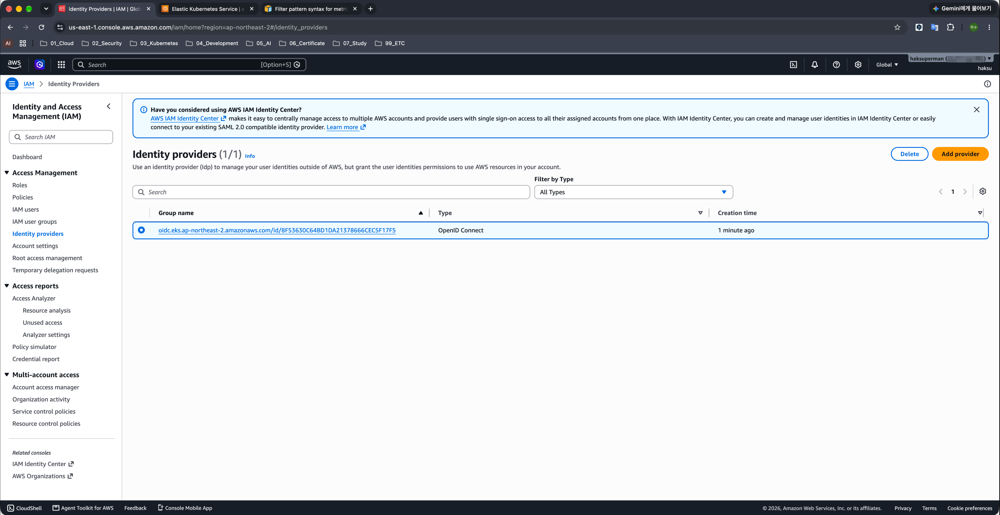
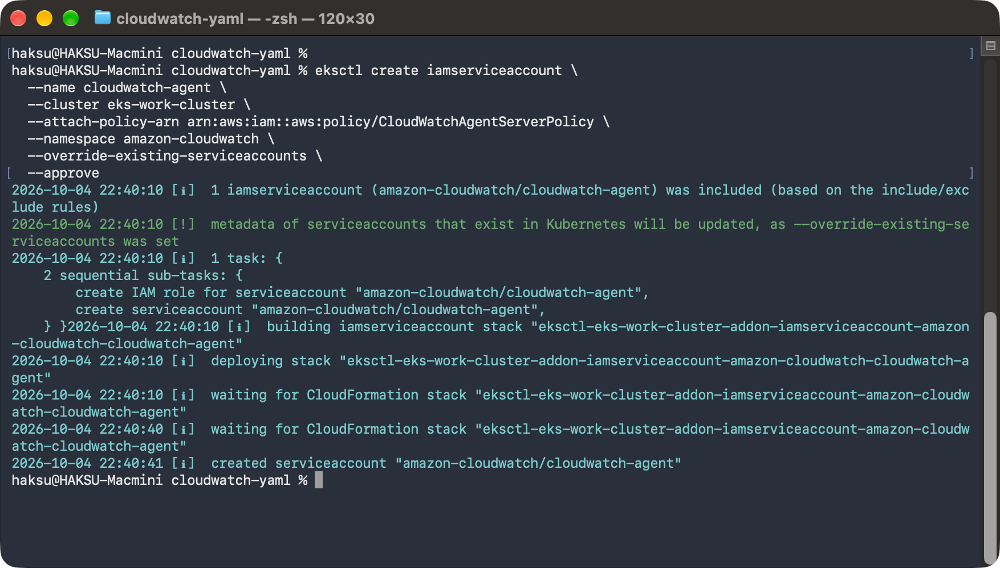
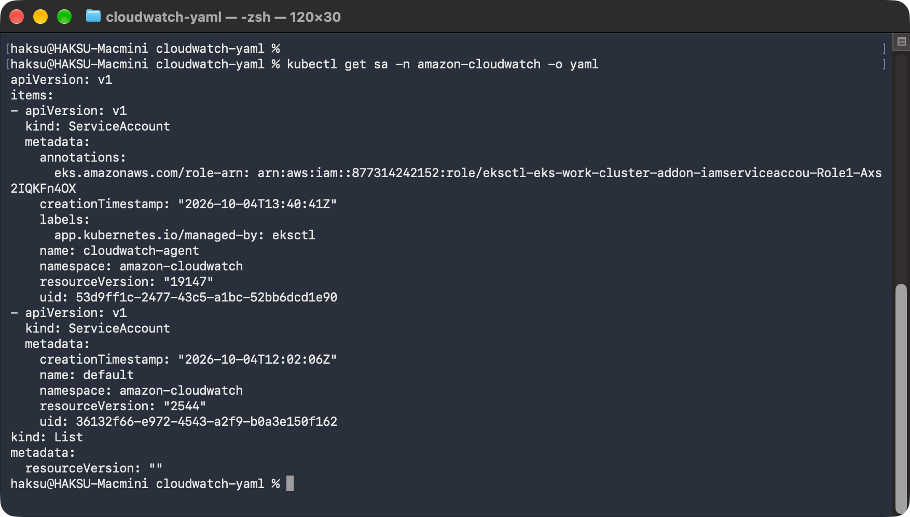
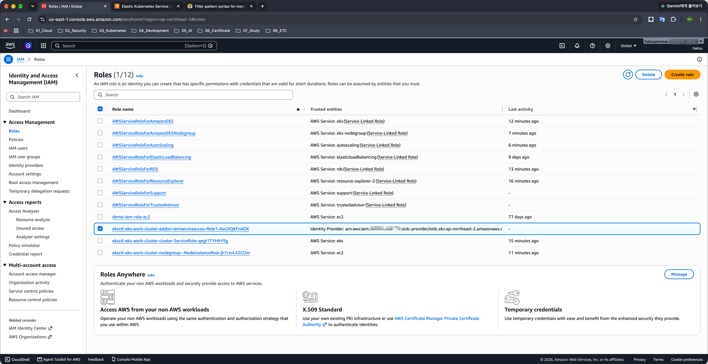

# 16. IAM 역할을 파드별로 설정하기

> 마지막 편집: 2026-10-04T14:46:17.878Z

## 1. IRSA

CloudWatch 에이전트나 Fluent-bit를 배포할 때 CloudWatch로 데이터를 전송할 수 있도록 하기 위해 노드에 IAM 역할을 연결했다.
IAM Role for Service Account(IRSA)를 통해 파드 별로 IAM 역할을 각각 부여할 수 있다.
IRSA는 클러스터 내의 서비스 계정(Service Account)과 IAM 역할을 안전하게 연결시키는 구조이다.
파드에서 AWS 서비스를 사용하려면 노드에 IAM 정책을 부여하므로 모든 파드에 불필요한 권한이 설정되어 버린다. 이러한 문제를 해결하기 위해 추가된 기능이 IRSA이다.
IRSA를 사용하려면 아래 세 가지 순서를 지켜야 한다.

1. EKS 클러스터의 OpenID Connect(OIDC) 공급자 기능을 활성화하고 IAM과 연결
2. 서비스 계정과 IAM 역할 연결
3. 서비스 계정을 설정하고 파드 동작

## 2. 구성

### 2.1. EKS 클러스터의 OpenID Connect 공급자 기능을 활성화하고 IAM과 연결

EKS에서는 서비스 계정과 IAM을 연결하기 위해 OpenID Connect를 사용한다.
구체적인 흐름은 EKS 클러스터의 OIDC 공급자 기능을 활성화하고 그 공급자 정보를 IAM에 등록해 EKS의 서비스 계정 인증과 IAM 인증 구조를 연결하는 것이다.

1. EKS 클러스터의 OIDC 공급자 URL이 설정된 자격 증명 공급자 생성

    ```bash
    eksctl utils associate-iam-oidc-provider \
      --cluster eks-work-cluster \
      --approve
    ```

    
2. AWS Console → IAM → Identity provider → 생성된 리소스 확인
    

### 2.2. 서비스 계정과 IAM 역할 연결

서비스 계정과 IAM 역할을 연결한다.
구체적인 흐름은 서비스 계정이 사용할 권한을 부여받은 IAM 역할을 생성하고, 서비스 계정을 생성할 때 그 IAM 역할의 ARN을 연결한다.

1. cloudwatch-agent라는 서비스 계정이 AWS의 CloudWatchAgentServerPolicy를 사용하는 경우 아래 명령 실행

    ```bash
    eksctl create iamserviceaccount \
      --name cloudwatch-agent \
      --cluster eks-work-cluster \
      --attach-policy-arn arn:aws:iam::aws:policy/CloudWatchAgentServerPolicy \
      --namespace amazon-cloudwatch \
      --override-existing-serviceaccounts \
      --approve
    ```

    
2. 서비스 계정과 IAM 역할 생성 확인

    ```bash
    # 생성된 서비스 계정 확인

    kubectl get sa -n amazon-cloudwatch -o yaml

    # 출력 결과

    apiVersion: v1
    items:

    - apiVersion: v1
      kind: ServiceAccount
      metadata:
        annotations:
          # 여기에 생성된 IAM 역할의 ARN이 설정
          eks.amazonaws.com/role-arn: arn:aws:iam::877314242152:role/eksctl-eks-work-cluster-addon-iamserviceaccou-Role1-Axs2IQKFn4OX
        creationTimestamp: "2026-10-04T13:40:41Z"
        labels:
          app.kubernetes.io/managed-by: eksctl
        name: cloudwatch-agent
        namespace: amazon-cloudwatch
        resourceVersion: "19147"
        uid: 53d9ff1c-2477-43c5-a1bc-52bb6dcd1e90
    - apiVersion: v1
      kind: ServiceAccount
      metadata:
        creationTimestamp: "2026-10-04T12:02:06Z"
        name: default
        namespace: amazon-cloudwatch
        resourceVersion: "2544"
        uid: 36132f66-e972-4543-a2f9-b0a3e150f162
    kind: List
    metadata:
      resourceVersion: ""
    ```

    
    

### 2.3. 서비스 계정을 설정하여 파드 동작시키기

생성한 서비스 계정을 설정하여 파드를 동작시킨다.

```yaml
apiVersion: apps/v1
kind: DaemonSet
metadata:
  name: cloudwatch-agent
  namespace: amazon-cloudwatch
spec:
  selector:
    matchLabels:
      name: cloudwatch-agent
  template:
    metadata:
      labels:
        name: cloudwatch-agent
    spec:
      containers:
      - name: cloudwatch-agent
        image: amazon/cloudwatch-agent:latest
        imagePullPolicy: Always
        #ports:
        #  - containerPort: 8125
        #    hostPort: 8125
        #    protocol: UDP
        resources:
          limits:
            cpu:  200m
            memory: 200Mi
          requests:
            cpu: 200m
            memory: 200Mi
      # ...중간 생략...

      serviceAccountName: cloudwatch-agent
```

EKS 클러스터가 IAM 역할을 부여하기 위해 필요한 토큰을 생성하고 그것이 파드 내의 특정 디렉터리에 마운트된다. <br>이 상태에서 파드 내부의 애플리케이션이 AWS SDK를 경유해 각종 처리를 요청하면 자동으로 이 토큰을 사용하여 IAM 역할을 연결하고 AWS 리소스를 조작할 수 있게 된다.

```yaml
apiVersion: v1
kind: Pod
metadata:
  annotations:

    # ...(중간 생략)...

  name: cloudwatch-agent-ljw49
  namespace: amazon-cloudwatch

  # ...(중간 생략)...

  - name: AWS_ROLE_ARN
    value: arn:aws:iam::123456789012:role/eksctl-eks-work-cluster-addon-
      iamserviceaccount-Role1-1WSHQAJM46ER

  - name: AWS_WEB_IDENTITY_TOKEN_FILE
    value: /var/run/secrets/eks.amazonaws.com/serviceaccount/token

  image: amazon/cloudwatch-agent:latest
  imagePullPolicy: Always
  name: cloudwatch-agent

  resources:
    limits:
      cpu: 200m
      memory: 200Mi
    requests:
      cpu: 200m
      memory: 200Mi

  # ...(중간 생략)...

  - mountPath: /var/run/secrets/kubernetes.io/serviceaccount
    name: cloudwatch-agent-token-hqn5t
    readOnly: true

  - mountPath: /var/run/secrets/eks.amazonaws.com/serviceaccount
    name: aws-iam-token
    readOnly: true

# ...(중간 생략)...

volumes:
- name: aws-iam-token
  projected:
    defaultMode: 420
    sources:
    - serviceAccountToken:
        audience: sts.amazonaws.com
        expirationSeconds: 86400
        path: token

# ...(이후 생략)...
```
