# 17. 오토스케일링

> 마지막 편집: 2026-10-07T09:26:21.199Z

## 1. Cluster Autoscaler를 이용한 데이터 플레인 오토스케일링

### 1.1. Cluster Autoscaler를 이용한 발견적 오토스케일링

Cluster Autoscaler의 스케일링 트리거 기준은 파드에 설정된 리소스 요청(requests)에 따라 판단한다.

새로운 파드를 배포하려고 할 때 요청한 CPU 리소스와 메모리 크기에 여유가 없다면 그 파드는 Pending 상태가 된다.
Cluster Autoscaler는 이 상황을 감지하고 요청된 파드가 동작할 수 있도록 노드를 추가한다.
즉, Pending 상태의 파드가 발생했을 때 노드가 추가된다.

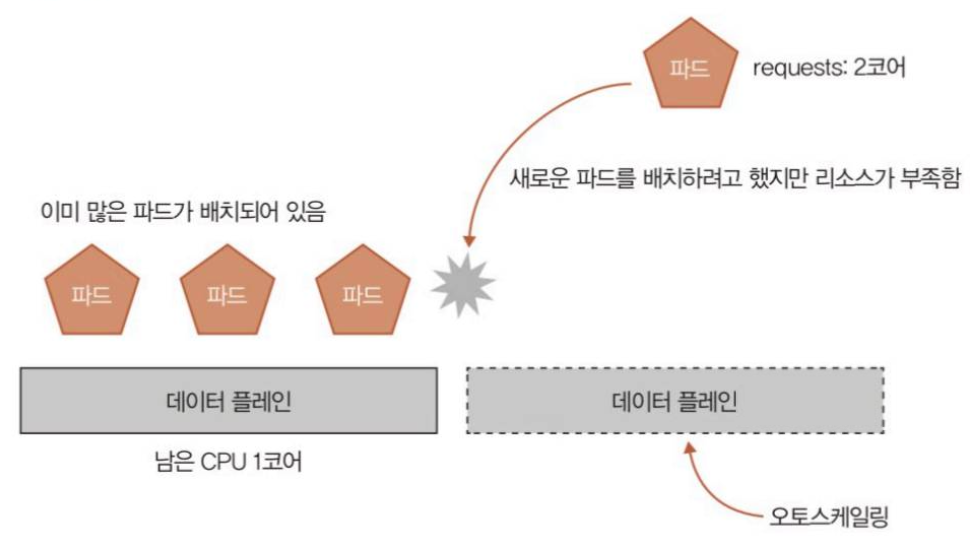

구체적인 설정 방법은 다음과 같다.

AWS 오토스케일링과 연결된 Cluster Autoscaler가 동작하기 위해서는 데이터 노드의 IAM 역할에 IAM 정책을 추가해야 한다.

1. AWS Management Console → EC2
2. 데이터 노드에 해당하는 EC2 선택 → IAM 역할 링크
    
    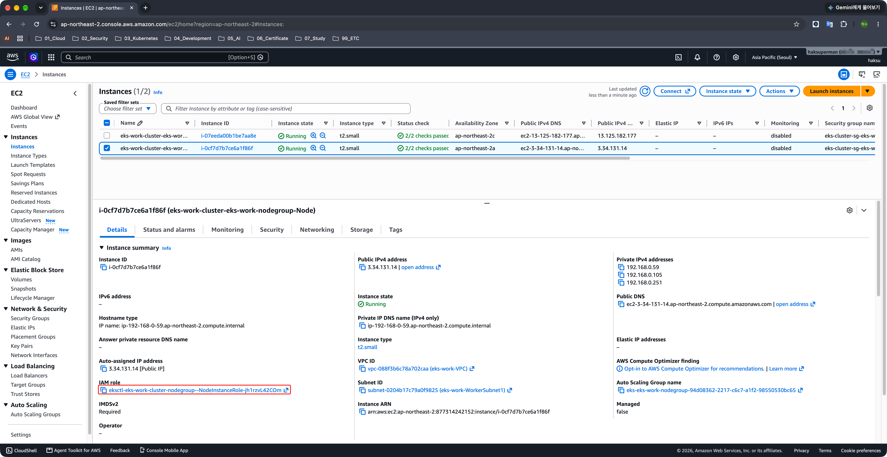
    
3. 우측 상단 Add permissions → Attach policies
4. AutoScalingFullAccess → Add permissions
    
    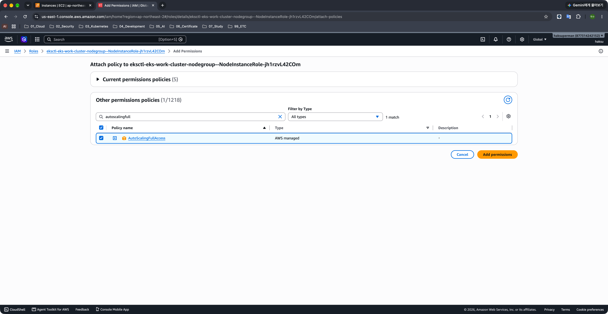
    
5. 정책 추가 확인
    
    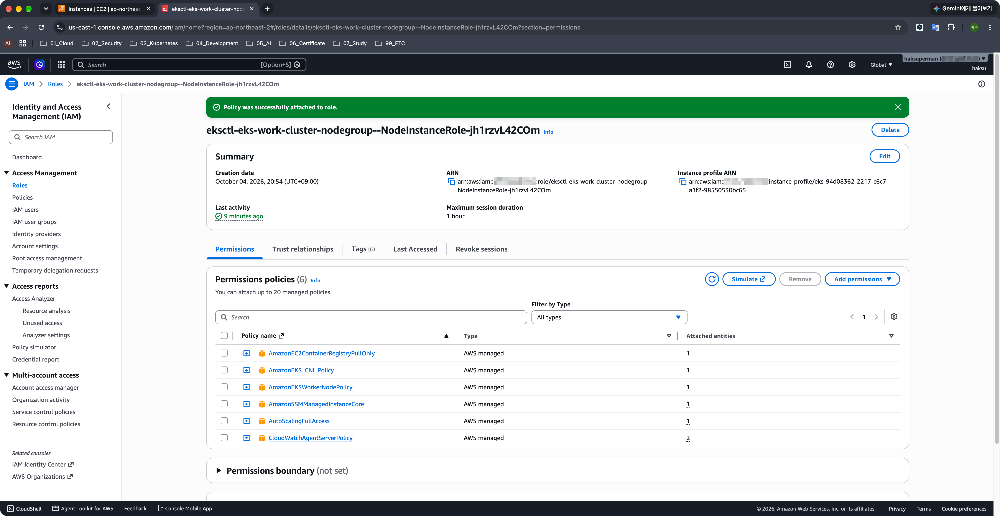
    

Cluster Autoscaler를 동작시킬 AutoScalingGroup 이름을 지정하여 CA 배포한다.

1. AWS Management Console → EC2 → AutoScalingGroup
2. AutoScalingGroup 이름 확인
3. autoscaling/cluster-autoscaler.yaml 파일 내 AutoScalingGroup 이름 항목 수정
    
    ```bash
    				command:
            - ./cluster-autoscaler
            - --v=4
            - --stderrthreshold=info
            - --cloud-provider=aws
            - --skip-nodes-with-local-storage=false
            # 오토스케일링 그룹 이름 설정
            - --nodes=2:5:<위에서 확인한 오토스케일링 그룹 이름 입력>
            env:
            - name: AWS_REGION
              # 리전을 지정
    ```
    
    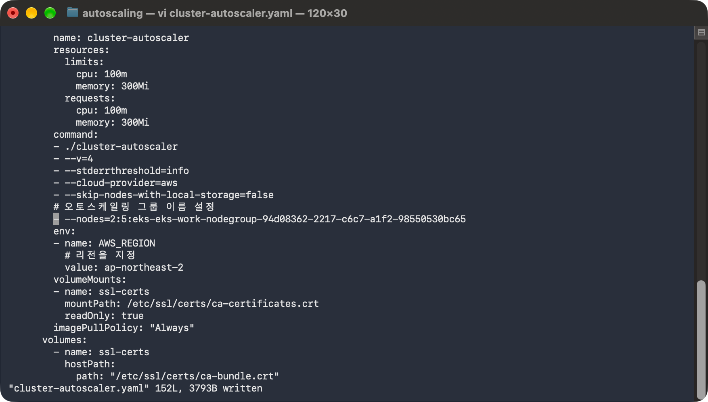
    
4. Cluster Autoscaler 배포 및 로그 확인
    
    ```bash
    kubectl apply -f cluster-autoscaler.yaml
    
    kubectl logs -f deployment/cluster-autoscaler -n kube-system
    ```
    
    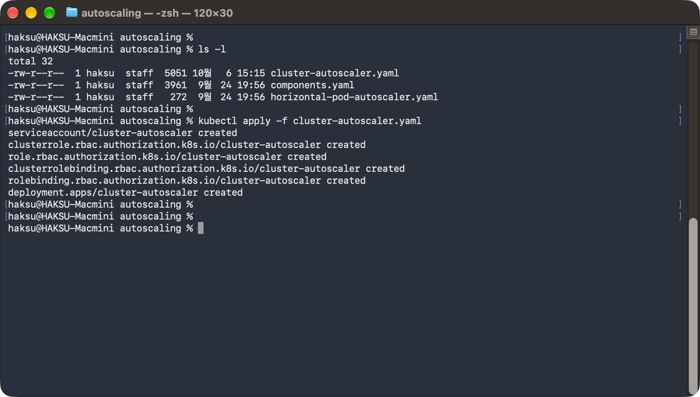
    
    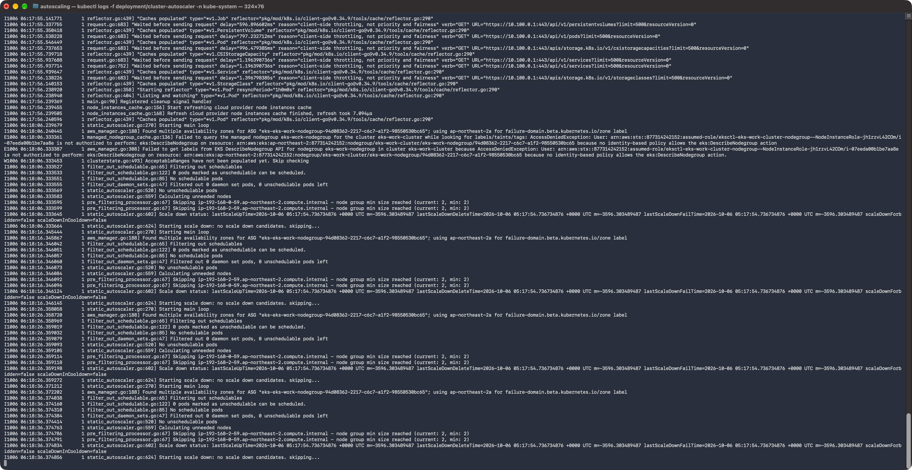
    

예제 애플리케이션 nginx를 여러 개 배포하여 데이터 노드 확장을 테스트한다.

1. 예제 애플리케이션 배포
    
    ```bash
    vi autoscaling/nginx-demo.yaml
    
    apiVersion: apps/v1
    kind: Deployment
    metadata:
      name: nginx-demo
    spec:
      replicas: 1
      selector:
        matchLabels:
          app: nginx-demo
      template:
        metadata:
          labels:
            app: nginx-demo
        spec:
          containers:
            - name: nginx
              image: nginx:latest
              resources:
                requests:
                  cpu: "500m"
                  memory: "128Mi"
                limits:
                  cpu: "600m"
                  memory: "256Mi"
    
    kubectl apply -f nginx-demo.yaml
    ```
    
    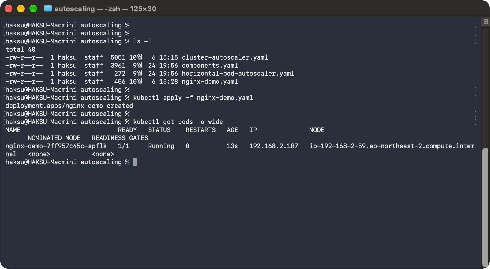
    
2. 배포 확인 및 replicas 증가 후 Pending 상태 파드 확인
    
    ```bash
    kubectl get pods -o wide
    
    kubectl scale deployment nginx-demo --replicas=4
    
    kubectl get pods
    ```
    
    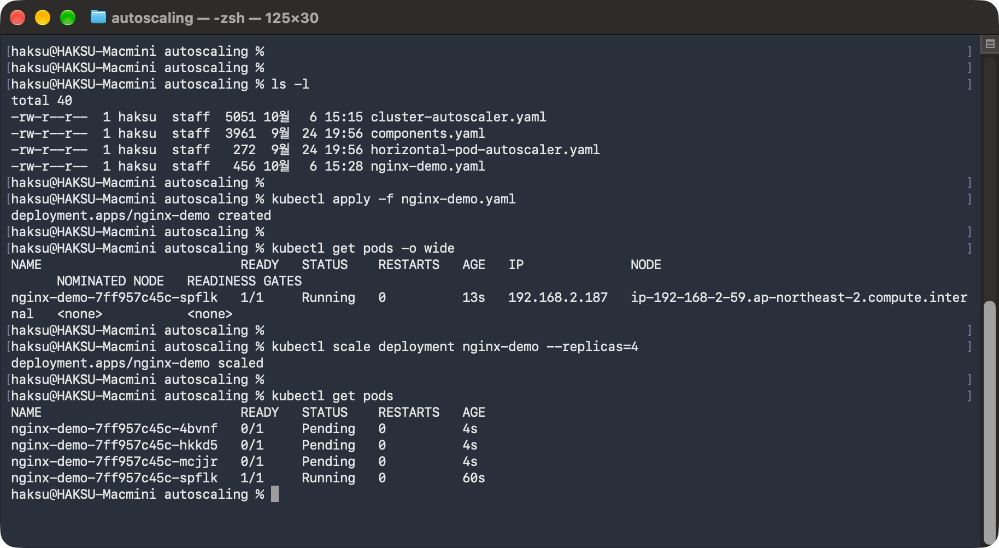
    

Cluster Autoscaler는 이 상황을 감지하고 오토스케일링 그룹 내의 노드 수를 Scale-out 한다.
Pending 상태가 된 파드의 Event 항목을 보면 노드의 스케일 아웃을 기다리는 것을 알 수 있다.

1. CA Scale-out 로그 확인
    
    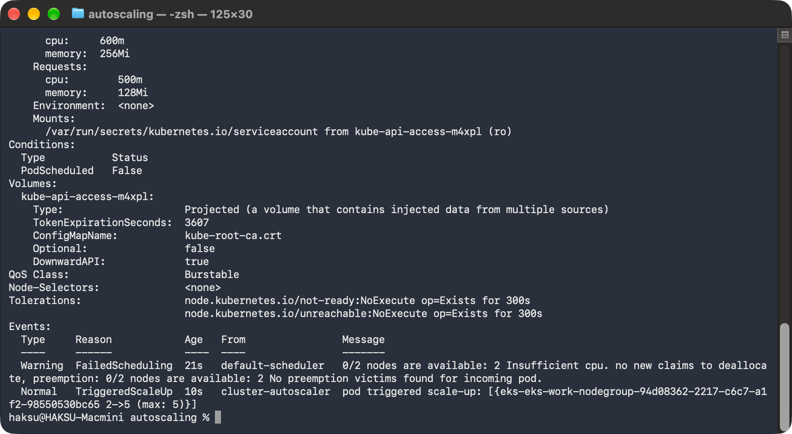
    
2. 데이터 노드 Scale-out 확인
    
    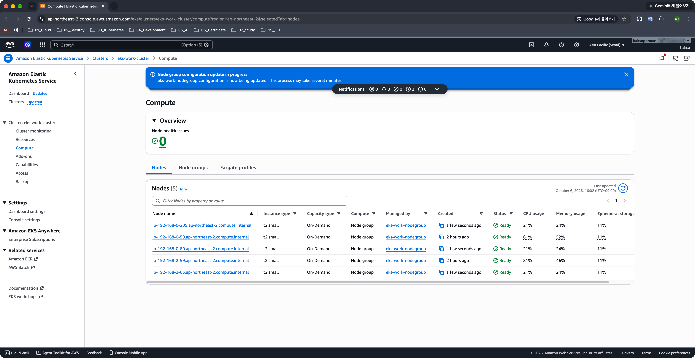
    
3. 데모 애플리케이션 파드 Running 확인
    
    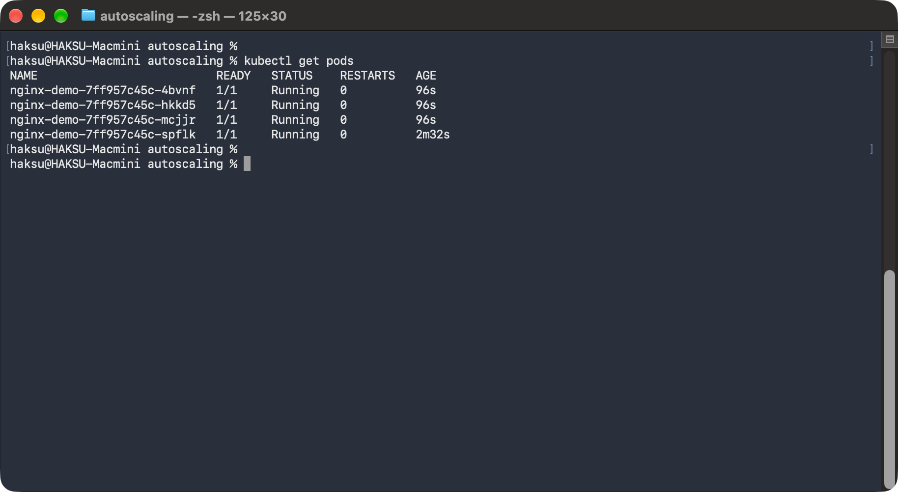
    

노드가 증가해 AWS 과금이 늘어나므로 레플리카 수를 원래 상태로 되돌려, 노드 수 감소를 확인한다.

```bash
kubectl scale deployment nginx-demo --replicas=2
```

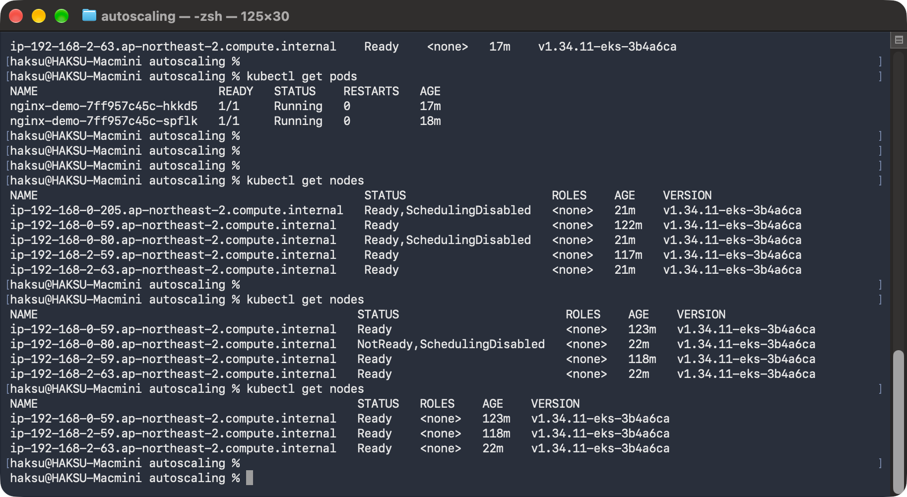

## 2. Cluster Autoscaler에서 주의할 점

Cluster Autoscaler는 requests 값으로 스케일링을 판단한다.
즉, 파드를 배치할 때만 스케일링할지 판단이 가능하다.

이미 파드가 배치된 상태에서 노드의 스케줄링을 실행되지 않는다.
예를 들어 실제 부하가 적지만 파드의 requests 값이 큰 경우 파드가 스케줄링되지 않고 노드가 스케일링되어 버린다.

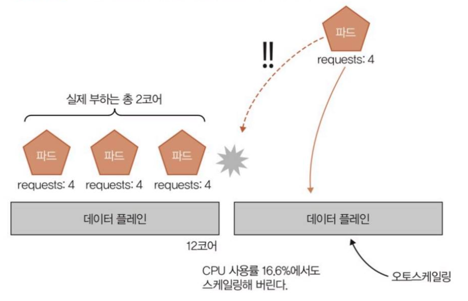

requests 값은 낮지만 limits 설정이 아예 없거나 limits 설정이 높은 값으로 설정된 경우 requests 자체에는 아직 리소스에 여유가 있다. 이때 파드를 배포하면 노드에 과부하가 걸리는 상태(오버 커밋)가 될 수 있다.

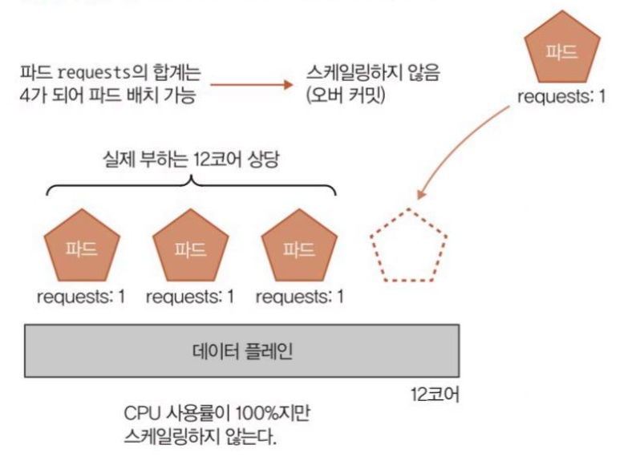

즉, requests와 limits은 적절히 설정해야 한다.

## 3. AWS 오토스케일링 기능을 이용한 예방적 오토스케일링

Cluster Autoscaler는 기본적으로 기존 노드에 배치할 수 없는 **Unschedulable(Pending) Pod**를 감지하여 Worker Node를 증가시킨다.

따라서 일시적인 Pending 상태는 Cluster Autoscaler가 Scale-out을 판단하기 위한 정상적인 동작 과정이다.

다만 노드 생성에는 일정 시간이 필요하므로, 서비스 특성에 따라 리소스 사용량을 모니터링하여 사전에 용량 부족 가능성을 파악하는 것이 중요하다.

Container Insights를 활성화하면 다음과 같은 지표를 확인할 수 있다.

- `pod_cpu_reserved_capacity`
    - Pod의 실제 CPU 사용률이 아니라, **Pod에 설정된 CPU Request가 노드 CPU 용량에서 차지하는 비율**
    - 값이 높을수록 신규 Pod를 배치할 수 있는 CPU 여유가 적다는 것을 의미
- `CPUUtilization`
    - Worker Node(EC2)의 **실제 CPU 사용률**
    - 노드의 실제 부하 상태를 확인할 때 사용

```
애플리케이션 부하 증가
        ↓
HPA가 Pod 수 증가
        ↓
기존 노드에 Pod 배치 공간 부족
        ↓
Pod Pending
        ↓
Cluster Autoscaler가 Worker Node 증가
```

현재 EKS에서는 일반적으로 **애플리케이션 부하에 따른 Pod 증감은 HPA**, **Pod를 배치할 노드가 부족할 때의 Worker Node 증감은 Cluster Autoscaler**가 담당하도록 구성한다.

즉, `pod_cpu_reserved_capacity`나 `CPUUtilization`은 **노드의 리소스 상태와 용량 부족 가능성을 모니터링하는 지표로 활용**하고, Cluster Autoscaler와 별도의 EC2 Auto Scaling 정책이 동일한 Node Group의 Desired Capacity를 동시에 제어하도록 구성하는 것은 피하는 것이 좋다.

## 2. Horizontal Pod Autoscaler를 이용한 파드 오토스케일링

### 2.1. 개요

노드와 마찬가지로 파드 리소스 사용률에 따라 파드의 Scale-out, Scale-in 기능을 구현할 수 있다.

AWS 오토스케일링과 마찬가지로 서비스의 문제 발생을 막는 차원에서 설정하는 것이다.
즉, 파드의 리소스 사용 현황을 모니터링하고 임곗값을 넘을 경우 Scale-out한다.

### 2.2. 메트릭 서버 배포

HPA가 CPU/Memory 사용량을 기반으로 Pod 수를 자동 조절하려면 Kubernetes Metrics API를 통해 리소스 사용량을 수집할 수 있어야 한다.

Metrics Server는 각 노드의 Kubelet에서 Pod 및 Node의 CPU/Memory 사용량을 수집하고 이를 Kubernetes Metrics API(`metrics.k8s.io`)로 제공한다. HPA는 이 값을 사용하여 Pod의 Scale-out/Scale-in을 판단한다.

AWS EKS에서는 Metrics Server를 EKS Community Add-on으로 설치할 수 있으며, 설치 후 Metrics API의 활성화를 확인할 수 있다.

```bash
kubectl get apiservice v1beta1.metrics.k8s.io -o yaml

... 중간 생략...
status:
  conditions:
  - lastTransitionTime: "2026-10-07T06:28:03Z"
    message: all checks passed
    reason: Passed
    status: "True"      ## True 확인
    type: Available
```

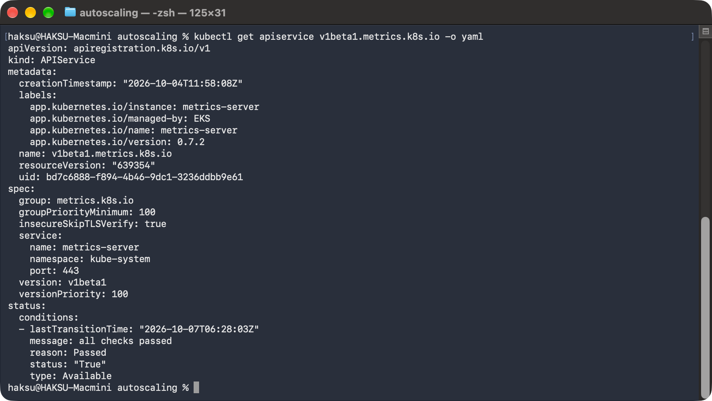

기본적으로 EKS 배포 시 함께 설치 되지만, 설치 되어 있지 않은 경우 아래의 방법으로 설치할 수 있다.

1. AWS Management Console → EKS
2. Cluster → Add ons → Metrics Server 확인
    
    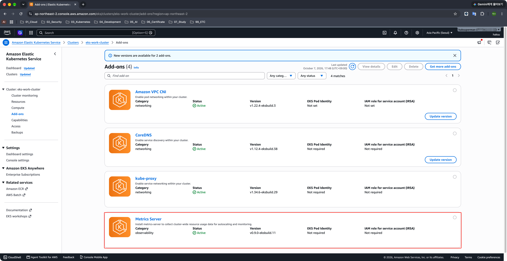
    
3. 조회
    
    ```bash
    kubectl get deployment metrics-server -n kube-system
    kubectl top nodes
    kubectl top pods
    ```
    
    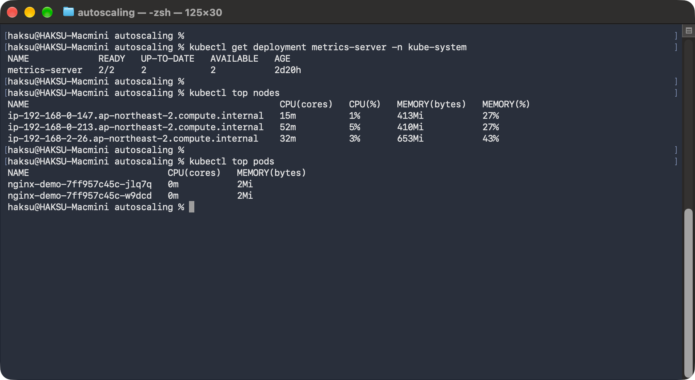
    

### 2.3. HPA 리소스 생성

```yaml
kubectl apply -f autoscaling/horizontal-pod-autoscaler.yaml

kubectl get hpa
```

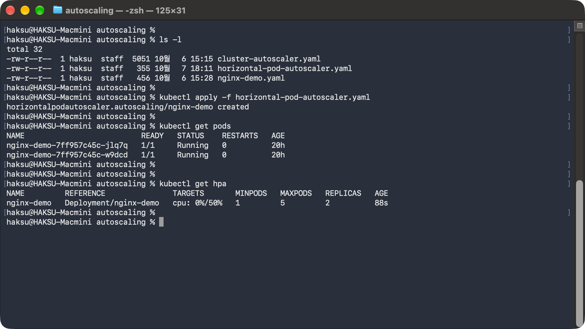

### 2.4. 동작 확인

1. 부하 수행
    
    ```yaml
    # 파드명 확인
    kubectl get pods -l app=nginx-demo
    
    # stress 설치
    kubectl exec -it <파드명> -- /bin/bash
    apt-get install -y stress-ng
    
    # CPU 부하
    stress-ng --cpu 1 --timeout 300s
    ```
    
    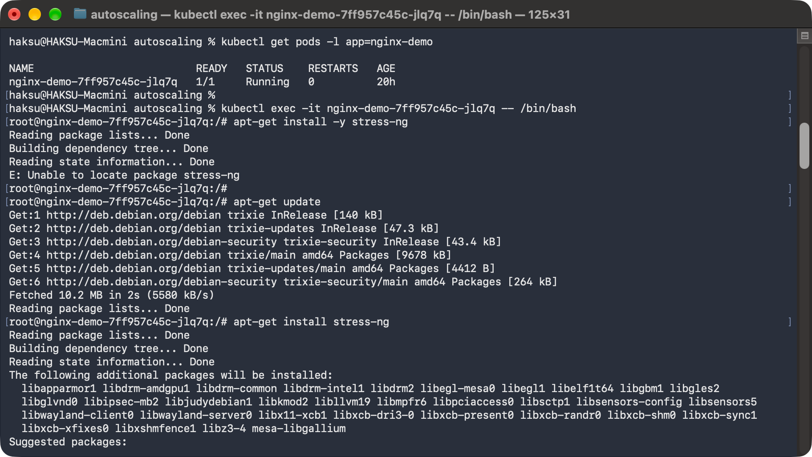
    
    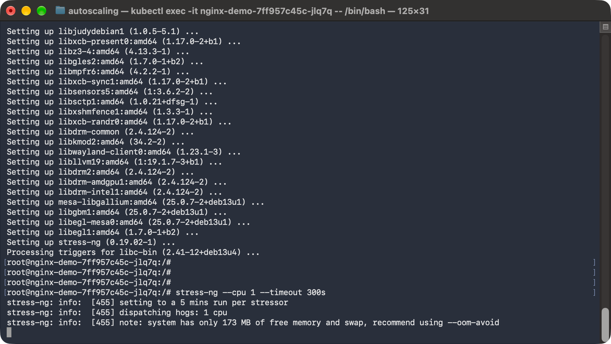
    
2. Scale-out 확인
    
    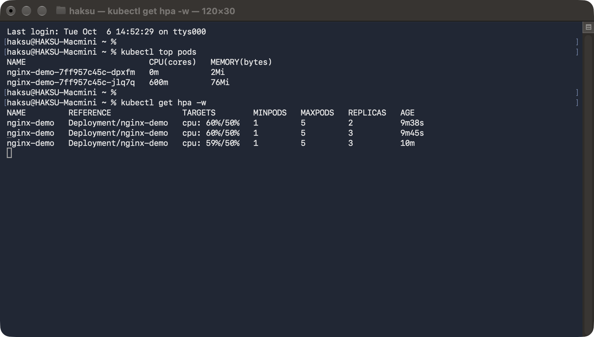
    
    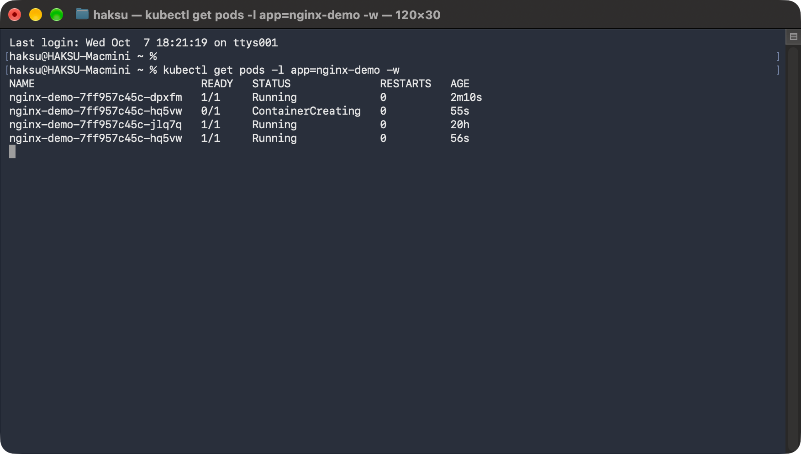
    

## 3. 리소스 삭제

오토스케일링 관련 리소스를 삭제한다.

```yaml
kubectl delete -f autoscaling
```

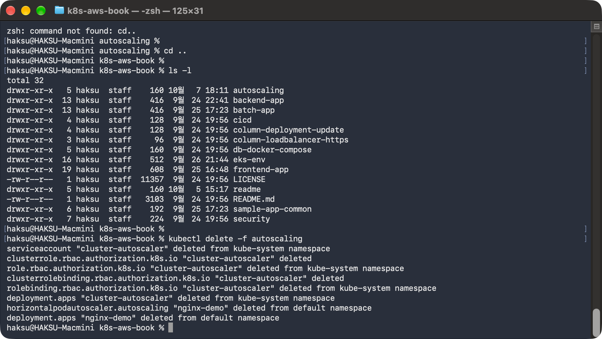
